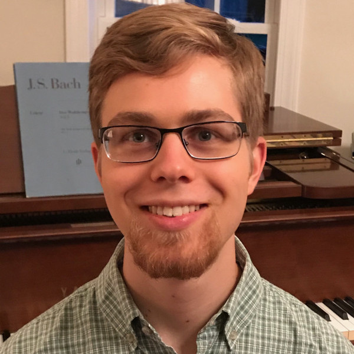

# Homepage for Tim Sierk

I'm a student in [ECE 4960: Fast Robots](https://cei-lab.github.io/ECE4960/).

## About me
Coming from central Virginia, I'm finishing my M.Eng. in mechanical engineering at Cornell University this fall, with one in-person class.

I chose to take ECE 4960 for several reasons:

* I'm so interested in robots that, after spending all of high school on a robotics team, I also spent all of undergrad on Cornell Mars Rover.
* It answers many of the questions I've accumulated over the last eight years.
* It will help me with my master's project (see [my other GitHub repo](https://github.com/kreismit)).
* I think it will be really fun.

Even though I have 19 credits, there are times I'm not studying or building robots.

* I follow Jesus. That's not a hobby, but a commitment that weaves into the rest of my life.
* I've been playing piano (especially classical music) even longer than I've been working on robots.
* My laptop dual-boots Arch Linux and Windows. I spent hours trimming seconds off my boot time. Enough said.