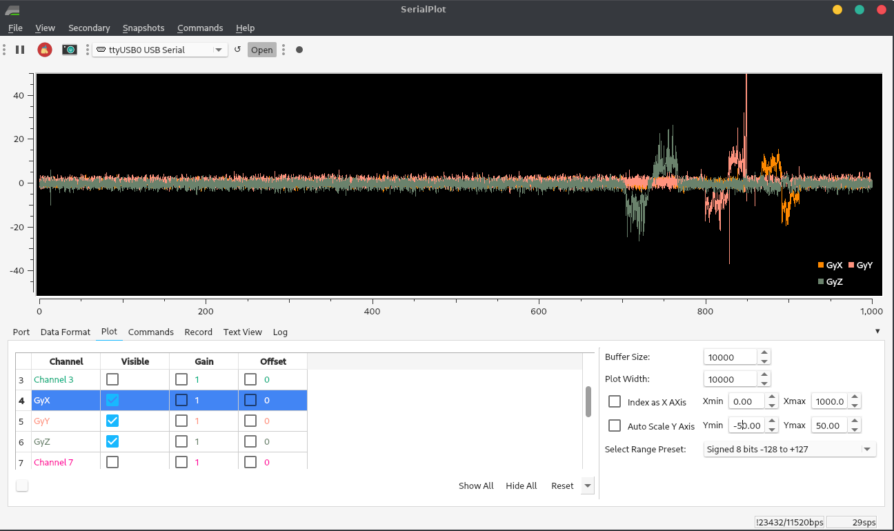

<h4 style="background-color:LightGray" id="navbar">
<a href="#L1">&emsp;Lab 1&emsp;</a>
<a href="#L2">&emsp;Lab 2&emsp;</a>
<a href="#L3">&emsp;Lab 3&emsp;</a>
<a href="#L4">&emsp;Lab 4&emsp;</a>
<a href="#L5">&emsp;Lab 5&emsp;</a>
<a href="#L6">&emsp;Lab 6&emsp;</a>
<a href="#L7">&emsp;Lab 7&emsp;</a>
<a href="#L8">&emsp;Lab 8&emsp;</a>
<a href="#L9">&emsp;Lab 9&emsp;</a>
<a href="#L10">&emsp;Lab 10&emsp;</a></h4>

<h1 id="L1"> Lab 1</h1>

## Goal

The purpose of this lab was to get acquainted with the [SparkFun Artemis Nano](https://www.sparkfun.com/products/15443) and with our custom Ubuntu VM.

## Materials

* 1 SparkFun Artemis RedBoard Nano
* 1 USB A-C cable
* 1 lithium-polymer rechargeable battery
* 1 laptop

## Procedure

### The IDE

Installed [Arduino from the Arch Linux repos](https://wiki.archlinux.org/index.php/Arduino). Only the IDE supports Artemis boards. `arduino-avr-core` is required for the IDE.

Installed the [Arduino core](https://github.com/sparkfun/Arduino_Apollo3) in the IDE:

* Open Tools > Board > Boards Manager in the IDE
* Search for apollo3
* Choose version 1.1.2 in the drop-down
* Click Install (this took several minutes)

Chose the "SparkFun RedBoard Artemis Nano" as the board.

### Testing

Uploaded four example sketches to test various parts of the board:

* Blink (from built-in examples)
* Example2_Serial (from SparkFun Apollo3 examples)
* Example4_analogRead (SparkFun)
* Example1_Microphone (SparkFun)

Also modified Example1_Microphone to blink the built-in LED when whistling.

## Results

### IDE

One pitfall was accessing the COM port, as Linux doesn't give users read-write permission by default. The permanent fix was a custom `udev` rule:
```shell
SUBSYSTEM=="tty" ATTRS{vendor}=="0x8086" ATTRS{subsystem_device}=="0x0740" MODE="0666"
```
Note that the exact requirements for this rule depend on the computer and the distro.

### Testing
The Blink example worked, blinking the blue LED labeled 19.
<video width="600" controls><source src="Lab1/Videos/Blink.mp4" type="video/mp4"></video>

The Serial example both input and output text via the USB serial connection.
<video width="600" controls><source src="Lab1/Videos/Serial.mp4" type="video/mp4"></video>

The analogRead sketch read temperature values which noticeably rose as I held my warm thumb against the device.
<video width="600" controls><source src="Lab1/Videos/Analog.mp4" type="video/mp4"></video>

The Microphone example showed that the loudest frequency doubled when I whistled an octave, indicating that the microphone is working well.
<video width="600" controls><source src="Lab1/Videos/Microphone.mp4" type="video/mp4"></video>

I added two pieces of code to the Microphone example to make it blink the LED when I whistle.

In `void setup()`:
```c++
pinMode(LED_BUILTIN,OUTPUT);
```
In `void loop()`:
```c++
if(ui32LoudestFrequency>800 && ui32LoudestFrequency<2000)
    digitalWrite(LED_BUILTIN,HIGH); // blink the LED when frequency is in whistling range
  else
    digitalWrite(LED_BUILTIN,LOW); // and not otherwise
```

This worked well. (It also picked up my squeaky chair or tapping on my desk.)
<video width="600"><source src="Lab1/Videos/WhistleDetect.mp4" type="video/mp4"></video>

While the Artemis Nano was plugged into my computer, plugging the battery in lit the yellow CHG light.

I commented out all the serial lines of code so that the board would not attempt to establish serial communication with my computer. Then, the board would recognize my whistle on battery too.

[See my code for Lab 1 here.](https://github.com/kreismit/ECE4960/tree/master/Lab1)

<h1 id="L2"> Lab 2</h1>

## Goal

## Materials

* 1 Artemis Nano
* 1 USB dongle
* 1 USB A-C cable
* 1 computer running the Ubuntu 18 VM


## Procedure

### Setup

Downloaded the [distribution code](https://cei-lab.github.io/ECE4960/ece4960lab2dist.zip).
(Re)installed `bleak` using `pip install bleak` at the command line.
Downloaded the sketch `ECE_4960_robot` to the Artemis and opened the serial monitor at 115200 baud.

Entered the folder generated by extracting the ZIP. Ran `./main.py` twice while the Artemis Nano was powered on to discover the board. Manually cached the Artemis' MAC address to `settings.py`.

### Ping Test

Commented out `pass` and uncommented `# await theRobot.ping()` under `async def myRobot.Tasks()` in `main.py`. Ran `./main.py` again while the Arduino serial monitor was still open. Copied the data from the terminal; pasted into a spreadsheet and set space as the delimiter; generated statistics.

### Request Float

Modified `case REQ_FLOAT` in the Arduino sketch `ECE_4960_robot.ino` as follows:

```c++
	case REQ_FLOAT:
		Serial.println("Going to send a float");
        res_cmd->command_type = GIVE_FLOAT;
        res_cmd->length = 6;
        ((float *) res_cmd->data)[0] = (float) 2.71828; // send e
        amdtpsSendData((uint8_t *)res_cmd, res_cmd->length);
		break;
```

In `main.py`, commented `await theRobot.ping()` and uncommented `await theRobot.sendCommand(Commands.REQ_FLOAT)`. Reran `main.py` and received the floating-point value of *e*.

### Bytestream Test

In `main.py`, commented `await theRobot.sendCommand(Commands.REQ_FLOAT)` and uncommented `await theRobot.testByteStream(25)`. Added the following code to `ECE_4960_robot.ino` within `if (bytestream_active)`:

```c++
Serial.printf("Stream %d after %3.1f ms latency\n", bytestream_active, (micros() - finish)*0.001);
int numInts = 3;          // how many integers will fit in this stream
bytestreamCount++;        // we are sending one bytestream now
res_cmd->command_type = BYTESTREAM_TX;
// Two bytes for command_type and for length;
res_cmd->length=2+bytestream_active*numInts; // then 4 bytes for each uint32_t and 8 for each uint64_t
start=micros();
uint32_t integer32 = 0xffffffff;  // different values to indicate whether we're getting a 32-bit
uint64_t integer64 = 0xffffffffffffffff;  // or a 64-bit number
uint32_t *p32;            // pointers to the appropriate data types
uint64_t *p64;
switch(bytestream_active){
  case 4:                 //asked for a 4-byte number!
  p32=(uint32_t*) res_cmd->data;
  for(int i=0; i<numInts-2; i++){ // the -2 is so the last two values can be the time and the count
      memcpy(p32, &integer32, sizeof(integer32));
      p32++;                      // move 4 bits down the array
    }
    memcpy(p32, &bytestreamCount, sizeof(bytestreamCount));
    p32++;
    memcpy(p32, &start, sizeof(start));
    break;
  case 8:               //asked for an 8-byte number!
  default:              // the default is to send a 64-bit (8-byte) array
    p64=(uint64_t*) res_cmd->data;
    for(int i=0; i<numInts-2; i++){
      memcpy(p64, &integer64, sizeof(integer64));
      p64++;                      // move 8 bits down the array
    }
    bytestreamCount64 = (uint64_t) bytestreamCount;
    memcpy(p64, &bytestreamCount64, sizeof(bytestreamCount));
    p64++;
    memcpy(p64, &start, sizeof(start));
    break;
}
amdtpsSendData((uint8_t *)res_cmd, res_cmd->length);
finish=micros();
Serial.printf("Finished sending bytestream after %u microseconds\n",finish-start);
```

where `start` and `finish` were defined as global variables and `finish` was initialized to zero.

Repurposed `bytestream_active` to tell the Artemis how large an integer to send; if `bytestream_active==4` then the Artemis sends back an array of 32-bit (4-byte) integers, and if `bytestream_active==8` then the Artemis sends back 64-bit integers. These maximum values were confirmed by setting `integer32=0xffffffff` and `integer64=0xffffffffffffffff` as the maximum values that can be sent. Because of this usage, changed `await theRobot.testByteStream(25)` to `await theRobot.testByteStream(4)` in the 32-bit case or `await theRobot.testByteStream(8)` for the 64-bit case.

Added the following code to `main.py` within `if code==Commands.BYTESTREAM_TX.value:`

```python
# dataUP = unpack("<III",data) # for 3 32-bit numbers 
dataUP = unpack("<QQQ", data) # for 3 64-bit numbers
# print(f"Received {length} bytes of data")
print(dataUP)
```

## Results

### Ping Test

<video width="600" controls><source src="Lab2/Videos/Ping.mp4" type="video/mp4"></video>

The Bluetooth icon in the statusbar does not appear until `main.py` is run. This indicates that the Python script, rather than the Ubuntu Bluetooth wizard, is establishing the connection.

The ping latency followed this histogram:

<image width="600" src="Lab2/Images/PingRTTHistogram.png"></image>

Using the setting `"OutputRawData": True` in `settings.py` showed me that returning a ping sends 96 bytes of data, all zeroes. Thus, the transfer rate followed this histogram:

<image width="600" src="Lab2/Images/PingRateHistogram.png"></image>

Most of the "rate" in this case is the latency of returning pings. From the Artemis side, I measured the average time between pings as *160.0 ms*. The average total RTT as measured by the Python script was *159.3 ms*. The Artemis sends data very quickly.

### Request Float

<image width="600" src="Lab2/Images/Float.png"></image>

The traceback at the bottom occurred because I stopped the program with Ctrl+C.
Note that although the floating-point value was `2.71828`, there were additional random digits. This means that floats cannot be compared like `if( float1 == float2 )`, but rather `if( abs(float1-float2) < tolerance )`.

### Bytestream Test

#### 32-bit Stream

<image width="600" src="Lab2/Images/Bytestream32.png"></image>
<image width="600" src="Lab2/Images/32-bit.png"></image>

The Python script indicates that it receives 14 bytes of data in each packet. The mean transfer rate is **963 bytes/second**. Note this is the average over the packets which were received; only **65%** of the packets made it to the computer.

<image width="600" src="Lab2/Images/32bitTransferHistogram.png"></image>

#### 64-bit Stream

<image width="600" src="Lab2/Images/Bytestream64.png"></image>
<image width="600" src="Lab2/Images/64-bit.png"></image>

The Python script indicates that it receives 26 bytes of data in each packet. The mean transfer rate is **1.46 KB/second**. Note this is the average over the packets which were received; only **22%** of the packets made it to the computer.

<image width="600" src="Lab2/Images/64bitTransferHistogram.png"></image>

## Lessons Learned

As I experienced, and as [this SuperUser post](https://superuser.com/questions/956622/no-usb-devices-available-in-virtualbox) points out, users must be part of the `vboxusers` group on the host machine, or else no USB devices are accessible from VirtualBox. This and other issues were solved when I did the following, in order:

* Add my user to the host machine's `vboxusers` group.
* In the VirtualBox settings, ensure `Enable USB Controller` is checked.
* Connect the Bluetooth USB dongle.
* Start the VM.
* In the VirtualBox menu bar, mouse to Devices > USB and check `Broadcom Corp 20702A0`.
* Run `main.py` in the CLI.

Adjusting the Ubuntu Bluetooth settings was unnecessary and caused issues. The USB dongle is more reliable than my built-in BLE radio.

Another surprise I shouldn't have experienced was that the code didn't run when I executed `python main.py`. I noted that the file was executable and began with `#!/usr/bin/env python3`. When I ran it as a script, it worked perfectly. `python` was mapped to `python2.7` and not `python3`. Always check versions.

I found that the Python code "cares" what length is sent with the message. The length must match the format string; and the code stops parsing data after `length` bytes.

Lastly, the shorter the data packets were, the more likely they were to reach their destination.

[See my code and data for Lab 2 here.](https://github.com/kreismit/ECE4960/tree/master/Lab2)

<h1 id="L3"> Lab 3</h1>

## Materials Used

* Fancy RC Amphibious Stunt car with remote
* 2 NiCd rechargeable batteries with USB charger
* 2 AA batteries
* Screwdriver
* Ruler / measuring tape
* Timer (app)
* GPS (app)
* Laptop running Ubuntu 18.04 VM with ROS Melodic Morenia


## Procedure

### Physical Robot

Charged each NiCd battery about 8-9 hours before first use (or until the red light on the USB charger stopped flashing.) Inserted NiCd battery into robot and two rechargeable AA batteries into the remote.

Collected various measurements using the available environment, a ruler, and a timer. For clocking speed, used a GPS app to get distance measurements.

### Simulation

Installed `ros-melodic-rosmon`.
Downloaded the [lab 3 base code](https://cornell.box.com/s/p4y4ovp6gu0alvqzog1hctzmcvby9eub) from Box into the folder shared between the host and the VM. Started the VM; extracted the archive; entered the folder extracted from the archive; and ran `./setup.sh`.

<image width="600" src="Lab3/Images/Setup.png"></image>

Closed and reopened the terminal emulator, per the instructions.

Started `lab3-manager`, which was now aliased as shown here. Hit `a` to enter the `Node Actions` menu; then hit `s` to start a simulator.

Opened another terminal window and ran `robot-keyboard-teleop` to allow me to control the simulation.

<image width="600" src="Lab3/Images/Teleop.png"></image>

Played the game and made the measurements below.

## Results and Lessons Learned

### Physical Robot

This video is courtesy of my apartment-mate Ben Hopkins.

<video width="600" controls><source src="Lab3/Videos/Stunts.mp4" type="video/mp4"></video>


The wheelbase is 4 in = 10.5 cm wide and 3.25 in = 8 cm long (measuring from the center of the wheels.) This measurement is useful to determine skid-steering quality.


Unless stated otherwise, the following tests were done on a flat surface.

#### Manual Control

How difficult it is to drive the robot manually helps me understand the difficulty of controlling it algorithmically.

* The three speed settings had significantly different effects. It was virtually impossible to flip when traveling slow; but at max speed I could hardly start without flipping. The top speed and the default speed were nearly the same.
* The robot can turn in place quite predictably; however, it requires a lot of power to skid the wheels, and when the battery is low, it can no longer turn in place.
* Long arc turns are difficult not to do. I could hardly drive straight even if the joysticks were maxed out. In code, driving straight will require a feedback loop.

#### Inertial Measurements

How quickly the robot accelerates and decelerates tells me a lot about the robot's power-to-weight ratio. I don't have a scale, but I can calculate its mass (at least in terms of its motor torque.)

* Acceleration: 6-8 feet to get to full speed. 6-8 feet to coast to a stop. 2-2.5 seconds to accelerate to full speed.
* Can stop quickly by reversing with slow button (2 feet)
* These numbers stayed relatively constant as the battery drained; but the maximum speed decreased.
* Average max speed at full (ish) battery: 12 ft/s = 3.5 m/s = 8 mi/h
* These measurements were the same whether the robot drove forward or backward.

#### Gravitational Measurements

OK, so I know the robot's motors are strong enough to accelerate and decelerate it quickly. How strong is that? Where is the weight in the robot?

* The robot is quite stable – it has to tilt around 75° before it flips.
* The robot is also somewhat topheavy - it flips if it accelerates or stops too suddenly.
* The motors were not very strong – it was sometimes difficult to climb hills. It could climb a 45° slope with a good battery, but it slowed significantly. Rough terrain also slowed it down since it had to climb over many short slopes.

#### Frictional Measurements

* The robot turned about its center predictably on a flat surface, but slopes made a big difference.
* The robot's turn radius was predictable at a given battery level, speed, and type of terrain. Little rocks, initial speed, battery level, and slope all made a big difference.
* Average maximum rotational speed when turning in place: 75 rpm = 7.9 rad/s
* I noticed no differences between driving on flat (hard) carpet, concrete, and asphalt.

#### Other Measurements

* The range was quite good, 250+ feet line-of-sight.
* I could drive the robot around and under cars. The signal can go around at least 10 cars in a parking lot.
* On the first and second runs, the battery lasted 35 min (when the robot was moving about 1/2 the time.)

### Simulation

<video width="600" controls><source src="Lab3/Videos/RobotSim_Functions.mp4" type="video/mp4"></video>

* The robot doesn't seem to have a minimum speed. I can reduce the input speed to 0.01 and less and still it moves (albeit around 1 square per minute.) It seems to have no maximum speed either.
* The same is true for angular speed.
* I could accelerate nearly instantly and reverse direction nearly instantly; the only limiting factor seems to be the frame rate. The time between 1x reverse and 1x forward is the same as between 3x reverse and 3x forward, or 3x forward and 3x reverse, etc.
* When I hit the wall, the robot did not bounce, flip, etc; the simulation paused and showed a warning triangle sign in the place of the robot until I backed away from the wall.
* I could grab and drag the robot using the mouse; as soon as I put the robot down, it resumed motion in the same direction as it was moving before. However, I couldn't both drag/pan and steer at once; the keyboard control only works when the terminal window running `robot-keyboard-teleop` has focus.

[Click here to see my data for Lab 3.](https://github.com/kreismit/ECE4960/tree/master/Lab3/)

<h1 id="L4">Lab 4</h1>

## Materials Used

* Sparkfun Artemis RedBoard Nano
* USB A-C cable
* SparkFun Serial Controlled Motor Driver (SCMD) module (with no jumpers soldered)
* SparkFun Qwiic (I²C) connector cable
* Fancy RC Amphibious Stunt Car
* 4.8V NiCd rechargeable battery
* 3.7V Li-ion rechargeable battery

### Tools and Software

* Laptop with Ubuntu 18.04 VM and Arduino IDE
* Wire cutters (wire stripper would be ideal; scissors also work)
* Small Phillips-head screwdriver (optional)
* Small flat-head screwdriver (required for clamping wires in SCMD)
* Electrical tape
* Duct tape (optional)


## Procedure

### Physical Robot

Reviewed documentation. Removed the aesthetic cover and the motor cover; cut the wires to the motors right at the connectors; stripped about 3/8" of insulation; and connected them to the SCMD. Cut the battery wires close to the control board, stripped the ends, and connected them to the SCMD. 

In Arduino IDE, installed the Serial Controlled Motor Driver library version 1.0.4 (Tools -> Manage Libraries -> search for "SCMD".) Loaded Example1_Wire (from the newly installed SCMD library); changed the I²C device address to `0x5D`; and ran it. It spun the two wheel motors. Used this command: `Serial.printf("Address %d\n",i);` within the `for` loop to tell me what the motor addresses were. Wrote code to spin the motors and found the minimum speed that made the wheels turn.

Removed the RC control board from the robot; pushed the SCMD into its place; and reattached the 
top cover. The Qwiic wire came out between the cover and the case, like this:


Wrote code to make the robot drive in a straight line (using a linear scaling calibration) and took a video.

### Simulation

Downloaded the Lab 4 Base Code from Box into the folder shared between the host and the VM. In the VM, opened a terminal window; entered the shared folder; extracted the base code; and ran `setup.sh` in the appropriate folder.

Closed and reopened terminal window. Ran `lab4-manager` and followed the instructions to open a simulator window.

Opened another terminal window (`Ctrl+Alt+T`). Entered the directory `/home/artemis/catkin_ws/src/lab4/scripts` and ran `jupyter lab`.

In the resulting Firefox window, opened the Jupyter notebook `lab4.ipynb`. Followed the instructions and saved the lab notebook.

## Results and Notes

### Physical Robot

Running the example code, when the motor driver was plugged in, gave the result

	I2C device found at address 0x5D  !

Not surprisingly, the addresses of the wheel motors were 0 and 1 (since the SCMD drives up to two motors.)

I could not fit the Qwiic connector through the start button hole.

The minimum power at which I could make the wheels spin was not the same on either side. On the left (address 0) it was about 46; on the right (address 1) it was about 50. These numbers seem to change as the battery level changes.

I reasoned that the friction in the wheels is a constant force, not a velocity-dependent one, so the frictional resistance should be a constant offset. This seemed to to work; at low power, I needed +4 power on the right side, and the same should be true at higher power levels. However, the wheels were not exactly the same size, as evidenced by the fact that the robot drove in a curve. By trial and error, I scaled the left side up by 8% to compensate for this, and then the robot drove straighter.

When I assembled the robot, I found that the electrical tape wasn't sticky enough to hold the Artemis Nano onto the robot case; and zip ties would prevent me from replacing the battery. So I used duct tape instead.

Below is a video of a straight line (triggered by a whistle).

<video width="600" controls><source src="Lab4/Videos/DriveStraightWhistle.mp4" type="video/mp4"></video>

Also, note that I could not set to recognize higher-frequency whistles, or else the robot would pick up the sound of its own motors and keep on driving.

The next two videos show two of my attempts to make it drive in a triangle, using the following code (with different wait times):

	for(int i=0; i<3; i++){
		  myMotorDriver.setDrive( right, 1, power);             // 1 for forward
		  myMotorDriver.setDrive( left, 0, calib*power+offset); // left side is reversed
		  int t = millis();
		  while (millis()-t < 350){ // Wait for a specified time, but keep updating the PDM data
		    myPDM.getData(pdmDataBuffer, pdmDataBufferSize);
		  }
		  // Coast to a stop
		  myMotorDriver.setDrive( left, 1, 0);                  // Set both sides to zero
		  myMotorDriver.setDrive( right, 1, 0);
		  t = millis();
		  while (millis()-t < 500){ // Wait for a specified time, but keep updating the PDM data
		    myPDM.getData(pdmDataBuffer, pdmDataBufferSize);
		  }
		  // Spin in place
		  myMotorDriver.setDrive( right, 1, power);             // 1 for forward
		  myMotorDriver.setDrive( left, 1, calib*power+offset); // left side is NOT reversed since we're spinning!
		  t = millis();
		  while (millis()-t < 290){ // Wait for a specified time, but keep updating the PDM data
		    myPDM.getData(pdmDataBuffer, pdmDataBufferSize);
		  }
		  // Coast to a stop
		  myMotorDriver.setDrive( left, 1, 0);                  // Set both sides to zero
		  myMotorDriver.setDrive( right, 1, 0);
		  t = millis();
		  while (millis()-t < 500){ // Wait for a specified time, but keep updating the PDM data
		    myPDM.getData(pdmDataBuffer, pdmDataBufferSize);
		  }
		}

The open-loop control is very sensitive to

* Timing (the difference between the first and the second videos is 20 ms)
* Surfaces (hardly turns on carpet; spins easily on tile)
* Battery level (in less than a minute, the robot would no longer turn enough)

<video width="600" controls><source src="Lab4/Videos/BadTriangle.mp4" type="video/mp4"></video>

<video width="600" controls><source src="Lab4/Videos/BetterTriangle.mp4" type="video/mp4"></video>

### Simulation

```shell
artemis@artemis-VirtualBox:~$ cd Shared
artemis@artemis-VirtualBox:~/Shared$ ls
 ...
 lab4_base_code.zip
...
artemis@artemis-VirtualBox:~/Shared$ unzip lab4_base_code.zip
Archive:  lab4_base_code.zip
   creating: lab4_base_code/
  inflating: lab4_base_code/bash_aliases  
  inflating: lab4_base_code/setup.sh  
  inflating: lab4_base_code/lab4.zip  
artemis@artemis-VirtualBox:~/Shared$ ls
...
 lab4_base_code
 lab4_base_code.zip
...
artemis@artemis-VirtualBox:~/Shared$ cd ./lab4_base_code/
artemis@artemis-VirtualBox:~/Shared/lab4_base_code$ ls
bash_aliases  lab4.zip  setup.sh
artemis@artemis-VirtualBox:~/Shared/lab4_base_code$ ./setup.sh 
 > Log output written to: /home/artemis/Shared/lab4_base_code/output_lab4.log 
 > Lab Work Directory: /home/artemis/catkin_ws/src/lab4/scripts/ 
Validating...
Step 1/3: Extracting Files to: /home/artemis/catkin_ws/src/ 
Step 2/3: Setting up commands
Step 3/3: Compiling Project

Successfully compiled lab.
NOTE: Make sure you close all terminals after this message.
artemis@artemis-VirtualBox:~/Shared/lab4_base_code$ exit
```

My working open-loop square was as follows:

```python
# Your code goes here
for i in range(4):
    robot.set_vel(1,0)
    time.sleep(0.5)
    robot.set_vel(0,1)
    time.sleep(1.625)
robot.set_vel(0,0)
```

It was easy to tune the timing so that the robot predictably drove in a perfect square, like this:

<video width="600" controls><source src="Lab4/Videos/SimRectangle.mp4" type="video/mp4"></video>

See the rest of my code, and the Jupyter notebook, [here](https://github.com/kreismit/ECE4960/tree/master/Lab4).


<h1 id="L5">Lab 5</h1>

## Background

## Materials

### Components

* SparkFun Artemis RedBoard Nano
* USB A-C cable
* SparkFun 4m time-of-flight sensor (VL53L1X)
* SparkFun 20cm proximity sensor (VCNL4040)
* SparkFun Serial Controlled Motor Driver (SCMD) module (with no jumpers soldered)
* SparkFun Qwiic (I²C) connector cable
* Fancy RC Amphibious Stunt Car
* 4.8V NiCd rechargeable battery
* 3.7V Li-ion rechargeable battery
* Boxes and targets of various sizes

### Tools and Software

* Laptop with Ubuntu 18.04 VM and Arduino IDE
* Wire cutters (scissors also work)
* Small Phillips-head screwdriver (may substitute flathead)
* Ruler (or printed graph paper)
* Gray target (printed; 17% dark)
* Electrical tape
* Double-sided tape or sticky pad

## Prelab

The two sensors are quite different. The long-range ToF sensor (VL53L1X) has a field of view of about 15 degrees, and it has a much longer range. It can safely be put near the ground without seeing the ground; it could miss obstacles right in front of the wheels since the detection cone is very narrow near the robot. Outside of its detection cone, the prox sensor (VCNL4040) has a wider field of view (&pm;20&deg; = 40&deg;) so it may be placed right at the center of the robot and hopefully it will pick up the obstacles close and to the side, which would be missed by the VL53L1X. Also note that the VCNL4040 maxes out within the range of the VL53L1X, so there is some overlap where the two sensors' readings may be compared.

These two distance sensors exemplify the main types of infrared ranging sensors.

* Infrared intensity measurement: This uses the inverse-square law to determine the distance to an object. However, the coefficient of the inverse-square law varies widely with color, and this intensity is also extremely sensitive to ambient light. The VCNL4040 uses intensity measurement.
* Infrared time-of-flight (ToF): This works like RADAR, by measuring the elapsed time for the optical signal to bounce back. It is more immune to noise than intensity measurement, but it is still vulnerable to interference from ambient light.
* Infrared angle measurement: This uses the angle (sometimes in conjunction with ToF) of the returned light to triangulate the distance. It eliminates some more of the problems of ToF, but is again sensitive to ambient light and refraction / angle of the reflector. The VL53L1X uses both angle and ToF measurement.

Other available ranging sensors include SONAR (used in submarines and bats ☺) and RADAR (used in aircraft.) Since the width of a diffracted beam decreases with increasing wavelength, both of these require some sort of beam-steering to get a sufficiently narrow beam to see only what's in front of the robot. IR ranging is thus simpler and usually cheaper to use.

## Procedure

### Physical Robot

Skimmed the documentation for the [VCNL4040](https://www.vishay.com/docs/84274/vcnl4040.pdf) and the SparkFun [repo](https://github.com/sparkfun/SparkFun_VCNL4040_Arduino_Library) and [hookup guide](https://learn.sparkfun.com/tutorials/qwiic-proximity-sensor-vcnl4040-hookup-guide). Noted that the default I²C address of the sensor is `0x60`.
In the Arduino IDE, installed the [SparkFun VCNL4040 Arduino Library](https://github.com/sparkfun/SparkFun_VCNL4040_Arduino_Library) using Tools > Manage Libraries.

Reviewed the [datasheet](https://cdn.sparkfun.com/assets/8/9/9/a/6/VL53L0X_DS.pdf) and the [manual](https://cdn.sparkfun.com/assets/e/1/8/4/e/VL53L1X_API.pdf) for the VL53L1X.

Ran `Example1_Wire` (File > Examples > Wire) to find all I²C addresses. Ran `Example4_AllReadings` (File > Examples > SparkFun VCNL4040 Proximity Sensor Library) to measure data. Tested on ~~four~~ five different targets under various conditions. Recorded data once the reading stabilized (after about 5s.) When the data fluctuated wildly (e.g. at very close ranges) took the median and rounded.

In the Arduino IDE, installed the [SparkFun VL53L1X Arduino Library](https://github.com/sparkfun/SparkFun_VL53L1X_Arduino_Library) using Tools > Manage Libraries. Ran `Example1_Wire` again to find the I²C address of the time-of-flight sensor. Tested ranging once and saw that it needed calibration. Calibrated using `Example7_Calibration` (File > Examples > SparkFun VL53L1X Distance Sensor). Adjusted offset accordingly in `Example1_ReadDistance` and tested ranging on several targets with the lights on and with the lights off.

Wrote and tested an obstacle-avoidance program.

### Simulation

Downloaded and extracted the [lab 5 base code](https://cornell.box.com/s/a7t117nifn7q9esjshoj5qx0jmmjm26y). Entered the directory and ran `setup.sh`. Closed the terminal window.

Entered the directory `~/catkin_ws/src/lab5/scripts/`. Ran `jupyter lab`; opened `lab5.ipynb'; followed the instructions in the Jupyter Notebook.

## Results and Notes

### Physical Robot

```
Unknown error at address 0x5D
Unknown error at address 0x5E
Unknown error at address 0x5F
I2C device found at address 0x60  !
Unknown error at address 0x61
Unknown error at address 0x62
Unknown error at address 0x63
```

The VCNL4040 indeed had the default I²C address of `0x60`.

When testing the ranging for both sensors, I found it useful to tape the sensor to a fixed object, as suggested in the instructions. For me, it was a screwdriver case.


Figure 1. Ranging test with VCNL4040.

When running `Example4_AllReadings`, I noticed that the sensor readings took 3-5 seconds to stabilize. It seems like there is a rolling-average filter or an integrator in the sensor. I was also a bit surprised since the "prox reading" wasn't a range estimate (like it is on ultrasonic rangefinders), but an intensity which scales with the inverse-square law. After gathering data from several surfaces, I found that my data looked much like the screenshot shown in the lab instructions.

I was pleasantly surprised that the VCNL4040 proximity ranges were about the same whether I had the lights on or off, and even if I shone a flashlight on the sensor. Both the shadow of the target and the red LED on the board significantly affected brightness readings as the sensor approached the target, so I recorded brightness at 20cm away where these had less effect.


Figure 2. Ranging test with desk leg and VCNL4040.

With the desk leg, I noticed that the readings were much worse than they were for other objects. At first I assumed it was the reflectivity of the surface, but I noted three other things:

* The graph paper was rumpled. Was the sensor seeing the paper instead? Turning the sensor sideways (so it completely missed the leg) gave approximately the same readings. Maybe it was seeing the paper.
* The reading varied significantly when the sensor moved side to side. Was it the width?
* The desk leg wasn't parallel to the sensor, and I noticed that angles mattered in the case of the plywood too. But, holding the sensor off the ground and pointing it directly at the angled leg didn't make much difference.

I repeated a few measurements of the desk leg with a ruler instead of the graph paper, and achieved the same results.

I also added an additional measurement of the box on its side, ruling out the possibility that it was the object's width and not its surface texture.

)`, as the loop kept running forever and the sensor was never ready. Comparing this example code to `Example1_ReadDistance` (which worked) I noticed that `distanceSensor.startRanging()` had never been called. Adding this line to the example gave me successful (and repeatable) calibration.

```
*****************************************************************************************************
                                    Offset calibration
Place a light grey (17 % gray) target at a distance of 140mm in front of the VL53L1X sensor.
The calibration will start 5 seconds after a distance below 10 cm was detected for 1 second.
Use the resulting offset distance as parameter for the setOffset() function called after begin().
*****************************************************************************************************

Sensor online!
Distance below 10cm detected for more than a second, start offset calibration in 5 seconds
Result of offset calibration. RealDistance - MeasuredDistance=37 mm
```

Then, I slightly modified the example distance-reading code as follows:

In `void setup()`, added a line `distanceSensor.setOffset(37);`

In `void loop()`, added code to time each range measurement and to print the time to the serial output.

When I tried different timing budgets, I didn't see much improvement in precision when using timing budgets over 60 ms in short-range mode or over 180 ms in long-range mode. These maximum timing budgets seemed to be the best compromise between accuracy and speed; adding more doesn't gain much accuracy, and reducing more doesn't gain much speed.

I noticed that, as the datasheet said, the ranging in ambient light was significantly more precise when I used short mode. The same seemed to be true in the dark, however. My data, plotted below, shows these trends. Note that some "waves" in the graphs are repeated for all surfaces.


Figure 3. Ranging setup with plywood.

The ToF sensor was much less sensitive to the width of the object being detected; it made no difference what the orientation of the box was. It was somewhat sensitive to the angle of the plywood board, but only at short distances (where the VCNL4040 might be a better choice.)


Figure 4. Ranging setup with door (using graph paper for 20cm or less). Note: used measuring tape and taller box for long-range testing.

 vs. real range.

In the long-range case, my (mini) tape measure was only 1 m long, so I added an 18" ruler at the end of the tape measure to reach 1.4 m. The ToF sensor was surprisingly immune to small changes in angle (probably because the beam spans about 15°); but, when mounted low, it kept picking up the rough carpet, leading to noisy and very inaccurate measurements. To mount the sensor higher, I taped it to the box of the RC car. That is why there is a series which dips back down, and another series labeled "raised".

The VL53L1X ToF sensor didn't seem to see the metal desk leg at all. Hence, I did not gather range data for that. This will obviously cause bloopers when the robot cannot see shiny metal objects. 

 vs. real range.

Unfortunately, the SparkFun library doesn't have a function to output the signal or the sigma values. It can only set the thresholds. By default, these are

	Signal intensity threshold: 0.0 
	Standard deviation threshold: 0.0

This seems to mean that there is no threshold. (I tried showing more decimal places and they were also zeros.)

I also didn't notice much change in accuracy when I increased or decreased the time between measurements (at least not during manual testing.) By default, it is

	100 ms between measurements.

When I moved the ToF sensor back and forth suddenly, it still gave consistent readings as fast as I could move it. Without knowing what typical standard deviations and signal intensities were, I didn't have data to improve the values. So, I left these values at their defaults.

#### Update on Robot Construction

The wires now fit through the hole; I used the Qwiic-to-serial connectors and fed the pins through one at a time.

Both sensors are taped securely on the front using the double-sided tape.

The IMU and the Artemis board are also taped to the top. Unfortunately, the tape isn't that sticky and the top is slippery, so they keep coming off. I intend to use duct tape again after the next lab.

The LiPo battery is taped to the bottom of the robot. This eliminates mess on the top and makes it easier to unplug or replace the battery without removing the Artemis. It also allows the Artemis USB-C port to face off the edge of the robot, so I can easily plug and unplug it to upload code.


Figure 7. Front of robot, showing rangefinders (front), IMU (top, front), and RedBoard Artemis (top, back).


Figure 8. Rear of robot, showing RedBoard Artemis (top, front), IMU (top, back), and LiPo battery (underneath, unplugged.)

#### Obstacle Avoidance

Unfortunately, I spent a long time taking data and didn't get obstacle avoidance working by 8 in the morning. But I did eventually get it. Below, I made the mistake of using a binary on-off speed control with too long of a minimum range. 

<video width="600" controls><source src="Lab5/Videos/disco.mp4" type="video/mp4"></video>

I was able to drive faster and still be able to stop when I set the robot to control its speed by how far away it was from an obstacle.

<video width="600" controls><source src="Lab5/Videos/firstsuccess.mp4" type="video/mp4"></video>

Backing up while turning gave even better results. Note the deceleration as it approaches an obstacle.

<video width="600" controls><source src="Lab5/Videos/secondsuccess.mp4" type="video/mp4"></video>

Coming soon: the robot can drive pretty fast without hitting the wall. Below is a video of it driving down a 0.4m tape strip. Note the deceleration.

<video width="600" controls><source src="Lab5/Videos/speedtest.mp4" type="video/mp4"></video>

This one is faster, after I get the robot to aim the right direction:

<video width="600" controls><source src="Lab5/Videos/dodge.mp4" type="video/mp4"></video>

See all my range measurements, pictures, videos, and code [here on GitHub](https://github.com/kreismit/ECE4960/tree/master/Lab5).

### Simulation

This was a simple exercise after previous labs. I found that it was much easier to dodge walls when the robot traveled in arcs, so I set it to always drive in long arcs since it's impossible to be perfectly parallel to a wall.

```python
def perform_obstacle_avoidance(robot):
    while True:
        # Obstacle avoidance code goes here
        if robot.get_laser_data()<0.5:
            robot.set_vel(0.0,0.5)  # turn
            initialAngle = robot.get_pose()[2]
            angleTurned = 0
            while angleTurned < 0.5: # turn about 30 degrees, then read again
                angleTurned = robot.get_pose()[2]-initialAngle
            robot.set_vel(0,0)
        else:
            robot.set_vel(0.5,0.05)  # drive in a slight curve since we will
                                    # never be exactly parallel to a wall
        time.sleep(0.1)
           
perform_obstacle_avoidance(robot)
```

The turning function uses a while loop to ensure it turns (at least) 30 degrees. Since this simulated robot starts and stops basically instantly, it will turn exactly 30 degrees.

<video width=600 controls><source src="Lab5/Videos/ArcObstAvoidTest.mp4" type="video/mp4"></video>

The reasoning for this is to allow the robot to "follow" walls to which it is neither perpendicular nor parallel. (Good practice for my room with lots of angles.) However, in this perfect simulated environment, all the surfaces are perpendicular to each other. A simplified version and its performance are shown below.

<video width=600 controls><source src="Lab5/Videos/SimObstAvoid.mp4" type="video/mp4"></video>

See all my code [here on GitHub](https://github.com/kreismit/ECE4960/tree/master/Lab5).

<h1 id="L6">Lab 6</h1>

## Materials Used

* Robot from lab 5, containing
    * Driving base of RC car
    * 4.8V NiCd battery
    * SparkFun Serially Controlled Motor Driver (SCMD)
    * SparkFun VCNL4040 IR proximity sensor breakout board
    * SparkFun VL53L1X IR rangefinder breakout board
    * SparkFun ICM-20948 9 DoF IMU breakout board
    * SparkFun RedBoard Artemis
    * 3.7v LiPo battery
    * 4 short SparkFun Qwiic (I²C) connector cables (or long cables and zip ties)
    * Electrical tape, duct tape, and sticky pads (3M)
* Computer with the following software:
    * Course Ubuntu 18.04 VM (installed in Lab 1)
    * Arduino IDE with Artemis RedBoard Nano board installed
    * At least the following Arduino libraries:
        * Core libraries (Arduino, etc.)
        * Serial Controlled Motor Driver (Sparkfun)
        * SparkFun 9DoF IMU Breakout - ICM 20948 - Arduino Library
        * SparkFun VCNL4040 Proximity Sensor Library
        * SparkFun VCNL53L1X 4m Laser Distance Sensor
    * Optional: [SerialPlot](https://hackaday.io/project/5334-serialplot-realtime-plotting-software) - also on [sourcehut](https://hg.sr.ht/~hyozd/serialplot/)
* USB A-C cable (for a computer with USB A ports)
        
## Procedure

### Physical Robot (part *a*)
Reviewed the [Sparkfun product info and documentation](https://www.sparkfun.com/products/15335) for the [ICM-20948 IMU](https://cdn.sparkfun.com/assets/7/f/e/c/d/DS-000189-ICM-20948-v1.3.pdf). Noted (among other things) that the default I²C address is `0x69`.

With the *SparkFun 9DoF IMU Breakout - ICM 20948 - Arduino Library* installed, and the IMU connected to the Artemis via a Qwiic cable, ran the `Example1_Wire` Arduino sketch (Arduino IDE: File > Examples > Wire (under "Examples for Artemis RedBoard Nano"). Confirmed the default I²C address.

Ran the `Example1_Basics` Arduino sketch (accessed from the IDE by File > Examples > SparkFun 9DoF IMU Breakout - ICM 20948 - Arduino Library). Confirmed that the IMU read out sensible values on all nine axes. 

Wrote code to calculate the tilt angle using the accelerometer. Wrote code to calculate roll, pitch, and yaw using the gyroscope. Wrote code to calculate the yaw angle using the magnetometer. Wrote sensor fusion code using the accelerometer and the gyroscope.

Added features to the Bluetooth communication code allowing it to send IMU data and to receive motor commands over Bluetooth. Modified command set to add a "ramp" command (optional) and wrote Python code to spin in place, ramping the motor values from zero to maximum and back again. Collected IMU rotation rate data from the spin experiment. Wrote Python code to spin the robot at a constant speed; adjusted this speed to find a minimum and measured it using IMU data. Wrote Python code to implement a PI control of the rotation rate.

### Simulation (part *b*)

Downloaded and extracted the [lab six base code](https://cornell.box.com/s/psr506o6sw2l65fw6q98khu0fjdwvydk). In the VM, entered the folder and ran `./setup.sh`. Closed and reopened the terminal window. Started `lab6-manager` and `robot-keyboard-teleop`. Entered `/home/artemis/catkin_ws/src/lab6/scripts` and started `jupyter lab`. Ensured the notebook kernel used Python 3.

Followed the notebook instructions.

## Results and Notes

Yes, the Wire code found an I²C device at `0x69`. It also still recognized the other three I²C devices at the same default addresses. I won't bore you with the output.

There was a magnet in my computer (to hold the lid shut.) The magnetometer readings near that magnet changed drastically as I moved the IMU from one side of the magnet to the other. All other readings were sensible (with constant offsets.) Below are demos of accelerometer and gyroscope readings.


Figure 1. Accelerometer data when the robot is tilted, then flipped upside-down. The data is in milli-*g*'s; *z* is facing down when the robot is level. The axis facing the ground reads 1 *g* when it's head-on; when it isn't, the gravitational acceleration is distributed among the axes. 


Figure 2. Accelerometer data when the robot is rotated about 90° about its three axes. The data is angular rate: the derivative of the robot's three orientation angles. Matching the product datasheet, rotating it CCW about Z, and then back, gave a positive spike and then a negative spike with equal area. Rotating it CW about Y, and then back, gave it a negative spike and then a positive spike with equal area. Rotating it CCW about X, and then back, gave it a positive spike, and then a negative spike with equal area.


Figure 3. Bonus: if I rotate slowly, the peaks are the same area, but flattened out! The bigger peaks are from when my hand slipped and I bumped the Qwiic cable. Also note the noise in the background when the robot is stationary!

### Finding Tilt from Accelerometer Data

At first, I tried finding angle using `atan2`. This was horribly noisy at 90° because the *z* acceleration, in the denominator, approached zero when the robot was tilted 90°: one axis would be accurate and the other would have nearly ±90° of noise. I solved this problem by dividing by the total acceleration and using `asin` instead:

```c++
aX = myICM.accX(); aY = myICM.accY(); aZ = myICM.accZ();
a = sqrt(pow(aX,2)+pow(aY,2)+pow(aZ,2));
roll = asin(aX/a)*180/M_PI;
pitch = asin(aY/a)*180/M_PI;
Serial.printf("%4.2f,%4.2f\n",roll,pitch);
```

Below is the output as I moved from -90° to 0° to 90° in roll and pitch, respectively.


Figure 4. Accelerometer angle readings from roll at right angles.


Figure 5. Accelerometer angle readings from pitch at right angles.

The accelerometer is quite accurate (though noisy.) Using SerialPlot, I found that it detected the 5° curve of the top of the robot. It consistently reads about 88° tilt when I tilt it 90° &ndash; probably for the same reason it reads more than 1 *g* when it's level: calibration.

### Finding Angles from Gyroscope Data

The gyroscope angles were much less noisy, since the angle is acquired by integrating the rate, the angle looks like it's been through a low-pass filter. Precise calibration is difficult, however, since the gyroscope's angular rate measurements change both in short and in long time spans. So, some drift in the readings is inevitable.

[//]: # (In another project, I sometimes achieved 1°/hour or less. But not consistently.) 

Below are the results of the same type of test as I ran on the accelerometer: rotating each axis to -90°, 0°, and +90°.


Figure 6. Gyro angle readings from roll at right angles.


Figure 7. Gyro angle readings from pitch at right angles.


Figure 8. Gyro angle readings from yaw at right angles.

Note how stable the readings are, compared to those of the accelerometer. The wiggles in the graph are *real* - they were when I was positioning the robot or not holding it perfectly still. However, the gyro readings can be ruined by bad calibration.


Figure 9. Calibration doesn't always work.

With sampling rates of 1 kHz or less, I noticed that *the integration was always more accurate with a faster sampling rate*, regardless of calibration time.

[//]: #(Even with long calibration times like 10s, slow sampling rates like 10 Hz predictably experienced bad drift. My explanation is that the noise in the gyro is aliased when the measurement frequency is too low; the aliasing effect worsens when the measurement frequency is farther off. I expected that increasing the sampling rate for calibration and decreasing it for measurement would be a good compromise; but actually both matter.)

I tried removing delays, giving a sampling rate of about 10 kHz. The result was no more accurate, and there were massive spikes or sometimes step changes. I hypothesize that this happened when a noise spike coincided with a short loop cycle.

[//]: # (the baud rate seemed to be the limiting factor)

I left the wait time at 10ms (100Hz sampling rate) for the rest of the lab.

I got the best results thus far from a complementary filter with α=0.3 and a correction factor of 1 for the accelerometer. α=0.5 works fine, but is noisy. The main bumps in this graph are from my imperfect movements. Drift is about 1° per minute for yaw and zero for the other axes.


Figure 10. Roll, pitch, and yaw tests; roll and pitch have a complementary filter with α=0.3 in favor of the gyroscope.

### Finding Angles from the Magnetometer

Besides obvious things like DC motors, there are magnets to hold our laptops shut, magnets in screwdrivers, and lots of steel beams in buildings. Moving the IMU into the center of my room, away from known magnets, I still saw a constant magnetic field of 50 μT into the floor. Worse, the field near the DC motors is about 1000 μT compared to 25-65 μT from Earth.


Figure 11. Magnetometer readings on top of the chassis, sitting still and pointing nearly north.

A miniscule ~60 Hz oscillation is superimposed on the constant field. But, when I roll the robot back and forth with my hand:


Figure 12. Magnetometer readings when backdriving the motors.

I was able to calibrate away all the constant fields and achieve sensible angle readings when the wheels didn't turn. However, the change in magnetic field when the wheels turn is of similar magnitude to that of the Earth (about 20 μT amplitude) so I couldn't get reliable magnetometer readings.


Figure 13. Magnetometer angle readings: decently accurate until the motors turn.

[//]: # (I intend to solve this problem in the long-term using a 3D-printed IMU mount which locates it away from the motors.)

### PID Control

Below is my data from a smooth ramp that incremented/decremented the motor power every 100 ms. Since the right and left drive power values were the same, the robot made a bad point turn; the left wheel tended to start spinning before the right.


Figure 14. Speed of the robot when ramping the motors. (The robot's motors whined and would not turn; the battery was dead.)

On a smooth table, I found that the minimum rotational speed I could maintain *for a very short time* was about 50 °/s.

This minimum speed would indicate that the points detected by the ToF sensor will be far apart. I found that the *optimal* sampling time for the ToF is 50-60 ms; per the datasheet, the *minimum* sampling time is 20 ms. Thus, I calculated the average distance between sensed points as xx cm! A little noise will significantly affect the generated map.

[//]: # (where the limiting factor is the timing budget, and the time between measurements may be zero.)

To accurately spin the robot in place, I chose to use PI control (no derivative) because the robot is a first-order system and its transfer function is already stable without adding derivative. Below are some graphs that demonstrate my tuning process: raise Kₚ until the system rings, reduce Kₚ, raise Kᵢ until it overshoots too much, drop Kᵢ, and raise Kᵢ again. I used only the gyroscope to measure yaw rates. I used the linear scaling from Lab 4 to compensate for the difference between the right motor and the left.

Figure 0. I had difficulty charging my NiCd batteries. As a result, the robot would not move regardless of motor power applied, which is why this data is missing.

The minimum rotational speed I could maintain was now xx °/s using the feedback loop. This should allow much closer points.

50°/s &times; (&pi; rad / 180°) = 0.873 rad/s = 

 = 50°/s &times; (&pi; rad / 180°) &times; 50 ms = 0.0174 rad = 1°

 = 50°/s &times; (&pi; rad / 180°) &times; 50 ms &times; 0.5 m = 1.7 cm/s


### Simulation

Based on the speed of readings I got in SerialPlot earlier in this lab, I reasoned that >10 points/sec was excessive. I also tried plotting rates of <10 points/sec: the dots were sparse when the robot drove faster. So, I stuck with 10 points/sec.

The odometry readings looked similar to the ground truth, but they were offset and rotated. The amount of the offset and rotation increased with time (even when the robot was stationary), as I would expect with IMU drift. The noise in the points was surprisingly small compared to the movement of the robot. Not surprisingly, dragging the robot around by hand completely threw off the odometry.

<video width=600 controls><source src="Lab6/Videos/Simulation1.mp4" type="video/mp4"></video>

Note that the drift was worse (though the rate of drift was about equal) with very low speeds of 0.05 linear and 0.08 turn.


Figure 15. Ground-truth (green) and odometry (red) data from simulated robot.

When I drove very fast (linear 6, angular 3), the pose estimate drifted less *per distance traveled.* But the *rate* of drift appears to vary only with time.
