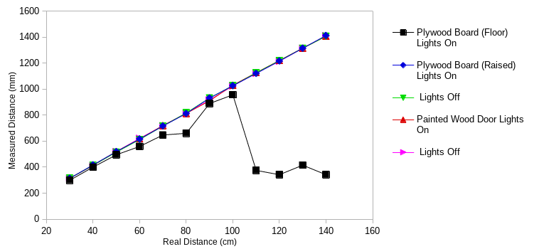
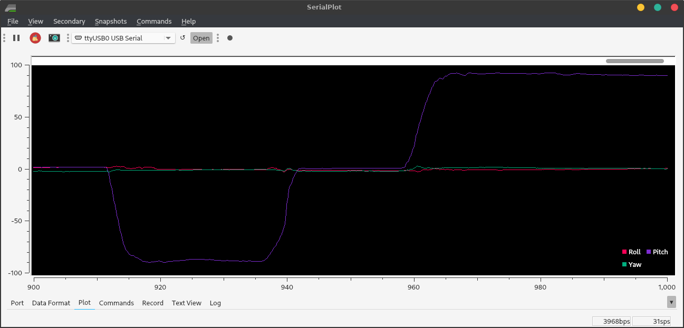
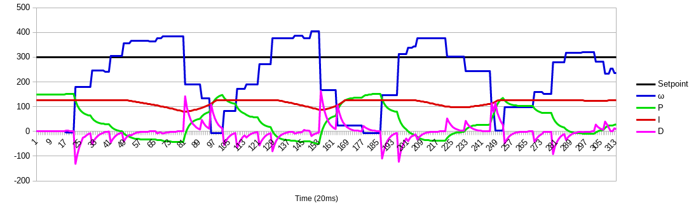

<h4 style="background-color:LightGray" id="navbar">
<a href="#L1">&emsp;Lab 1&emsp;</a>
<a href="#L2">&emsp;Lab 2&emsp;</a>
<a href="#L3">&emsp;Lab 3&emsp;</a>
<a href="#L4">&emsp;Lab 4&emsp;</a>
<a href="#L5">&emsp;Lab 5&emsp;</a>
<a href="#L6">&emsp;Lab 6&emsp;</a>
<a href="#L7">&emsp;Lab 7&emsp;</a>
<a href="#L8">&emsp;Lab 8&emsp;</a><br/>
<a href="#L9">&emsp;Lab 9&emsp;</a>
<a href="#L10">&emsp;Lab 10&emsp;</a>
<a href="#L11">&emsp;Lab 11&emsp;</a>
<a href="#L12">&emsp;Lab 12&emsp;</a></h4>

<h1 id="L1"> Lab 1</h1>

## Goal

The purpose of this lab was to get acquainted with the [SparkFun Artemis Nano](https://www.sparkfun.com/products/15443) and with our custom Ubuntu VM.

## Materials

* 1 SparkFun Artemis RedBoard Nano
* 1 USB A-C cable
* 1 lithium-polymer rechargeable battery
* 1 laptop

## Procedure

### The IDE

Installed [Arduino from the Arch Linux repos](https://wiki.archlinux.org/index.php/Arduino). Only the IDE supports Artemis boards. `arduino-avr-core` is required for the IDE.

Installed the [Arduino core](https://github.com/sparkfun/Arduino_Apollo3) in the IDE:

* Open Tools > Board > Boards Manager in the IDE
* Search for apollo3
* Choose version 1.1.2 in the drop-down
* Click Install (this took several minutes)

Chose the "SparkFun RedBoard Artemis Nano" as the board.

### Testing

Uploaded four example sketches to test various parts of the board:

* Blink (from built-in examples)
* Example2_Serial (from SparkFun Apollo3 examples)
* Example4_analogRead (SparkFun)
* Example1_Microphone (SparkFun)

Also modified Example1_Microphone to blink the built-in LED when whistling.

## Results

### IDE

One pitfall was accessing the COM port, as Linux doesn't give users read-write permission by default. The permanent fix was a custom `udev` rule:
```shell
SUBSYSTEM=="tty" ATTRS{vendor}=="0x8086" ATTRS{subsystem_device}=="0x0740" MODE="0666"
```
Note that the exact requirements for this rule depend on the computer and the distro.

### Testing
The Blink example worked, blinking the blue LED labeled 19.
<video width="600" controls><source src="Lab1/Videos/Blink.mp4" type="video/mp4"></video>

The Serial example both input and output text via the USB serial connection.
<video width="600" controls><source src="Lab1/Videos/Serial.mp4" type="video/mp4"></video>

The analogRead sketch read temperature values which noticeably rose as I held my warm thumb against the device.
<video width="600" controls><source src="Lab1/Videos/Analog.mp4" type="video/mp4"></video>

The Microphone example showed that the loudest frequency doubled when I whistled an octave, indicating that the microphone is working well.
<video width="600" controls><source src="Lab1/Videos/Microphone.mp4" type="video/mp4"></video>

I added two pieces of code to the Microphone example to make it blink the LED when I whistle.

In `void setup()`:
```c++
pinMode(LED_BUILTIN,OUTPUT);
```
In `void loop()`:
```c++
if(ui32LoudestFrequency>800 && ui32LoudestFrequency<2000)
    digitalWrite(LED_BUILTIN,HIGH); // blink the LED when frequency is in whistling range
  else
    digitalWrite(LED_BUILTIN,LOW); // and not otherwise
```

This worked well. (It also picked up my squeaky chair or tapping on my desk.)
<video width="600"><source src="Lab1/Videos/WhistleDetect.mp4" type="video/mp4"></video>

While the Artemis Nano was plugged into my computer, plugging the battery in lit the yellow CHG light.

I commented out all the serial lines of code so that the board would not attempt to establish serial communication with my computer. Then, the board would recognize my whistle on battery too.

[See my code for Lab 1 here.](https://github.com/kreismit/ECE4960/tree/master/Lab1)

<h1 id="L2"> Lab 2</h1>

## Goal

## Materials

* 1 Artemis Nano
* 1 USB dongle
* 1 USB A-C cable
* 1 computer running the Ubuntu 18 VM


## Procedure

### Setup

Downloaded the [distribution code](https://cei-lab.github.io/ECE4960/ece4960lab2dist.zip).
(Re)installed `bleak` using `pip install bleak` at the command line.
Downloaded the sketch `ECE_4960_robot` to the Artemis and opened the serial monitor at 115200 baud.

Entered the folder generated by extracting the ZIP. Ran `./main.py` twice while the Artemis Nano was powered on to discover the board. Manually cached the Artemis' MAC address to `settings.py`.

### Ping Test

Commented out `pass` and uncommented `# await theRobot.ping()` under `async def myRobot.Tasks()` in `main.py`. Ran `./main.py` again while the Arduino serial monitor was still open. Copied the data from the terminal; pasted into a spreadsheet and set space as the delimiter; generated statistics.

### Request Float

Modified `case REQ_FLOAT` in the Arduino sketch `ECE_4960_robot.ino` as follows:

```c++
	case REQ_FLOAT:
		Serial.println("Going to send a float");
        res_cmd->command_type = GIVE_FLOAT;
        res_cmd->length = 6;
        ((float *) res_cmd->data)[0] = (float) 2.71828; // send e
        amdtpsSendData((uint8_t *)res_cmd, res_cmd->length);
		break;
```

In `main.py`, commented `await theRobot.ping()` and uncommented `await theRobot.sendCommand(Commands.REQ_FLOAT)`. Reran `main.py` and received the floating-point value of *e*.

### Bytestream Test

In `main.py`, commented `await theRobot.sendCommand(Commands.REQ_FLOAT)` and uncommented `await theRobot.testByteStream(25)`. Added the following code to `ECE_4960_robot.ino` within `if (bytestream_active)`:

```c++
Serial.printf("Stream %d after %3.1f ms latency\n", bytestream_active, (micros() - finish)*0.001);
int numInts = 3;          // how many integers will fit in this stream
bytestreamCount++;        // we are sending one bytestream now
res_cmd->command_type = BYTESTREAM_TX;
// Two bytes for command_type and for length;
res_cmd->length=2+bytestream_active*numInts; // then 4 bytes for each uint32_t and 8 for each uint64_t
start=micros();
uint32_t integer32 = 0xffffffff;  // different values to indicate whether we're getting a 32-bit
uint64_t integer64 = 0xffffffffffffffff;  // or a 64-bit number
uint32_t *p32;            // pointers to the appropriate data types
uint64_t *p64;
switch(bytestream_active){
  case 4:                 //asked for a 4-byte number!
  p32=(uint32_t*) res_cmd->data;
  for(int i=0; i<numInts-2; i++){ // the -2 is so the last two values can be the time and the count
      memcpy(p32, &integer32, sizeof(integer32));
      p32++;                      // move 4 bits down the array
    }
    memcpy(p32, &bytestreamCount, sizeof(bytestreamCount));
    p32++;
    memcpy(p32, &start, sizeof(start));
    break;
  case 8:               //asked for an 8-byte number!
  default:              // the default is to send a 64-bit (8-byte) array
    p64=(uint64_t*) res_cmd->data;
    for(int i=0; i<numInts-2; i++){
      memcpy(p64, &integer64, sizeof(integer64));
      p64++;                      // move 8 bits down the array
    }
    bytestreamCount64 = (uint64_t) bytestreamCount;
    memcpy(p64, &bytestreamCount64, sizeof(bytestreamCount));
    p64++;
    memcpy(p64, &start, sizeof(start));
    break;
}
amdtpsSendData((uint8_t *)res_cmd, res_cmd->length);
finish=micros();
Serial.printf("Finished sending bytestream after %u microseconds\n",finish-start);
```

where `start` and `finish` were defined as global variables and `finish` was initialized to zero.

Repurposed `bytestream_active` to tell the Artemis how large an integer to send; if `bytestream_active==4` then the Artemis sends back an array of 32-bit (4-byte) integers, and if `bytestream_active==8` then the Artemis sends back 64-bit integers. These maximum values were confirmed by setting `integer32=0xffffffff` and `integer64=0xffffffffffffffff` as the maximum values that can be sent. Because of this usage, changed `await theRobot.testByteStream(25)` to `await theRobot.testByteStream(4)` in the 32-bit case or `await theRobot.testByteStream(8)` for the 64-bit case.

Added the following code to `main.py` within `if code==Commands.BYTESTREAM_TX.value:`

```python
# dataUP = unpack("<III",data) # for 3 32-bit numbers 
dataUP = unpack("<QQQ", data) # for 3 64-bit numbers
# print(f"Received {length} bytes of data")
print(dataUP)
```

## Results

### Ping Test

<video width="600" controls><source src="Lab2/Videos/Ping.mp4" type="video/mp4"></video>

The Bluetooth icon in the statusbar does not appear until `main.py` is run. This indicates that the Python script, rather than the Ubuntu Bluetooth wizard, is establishing the connection.

The ping latency followed this histogram:

<image width="600" src="Lab2/Images/PingRTTHistogram.png"></image>

Using the setting `"OutputRawData": True` in `settings.py` showed me that returning a ping sends 96 bytes of data, all zeroes. Thus, the transfer rate followed this histogram:

<image width="600" src="Lab2/Images/PingRateHistogram.png"></image>

Most of the "rate" in this case is the latency of returning pings. From the Artemis side, I measured the average time between pings as *160.0 ms*. The average total RTT as measured by the Python script was *159.3 ms*. The Artemis sends data very quickly.

### Request Float

<image width="600" src="Lab2/Images/Float.png"></image>

The traceback at the bottom occurred because I stopped the program with Ctrl+C.
Note that although the floating-point value was `2.71828`, there were additional random digits. This means that floats cannot be compared like `if( float1 == float2 )`, but rather `if( abs(float1-float2) < tolerance )`.

### Bytestream Test

#### 32-bit Stream

<image width="600" src="Lab2/Images/Bytestream32.png"></image>
<image width="600" src="Lab2/Images/32-bit.png"></image>

The Python script indicates that it receives 14 bytes of data in each packet. The mean transfer rate is **963 bytes/second**. Note this is the average over the packets which were received; only **65%** of the packets made it to the computer.

<image width="600" src="Lab2/Images/32bitTransferHistogram.png"></image>

#### 64-bit Stream

<image width="600" src="Lab2/Images/Bytestream64.png"></image>
<image width="600" src="Lab2/Images/64-bit.png"></image>

The Python script indicates that it receives 26 bytes of data in each packet. The mean transfer rate is **1.46 KB/second**. Note this is the average over the packets which were received; only **22%** of the packets made it to the computer.

<image width="600" src="Lab2/Images/64bitTransferHistogram.png"></image>

## Lessons Learned

As I experienced, and as [this SuperUser post](https://superuser.com/questions/956622/no-usb-devices-available-in-virtualbox) points out, users must be part of the `vboxusers` group on the host machine, or else no USB devices are accessible from VirtualBox. This and other issues were solved when I did the following, in order:

* Add my user to the host machine's `vboxusers` group.
* In the VirtualBox settings, ensure `Enable USB Controller` is checked.
* Connect the Bluetooth USB dongle.
* Start the VM.
* In the VirtualBox menu bar, mouse to Devices > USB and check `Broadcom Corp 20702A0`.
* Run `main.py` in the CLI.

Adjusting the Ubuntu Bluetooth settings was unnecessary and caused issues. The USB dongle is more reliable than my built-in BLE radio.

Another surprise I shouldn't have experienced was that the code didn't run when I executed `python main.py`. I noted that the file was executable and began with `#!/usr/bin/env python3`. When I ran it as a script, it worked perfectly. `python` was mapped to `python2.7` and not `python3`. Always check versions.

I found that the Python code "cares" what length is sent with the message. The length must match the format string; and the code stops parsing data after `length` bytes.

Lastly, the shorter the data packets were, the more likely they were to reach their destination.

[See my code and data for Lab 2 here.](https://github.com/kreismit/ECE4960/tree/master/Lab2)

<h1 id="L3"> Lab 3</h1>

## Materials Used

* Fancy RC Amphibious Stunt car with remote
* 2 NiCd rechargeable batteries with USB charger
* 2 AA batteries
* Screwdriver
* Ruler / measuring tape
* Timer (app)
* GPS (app)
* Laptop running Ubuntu 18.04 VM with ROS Melodic Morenia


## Procedure

### Physical Robot

Charged each NiCd battery about 8-9 hours before first use (or until the red light on the USB charger stopped flashing.) Inserted NiCd battery into robot and two rechargeable AA batteries into the remote.

Collected various measurements using the available environment, a ruler, and a timer. For clocking speed, used a GPS app to get distance measurements.

### Simulation

Installed `ros-melodic-rosmon`.
Downloaded the [lab 3 base code](https://cornell.box.com/s/p4y4ovp6gu0alvqzog1hctzmcvby9eub) from Box into the folder shared between the host and the VM. Started the VM; extracted the archive; entered the folder extracted from the archive; and ran `./setup.sh`.

<image width="600" src="Lab3/Images/Setup.png"></image>

Closed and reopened the terminal emulator, per the instructions.

Started `lab3-manager`, which was now aliased as shown here. Hit `a` to enter the `Node Actions` menu; then hit `s` to start a simulator.

Opened another terminal window and ran `robot-keyboard-teleop` to allow me to control the simulation.

<image width="600" src="Lab3/Images/Teleop.png"></image>

Played the game and made the measurements below.

## Results and Lessons Learned

### Physical Robot

This video is courtesy of my apartment-mate Ben Hopkins.

<video width="600" controls><source src="Lab3/Videos/Stunts.mp4" type="video/mp4"></video>


The wheelbase is 4 in = 10.5 cm wide and 3.25 in = 8 cm long (measuring from the center of the wheels.) This measurement is useful to determine skid-steering quality.


Unless stated otherwise, the following tests were done on a flat surface.

#### Manual Control

How difficult it is to drive the robot manually helps me understand the difficulty of controlling it algorithmically.

* The three speed settings had significantly different effects. It was virtually impossible to flip when traveling slow; but at max speed I could hardly start without flipping. The top speed and the default speed were nearly the same.
* The robot can turn in place quite predictably; however, it requires a lot of power to skid the wheels, and when the battery is low, it can no longer turn in place.
* Long arc turns are difficult not to do. I could hardly drive straight even if the joysticks were maxed out. In code, driving straight will require a feedback loop.

#### Inertial Measurements

How quickly the robot accelerates and decelerates tells me a lot about the robot's power-to-weight ratio. I don't have a scale, but I can calculate its mass (at least in terms of its motor torque.)

* Acceleration: 6-8 feet to get to full speed. 6-8 feet to coast to a stop. 2-2.5 seconds to accelerate to full speed.
* Can stop quickly by reversing with slow button (2 feet)
* These numbers stayed relatively constant as the battery drained; but the maximum speed decreased.
* Average max speed at full (ish) battery: 12 ft/s = 3.5 m/s = 8 mi/h
* These measurements were the same whether the robot drove forward or backward.

#### Gravitational Measurements

OK, so I know the robot's motors are strong enough to accelerate and decelerate it quickly. How strong is that? Where is the weight in the robot?

* The robot is quite stable – it has to tilt around 75° before it flips.
* The robot is also somewhat topheavy - it flips if it accelerates or stops too suddenly.
* The motors were not very strong – it was sometimes difficult to climb hills. It could climb a 45° slope with a good battery, but it slowed significantly. Rough terrain also slowed it down since it had to climb over many short slopes.

#### Frictional Measurements

* The robot turned about its center predictably on a flat surface, but slopes made a big difference.
* The robot's turn radius was predictable at a given battery level, speed, and type of terrain. Little rocks, initial speed, battery level, and slope all made a big difference.
* Average maximum rotational speed when turning in place: 75 rpm = 7.9 rad/s
* I noticed no differences between driving on flat (hard) carpet, concrete, and asphalt.

#### Other Measurements

* The range was quite good, 250+ feet line-of-sight.
* I could drive the robot around and under cars. The signal can go around at least 10 cars in a parking lot.
* On the first and second runs, the battery lasted 35 min (when the robot was moving about 1/2 the time.)

### Simulation

<video width="600" controls><source src="Lab3/Videos/RobotSim_Functions.mp4" type="video/mp4"></video>

* The robot doesn't seem to have a minimum speed. I can reduce the input speed to 0.01 and less and still it moves (albeit around 1 square per minute.) It seems to have no maximum speed either.
* The same is true for angular speed.
* I could accelerate nearly instantly and reverse direction nearly instantly; the only limiting factor seems to be the frame rate. The time between 1x reverse and 1x forward is the same as between 3x reverse and 3x forward, or 3x forward and 3x reverse, etc.
* When I hit the wall, the robot did not bounce, flip, etc; the simulation paused and showed a warning triangle sign in the place of the robot until I backed away from the wall.
* I could grab and drag the robot using the mouse; as soon as I put the robot down, it resumed motion in the same direction as it was moving before. However, I couldn't both drag/pan and steer at once; the keyboard control only works when the terminal window running `robot-keyboard-teleop` has focus.

[Click here to see my data for Lab 3.](https://github.com/kreismit/ECE4960/tree/master/Lab3/)

<h1 id="L4">Lab 4</h1>

## Materials Used

* Sparkfun Artemis RedBoard Nano
* USB A-C cable
* SparkFun Serial Controlled Motor Driver (SCMD) module (with no jumpers soldered)
* SparkFun Qwiic (I²C) connector cable
* Fancy RC Amphibious Stunt Car
* 4.8V NiCd rechargeable battery
* 3.7V Li-ion rechargeable battery

### Tools and Software

* Laptop with Ubuntu 18.04 VM and Arduino IDE
* Wire cutters (wire stripper would be ideal; scissors also work)
* Small Phillips-head screwdriver (optional)
* Small flat-head screwdriver (required for clamping wires in SCMD)
* Electrical tape
* Duct tape (optional)


## Procedure

### Physical Robot

Reviewed documentation. Removed the aesthetic cover and the motor cover; cut the wires to the motors right at the connectors; stripped about 3/8" of insulation; and connected them to the SCMD. Cut the battery wires close to the control board, stripped the ends, and connected them to the SCMD. 

In Arduino IDE, installed the Serial Controlled Motor Driver library version 1.0.4 (Tools -> Manage Libraries -> search for "SCMD".) Loaded Example1_Wire (from the newly installed SCMD library); changed the I²C device address to `0x5D`; and ran it. It spun the two wheel motors. Used this command: `Serial.printf("Address %d\n",i);` within the `for` loop to tell me what the motor addresses were. Wrote code to spin the motors and found the minimum speed that made the wheels turn.

Removed the RC control board from the robot; pushed the SCMD into its place; and reattached the 
top cover. The Qwiic wire came out between the cover and the case, like this:


Wrote code to make the robot drive in a straight line (using a linear scaling calibration) and took a video.

### Simulation

Downloaded the Lab 4 Base Code from Box into the folder shared between the host and the VM. In the VM, opened a terminal window; entered the shared folder; extracted the base code; and ran `setup.sh` in the appropriate folder.

Closed and reopened terminal window. Ran `lab4-manager` and followed the instructions to open a simulator window.

Opened another terminal window (`Ctrl+Alt+T`). Entered the directory `/home/artemis/catkin_ws/src/lab4/scripts` and ran `jupyter lab`.

In the resulting Firefox window, opened the Jupyter notebook `lab4.ipynb`. Followed the instructions and saved the lab notebook.

## Results and Notes

### Physical Robot

Running the example code, when the motor driver was plugged in, gave the result

	I2C device found at address 0x5D  !

Not surprisingly, the addresses of the wheel motors were 0 and 1 (since the SCMD drives up to two motors.)

I could not fit the Qwiic connector through the start button hole.

The minimum power at which I could make the wheels spin was not the same on either side. On the left (address 0) it was about 46; on the right (address 1) it was about 50. These numbers seem to change as the battery level changes.

I reasoned that the friction in the wheels is a constant force, not a velocity-dependent one, so the frictional resistance should be a constant offset. This seemed to to work; at low power, I needed +4 power on the right side, and the same should be true at higher power levels. However, the wheels were not exactly the same size, as evidenced by the fact that the robot drove in a curve. By trial and error, I scaled the left side up by 8% to compensate for this, and then the robot drove straighter.

When I assembled the robot, I found that the electrical tape wasn't sticky enough to hold the Artemis Nano onto the robot case; and zip ties would prevent me from replacing the battery. So I used duct tape instead.

Below is a video of a straight line (triggered by a whistle).

<video width="600" controls><source src="Lab4/Videos/DriveStraightWhistle.mp4" type="video/mp4"></video>

Also, note that I could not set to recognize higher-frequency whistles, or else the robot would pick up the sound of its own motors and keep on driving.

The next two videos show two of my attempts to make it drive in a triangle, using the following code (with different wait times):

	for(int i=0; i<3; i++){
		  myMotorDriver.setDrive( right, 1, power);             // 1 for forward
		  myMotorDriver.setDrive( left, 0, calib*power+offset); // left side is reversed
		  int t = millis();
		  while (millis()-t < 350){ // Wait for a specified time, but keep updating the PDM data
		    myPDM.getData(pdmDataBuffer, pdmDataBufferSize);
		  }
		  // Coast to a stop
		  myMotorDriver.setDrive( left, 1, 0);                  // Set both sides to zero
		  myMotorDriver.setDrive( right, 1, 0);
		  t = millis();
		  while (millis()-t < 500){ // Wait for a specified time, but keep updating the PDM data
		    myPDM.getData(pdmDataBuffer, pdmDataBufferSize);
		  }
		  // Spin in place
		  myMotorDriver.setDrive( right, 1, power);             // 1 for forward
		  myMotorDriver.setDrive( left, 1, calib*power+offset); // left side is NOT reversed since we're spinning!
		  t = millis();
		  while (millis()-t < 290){ // Wait for a specified time, but keep updating the PDM data
		    myPDM.getData(pdmDataBuffer, pdmDataBufferSize);
		  }
		  // Coast to a stop
		  myMotorDriver.setDrive( left, 1, 0);                  // Set both sides to zero
		  myMotorDriver.setDrive( right, 1, 0);
		  t = millis();
		  while (millis()-t < 500){ // Wait for a specified time, but keep updating the PDM data
		    myPDM.getData(pdmDataBuffer, pdmDataBufferSize);
		  }
		}

The open-loop control is very sensitive to

* Timing (the difference between the first and the second videos is 20 ms)
* Surfaces (hardly turns on carpet; spins easily on tile)
* Battery level (in less than a minute, the robot would no longer turn enough)

<video width="600" controls><source src="Lab4/Videos/BadTriangle.mp4" type="video/mp4"></video>

<video width="600" controls><source src="Lab4/Videos/BetterTriangle.mp4" type="video/mp4"></video>

### Simulation

```shell
artemis@artemis-VirtualBox:~$ cd Shared
artemis@artemis-VirtualBox:~/Shared$ ls
 ...
 lab4_base_code.zip
...
artemis@artemis-VirtualBox:~/Shared$ unzip lab4_base_code.zip
Archive:  lab4_base_code.zip
   creating: lab4_base_code/
  inflating: lab4_base_code/bash_aliases  
  inflating: lab4_base_code/setup.sh  
  inflating: lab4_base_code/lab4.zip  
artemis@artemis-VirtualBox:~/Shared$ ls
...
 lab4_base_code
 lab4_base_code.zip
...
artemis@artemis-VirtualBox:~/Shared$ cd ./lab4_base_code/
artemis@artemis-VirtualBox:~/Shared/lab4_base_code$ ls
bash_aliases  lab4.zip  setup.sh
artemis@artemis-VirtualBox:~/Shared/lab4_base_code$ ./setup.sh 
 > Log output written to: /home/artemis/Shared/lab4_base_code/output_lab4.log 
 > Lab Work Directory: /home/artemis/catkin_ws/src/lab4/scripts/ 
Validating...
Step 1/3: Extracting Files to: /home/artemis/catkin_ws/src/ 
Step 2/3: Setting up commands
Step 3/3: Compiling Project

Successfully compiled lab.
NOTE: Make sure you close all terminals after this message.
artemis@artemis-VirtualBox:~/Shared/lab4_base_code$ exit
```

My working open-loop square was as follows:

```python
# Your code goes here
for i in range(4):
    robot.set_vel(1,0)
    time.sleep(0.5)
    robot.set_vel(0,1)
    time.sleep(1.625)
robot.set_vel(0,0)
```

It was easy to tune the timing so that the robot predictably drove in a perfect square, like this:

<video width="600" controls><source src="Lab4/Videos/SimRectangle.mp4" type="video/mp4"></video>

See the rest of my code, and the Jupyter notebook, [here](https://github.com/kreismit/ECE4960/tree/master/Lab4). Also see additional things I learned and notes in the [Other Lessons Learned](https://github.com/kreismit/ECE4960/tree/master/Notes/OtherLessonsLearned.md) page.


<h1 id="L5">Lab 5</h1>

## Background

## Materials

### Components

* SparkFun Artemis RedBoard Nano
* USB A-C cable
* SparkFun 4m time-of-flight sensor (VL53L1X)
* SparkFun 20cm proximity sensor (VCNL4040)
* SparkFun Serial Controlled Motor Driver (SCMD) module (with no jumpers soldered)
* SparkFun Qwiic (I²C) connector cable
* Fancy RC Amphibious Stunt Car
* 4.8V NiCd rechargeable battery
* 3.7V Li-ion rechargeable battery
* Boxes and targets of various sizes

### Tools and Software

* Laptop with Ubuntu 18.04 VM and Arduino IDE
* Wire cutters (scissors also work)
* Small Phillips-head screwdriver (may substitute flathead)
* Ruler (or printed graph paper)
* Gray target (printed; 17% dark)
* Electrical tape
* Double-sided tape or sticky pad

## Prelab

The two sensors are quite different. The long-range ToF sensor (VL53L1X) has a field of view of about 15 degrees, and it has a much longer range. It can safely be put near the ground without seeing the ground; it could miss obstacles right in front of the wheels since the detection cone is very narrow near the robot. Outside of its detection cone, the prox sensor (VCNL4040) has a wider field of view (&pm;20&deg; = 40&deg;) so it may be placed right at the center of the robot and hopefully it will pick up the obstacles close and to the side, which would be missed by the VL53L1X. Also note that the VCNL4040 maxes out within the range of the VL53L1X, so there is some overlap where the two sensors' readings may be compared.

These two distance sensors exemplify the main types of infrared ranging sensors.

* Infrared intensity measurement: This uses the inverse-square law to determine the distance to an object. However, the coefficient of the inverse-square law varies widely with color, and this intensity is also extremely sensitive to ambient light. The VCNL4040 uses intensity measurement.
* Infrared time-of-flight (ToF): This works like RADAR, by measuring the elapsed time for the optical signal to bounce back. It is more immune to noise than intensity measurement, but it is still vulnerable to interference from ambient light.
* Infrared angle measurement: This uses the angle (sometimes in conjunction with ToF) of the returned light to triangulate the distance. It eliminates some more of the problems of ToF, but is again sensitive to ambient light and refraction / angle of the reflector. The VL53L1X uses both angle and ToF measurement.

Other available ranging sensors include SONAR (used in submarines and bats ☺) and RADAR (used in aircraft.) Since the width of a diffracted beam decreases with increasing wavelength, both of these require some sort of beam-steering to get a sufficiently narrow beam to see only what's in front of the robot. IR ranging is thus simpler and usually cheaper to use.

## Procedure

### Physical Robot

Skimmed the documentation for the [VCNL4040](https://www.vishay.com/docs/84274/vcnl4040.pdf) and the SparkFun [repo](https://github.com/sparkfun/SparkFun_VCNL4040_Arduino_Library) and [hookup guide](https://learn.sparkfun.com/tutorials/qwiic-proximity-sensor-vcnl4040-hookup-guide). Noted that the default I²C address of the sensor is `0x60`.
In the Arduino IDE, installed the [SparkFun VCNL4040 Arduino Library](https://github.com/sparkfun/SparkFun_VCNL4040_Arduino_Library) using Tools > Manage Libraries.

Reviewed the [datasheet](https://cdn.sparkfun.com/assets/8/9/9/a/6/VL53L0X_DS.pdf) and the [manual](https://cdn.sparkfun.com/assets/e/1/8/4/e/VL53L1X_API.pdf) for the VL53L1X.

Ran `Example1_Wire` (File > Examples > Wire) to find all I²C addresses. Ran `Example4_AllReadings` (File > Examples > SparkFun VCNL4040 Proximity Sensor Library) to measure data. Tested on ~~four~~ five different targets under various conditions. Recorded data once the reading stabilized (after about 5s.) When the data fluctuated wildly (e.g. at very close ranges) took the median and rounded.

In the Arduino IDE, installed the [SparkFun VL53L1X Arduino Library](https://github.com/sparkfun/SparkFun_VL53L1X_Arduino_Library) using Tools > Manage Libraries. Ran `Example1_Wire` again to find the I²C address of the time-of-flight sensor. Tested ranging once and saw that it needed calibration. Calibrated using `Example7_Calibration` (File > Examples > SparkFun VL53L1X Distance Sensor). Adjusted offset accordingly in `Example1_ReadDistance` and tested ranging on several targets with the lights on and with the lights off.

Wrote and tested an obstacle-avoidance program.

### Simulation

Downloaded and extracted the [lab 5 base code](https://cornell.box.com/s/a7t117nifn7q9esjshoj5qx0jmmjm26y). Entered the directory and ran `setup.sh`. Closed the terminal window.

Entered the directory `~/catkin_ws/src/lab5/scripts/`. Ran `jupyter lab`; opened `lab5.ipynb'; followed the instructions in the Jupyter Notebook.

## Results and Notes

### Physical Robot

```
Unknown error at address 0x5D
Unknown error at address 0x5E
Unknown error at address 0x5F
I2C device found at address 0x60  !
Unknown error at address 0x61
Unknown error at address 0x62
Unknown error at address 0x63
```

The VCNL4040 indeed had the default I²C address of `0x60`.

When testing the ranging for both sensors, I found it useful to tape the sensor to a fixed object, as suggested in the instructions. For me, it was a screwdriver case.


Figure 1. Ranging test with VCNL4040.

When running `Example4_AllReadings`, I noticed that the sensor readings took 3-5 seconds to stabilize. It seems like there is a rolling-average filter or an integrator in the sensor. I was also a bit surprised since the "prox reading" wasn't a range estimate (like it is on ultrasonic rangefinders), but an intensity which scales with the inverse-square law. After gathering data from several surfaces, I found that my data looked much like the screenshot shown in the lab instructions.

I was pleasantly surprised that the VCNL4040 proximity ranges were about the same whether I had the lights on or off, and even if I shone a flashlight on the sensor. Both the shadow of the target and the red LED on the board significantly affected brightness readings as the sensor approached the target, so I recorded brightness at 20cm away where these had less effect.


Figure 2. Ranging test with desk leg and VCNL4040.

With the desk leg, I noticed that the readings were much worse than they were for other objects. At first I assumed it was the reflectivity of the surface, but I noted three other things:

* The graph paper was rumpled. Was the sensor seeing the paper instead? Turning the sensor sideways (so it completely missed the leg) gave approximately the same readings. Maybe it was seeing the paper.
* The reading varied significantly when the sensor moved side to side. Was it the width?
* The desk leg wasn't parallel to the sensor, and I noticed that angles mattered in the case of the plywood too. But, holding the sensor off the ground and pointing it directly at the angled leg didn't make much difference.

I repeated a few measurements of the desk leg with a ruler instead of the graph paper, and achieved the same results.

I also added an additional measurement of the box on its side, ruling out the possibility that it was the object's width and not its surface texture.


Figure 3. Prox data vs. real range.

As the SparkFun hookup guide predicted, the I²C address of the ToF sensor was `0x29`.

```
Unknown error at address 0x26
Unknown error at address 0x27
Unknown error at address 0x28
I2C device found at address 0x29  !
Unknown error at address 0x2A
Unknown error at address 0x2B
Unknown error at address 0x2C
```

My first reading at 20cm distance showed 140cm instead, so I tried to run the `Example7_Calibration`. However, this code didn't work. I traced the problem to the line `while (!distanceSensor.checkForDataReady())`, as the loop kept running forever and the sensor was never ready. Comparing this example code to `Example1_ReadDistance` (which worked) I noticed that `distanceSensor.startRanging()` had never been called. Adding this line to the example gave me successful (and repeatable) calibration.

```
*****************************************************************************************************
                                    Offset calibration
Place a light grey (17 % gray) target at a distance of 140mm in front of the VL53L1X sensor.
The calibration will start 5 seconds after a distance below 10 cm was detected for 1 second.
Use the resulting offset distance as parameter for the setOffset() function called after begin().
*****************************************************************************************************

Sensor online!
Distance below 10cm detected for more than a second, start offset calibration in 5 seconds
Result of offset calibration. RealDistance - MeasuredDistance=37 mm
```

Then, I slightly modified the example distance-reading code as follows:

In `void setup()`, added a line `distanceSensor.setOffset(37);`

In `void loop()`, added code to time each range measurement and to print the time to the serial output.

When I tried different timing budgets, I didn't see much improvement in precision when using timing budgets over 60 ms in short-range mode or over 180 ms in long-range mode. These maximum timing budgets seemed to be the best compromise between accuracy and speed; adding more doesn't gain much accuracy, and reducing more doesn't gain much speed.

I noticed that, as the datasheet said, the ranging in ambient light was significantly more precise when I used short mode. The same seemed to be true in the dark, however. My data, plotted below, shows these trends. Note that some "waves" in the graphs are repeated for all surfaces.


Figure 3. Ranging setup with plywood.

The ToF sensor was much less sensitive to the width of the object being detected; it made no difference what the orientation of the box was. It was somewhat sensitive to the angle of the plywood board, but only at short distances (where the VCNL4040 might be a better choice.)


Figure 4. Ranging setup with door (using graph paper for 20cm or less). Note: used measuring tape and taller box for long-range testing.


Figure 5. Measured range (short range mode) vs. real range.

In the long-range case, my (mini) tape measure was only 1 m long, so I added an 18" ruler at the end of the tape measure to reach 1.4 m. The ToF sensor was surprisingly immune to small changes in angle (probably because the beam spans about 15°); but, when mounted low, it kept picking up the rough carpet, leading to noisy and very inaccurate measurements. To mount the sensor higher, I taped it to the box of the RC car. That is why there is a series which dips back down, and another series labeled "raised".

The VL53L1X ToF sensor didn't seem to see the metal desk leg at all. Hence, I did not gather range data for that. This will obviously cause bloopers when the robot cannot see shiny metal objects. 


Figure 6. Measured range (long range mode) vs. real range.

Unfortunately, the SparkFun library doesn't have a function to output the signal or the sigma values. It can only set the thresholds. By default, these are

	Signal intensity threshold: 0.0 
	Standard deviation threshold: 0.0

This seems to mean that there is no threshold. (I tried showing more decimal places and they were also zeros.)

I also didn't notice much change in accuracy when I increased or decreased the time between measurements (at least not during manual testing.) By default, it is

	100 ms between measurements.

When I moved the ToF sensor back and forth suddenly, it still gave consistent readings as fast as I could move it. Without knowing what typical standard deviations and signal intensities were, I didn't have data to improve the values. So, I left these values at their defaults.

#### Update on Robot Construction

The wires now fit through the hole; I used the Qwiic-to-serial connectors and fed the pins through one at a time.

Both sensors are taped securely on the front using the double-sided tape.

The IMU and the Artemis board are also taped to the top. Unfortunately, the tape isn't that sticky and the top is slippery, so they keep coming off. I intend to use duct tape again after the next lab.

The LiPo battery is taped to the bottom of the robot. This eliminates mess on the top and makes it easier to unplug or replace the battery without removing the Artemis. It also allows the Artemis USB-C port to face off the edge of the robot, so I can easily plug and unplug it to upload code.


Figure 7. Front of robot, showing rangefinders (front), IMU (top, front), and RedBoard Artemis (top, back).


Figure 8. Rear of robot, showing RedBoard Artemis (top, front), IMU (top, back), and LiPo battery (underneath, unplugged.)

#### Obstacle Avoidance

Unfortunately, I spent a long time taking data and didn't get obstacle avoidance working in time. Below, I made the mistake of using a binary on-off speed control with too long of a minimum range. 

<video width="600" controls><source src="Lab5/Videos/disco.mp4" type="video/mp4"></video>

I was able to drive faster and still be able to stop when I set the robot to control its speed by how far away it was from an obstacle.

<video width="600" controls><source src="Lab5/Videos/firstsuccess.mp4" type="video/mp4"></video>

Backing up while turning gave even better results. Note the deceleration as it approaches an obstacle.

<video width="600" controls><source src="Lab5/Videos/secondsuccess.mp4" type="video/mp4"></video>

The robot can drive pretty fast without hitting the wall. Below is a video of it driving down a 0.4m tape strip. Note the deceleration.

<video width="600" controls><source src="Lab5/Videos/speedtest.mp4" type="video/mp4"></video>

This one is faster, after I get the robot to aim the right direction:

<video width="600" controls><source src="Lab5/Videos/dodge.mp4" type="video/mp4"></video>

See all my range measurements, pictures, videos, and code [here on GitHub](https://github.com/kreismit/ECE4960/tree/master/Lab5).

##### Physical Robot - Data

Ex post facto, I realized that I typed square brackets instead of parentheses when inserting my graphs. See above for the data which was there, but not there. Adding to Lessons Learned.

### Simulation

This was a simple exercise after previous labs. I found that it was much easier to dodge walls when the robot traveled in arcs, so I set it to always drive in long arcs since it's impossible to be perfectly parallel to a wall.

```python
def perform_obstacle_avoidance(robot):
    while True:
        # Obstacle avoidance code goes here
        if robot.get_laser_data()<0.5:
            robot.set_vel(0.0,0.5)  # turn
            initialAngle = robot.get_pose()[2]
            angleTurned = 0
            while angleTurned < 0.5: # turn about 30 degrees, then read again
                angleTurned = robot.get_pose()[2]-initialAngle
            robot.set_vel(0,0)
        else:
            robot.set_vel(0.5,0.05)  # drive in a slight curve since we will
                                    # never be exactly parallel to a wall
        time.sleep(0.1)
           
perform_obstacle_avoidance(robot)
```

The turning function uses a while loop to ensure it turns (at least) 30 degrees. Since this simulated robot starts and stops basically instantly, it will turn exactly 30 degrees.

<video width=600 controls><source src="Lab5/Videos/ArcObstAvoidTest.mp4" type="video/mp4"></video>

The reasoning for this is to allow the robot to "follow" walls to which it is neither perpendicular nor parallel. (Good practice for my room with lots of angles.) However, in this perfect simulated environment, all the surfaces are perpendicular to each other. A simplified version and its performance are shown below.

<video width=600 controls><source src="Lab5/Videos/SimObstAvoid.mp4" type="video/mp4"></video>

See all my code [here on GitHub](https://github.com/kreismit/ECE4960/tree/master/Lab5). Also see additional things I learned and notes in the [Other Lessons Learned](https://github.com/kreismit/ECE4960/tree/master/Notes/OtherLessonsLearned.md) page.

<h1 id="L6">Lab 6</h1>

## Materials Used

* Robot from lab 5, containing
    * Driving base of RC car
    * 4.8V NiCd battery
    * SparkFun Serially Controlled Motor Driver (SCMD)
    * SparkFun VCNL4040 IR proximity sensor breakout board
    * SparkFun VL53L1X IR rangefinder breakout board
    * SparkFun ICM-20948 9 DoF IMU breakout board
    * SparkFun RedBoard Artemis
    * 3.7v LiPo battery
    * 4 short SparkFun Qwiic (I²C) connector cables (or long cables and zip ties)
    * Electrical tape, duct tape, and sticky pads (3M)
* Computer with the following software:
    * Course Ubuntu 18.04 VM (installed in Lab 1)
    * Arduino IDE with Artemis RedBoard Nano board installed
    * At least the following Arduino libraries:
        * Core libraries (Arduino, etc.)
        * Serial Controlled Motor Driver (Sparkfun)
        * SparkFun 9DoF IMU Breakout - ICM 20948 - Arduino Library
        * SparkFun VCNL4040 Proximity Sensor Library
        * SparkFun VCNL53L1X 4m Laser Distance Sensor
    * Optional: [SerialPlot](https://hackaday.io/project/5334-serialplot-realtime-plotting-software) - also on [sourcehut](https://hg.sr.ht/~hyozd/serialplot/)
* USB A-C cable (for a computer with USB A ports)
        
## Procedure

### Physical Robot (part *a*)
Reviewed the [Sparkfun product info and documentation](https://www.sparkfun.com/products/15335) for the [ICM-20948 IMU](https://cdn.sparkfun.com/assets/7/f/e/c/d/DS-000189-ICM-20948-v1.3.pdf). Noted (among other things) that the default I²C address is `0x69`.

With the *SparkFun 9DoF IMU Breakout - ICM 20948 - Arduino Library* installed, and the IMU connected to the Artemis via a Qwiic cable, ran the `Example1_Wire` Arduino sketch (Arduino IDE: File > Examples > Wire (under "Examples for Artemis RedBoard Nano"). Confirmed the default I²C address.

Ran the `Example1_Basics` Arduino sketch (accessed from the IDE by File > Examples > SparkFun 9DoF IMU Breakout - ICM 20948 - Arduino Library). Confirmed that the IMU read out sensible values on all nine axes. 

Wrote code to calculate the tilt angle using the accelerometer. Wrote code to calculate roll, pitch, and yaw using the gyroscope. Wrote code to calculate the yaw angle using the magnetometer. Wrote sensor fusion code using the accelerometer and the gyroscope.

Added features to the Bluetooth communication code allowing it to send IMU data and to receive motor commands over Bluetooth. Modified command set to add a "ramp" command (optional) and wrote Python code to spin in place, ramping the motor values from zero to maximum and back again. Collected IMU rotation rate data from the spin experiment. Wrote Python code to spin the robot at a constant speed; adjusted this speed to find a minimum and measured it using IMU data. Wrote Python code to implement a PI control of the rotation rate.

### Simulation (part *b*)

Downloaded and extracted the [lab six base code](https://cornell.box.com/s/psr506o6sw2l65fw6q98khu0fjdwvydk). In the VM, entered the folder and ran `./setup.sh`. Closed and reopened the terminal window. Started `lab6-manager` and `robot-keyboard-teleop`. Entered `/home/artemis/catkin_ws/src/lab6/scripts` and started `jupyter lab`. Ensured the notebook kernel used Python 3.

Followed the notebook instructions.

## Results and Notes

Yes, the Wire code found an I²C device at `0x69`. It also still recognized the other three I²C devices at the same default addresses. I won't bore you with the output.

There was a magnet in my computer (to hold the lid shut.) The magnetometer readings near that magnet changed drastically as I moved the IMU from one side of the magnet to the other. All other readings were sensible (with constant offsets.) Below are demos of accelerometer and gyroscope readings.


Figure 1. Accelerometer data when the robot is tilted, then flipped upside-down. The data is in milli-*g*'s; *z* is facing down when the robot is level. The axis facing the ground reads 1 *g* when it's head-on; when it isn't, the gravitational acceleration is distributed among the axes. 


Figure 2. Accelerometer data when the robot is rotated about 90° about its three axes. The data is angular rate: the derivative of the robot's three orientation angles. Matching the product datasheet, rotating it CCW about Z, and then back, gave a positive spike and then a negative spike with equal area. Rotating it CW about Y, and then back, gave it a negative spike and then a positive spike with equal area. Rotating it CCW about X, and then back, gave it a positive spike, and then a negative spike with equal area.


Figure 3. Bonus: if I rotate slowly, the peaks are the same area, but flattened out! The bigger peaks are from when my hand slipped and I bumped the Qwiic cable. Also note the noise in the background when the robot is stationary!

### Finding Tilt from Accelerometer Data

At first, I tried finding angle using `atan2`. This was horribly noisy at 90° because the *z* acceleration, in the denominator, approached zero when the robot was tilted 90°: one axis would be accurate and the other would have nearly ±90° of noise. I solved this problem by dividing by the total acceleration and using `asin` instead:

```c++
aX = myICM.accX(); aY = myICM.accY(); aZ = myICM.accZ();
a = sqrt(pow(aX,2)+pow(aY,2)+pow(aZ,2));
roll = asin(aX/a)*180/M_PI;
pitch = asin(aY/a)*180/M_PI;
Serial.printf("%4.2f,%4.2f\n",roll,pitch);
```

Below is the output as I moved from -90° to 0° to 90° in roll and pitch, respectively.


Figure 4. Accelerometer angle readings from roll at right angles.


Figure 5. Accelerometer angle readings from pitch at right angles.

The accelerometer is quite accurate (though noisy.) Using SerialPlot, I found that it detected the 5° curve of the top of the robot. It consistently reads about 88° tilt when I tilt it 90° &ndash; probably for the same reason it reads more than 1 *g* when it's level: calibration.

### Finding Angles from Gyroscope Data

The gyroscope angles were much less noisy, since the angle is acquired by integrating the rate, the angle looks like it's been through a low-pass filter. 
Precise calibration is difficult, since the gyroscope's angular rate measurements change both in short and in long time spans. So, some drift in the readings is inevitable, but this calibration code worked well.

```c++
  //// Calibrate gyroscope angles
  //Serial.println("Calibrating gyro...");
  int tCal = calTime*1000000;       // 1 sec = 1000000 microseconds
  float thXCal = 0, thYCal = 0, thZCal = 0; // angles to measure during calibration while the gyro is stationary
  tNow = micros();
  int tStartCal = tNow;             // starting calibration now!
  while(tNow-tStartCal < tCal){     // run for tCal microseconds (plus one loop)
    tLast = tNow;                   // what was new has grown old
    delay(tWait);
    myICM.getAGMT();                // The values are only updated when you call 'getAGMT'
    tNow = micros();                // update current time
    dt = (float) (tNow-tLast)*0.000001; // calculate change in time in seconds
    omX = myICM.gyrX(); omY = myICM.gyrY(); omZ = myICM.gyrZ(); // omega's (angular velocities) about all 3 axes
    thXCal = thXCal + omX*dt;                 // update rotation angles about X (roll)
    thYCal = thYCal + omY*dt;                 // Y (pitch)
    thZCal = thZCal + omZ*dt;                 // and Z (yaw)
  }
  // and we want the average rotation rate in deg/s after that loop
  omXCal = thXCal / calTime;
  omYCal = thYCal / calTime;
  omZCal = thZCal / calTime;
  //Serial.printf("Calibration offsets: X %6.4f, Y %6.4f, Z %6.4f degrees per second\n",omXCal,omYCal,omZCal);
```

[//]: # (In another project, I sometimes achieved 1°/hour or less. But not consistently.) 

Below are the results of the same type of test as I ran on the accelerometer: rotating each axis to -90°, 0°, and +90°.


Figure 6. Gyro angle readings from roll at right angles.


Figure 7. Gyro angle readings from pitch at right angles.


Figure 8. Gyro angle readings from yaw at right angles.

Note how stable the readings are, compared to those of the accelerometer. The wiggles in the graph are *real* - I was repositioning the robot or not holding it perfectly still. However, the gyro readings can be ruined by bad calibration.


Figure 9. Calibration doesn't always work.

With sampling rates of 1 kHz or less, I noticed that *the integration was always more accurate with a faster sampling rate*, regardless of calibration time.

[//]: #(Even with long calibration times like 10s, slow sampling rates like 10 Hz predictably experienced bad drift. My explanation is that the noise in the gyro is aliased when the measurement frequency is too low; the aliasing effect worsens when the measurement frequency is farther off. I expected that increasing the sampling rate for calibration and decreasing it for measurement would be a good compromise; but actually both matter.)

I tried removing delays, giving a sampling rate of about 10 kHz. The result was no more accurate, and there were massive spikes or sometimes step changes. I hypothesize that this happened when a noise spike coincided with a short loop cycle.

[//]: # (the baud rate seemed to be the limiting factor)

I left the wait time at 10ms (100Hz sampling rate) for the rest of the lab.

I got the best results thus far from a complementary filter with α=0.3 and a correction factor of 1 for the accelerometer. α=0.5 works fine, but is noisy. The main bumps in this graph are from my imperfect movements. Drift is about 1° per minute for yaw and zero for the other axes.


Figure 10. Roll, pitch, and yaw tests; roll and pitch have a complementary filter with α=0.3 in favor of the gyroscope.

```c++
  if( myICM.dataReady() ){
    myICM.getAGMT();                // The values are only updated when you call 'getAGMT'
    tLast = tNow;                   // the new has grown old
    tNow = micros();
    dt = (float) (tNow-tLast)*0.000001; // calculate change in time in seconds
    // printRawAGMT( myICM.agmt );     // Uncomment this to see the raw values, taken directly from the agmt structure
    // printScaledAGMT( myICM.agmt);   // This function takes into account the scale settings from when the measurement was made to calculate the values with units
    aX = myICM.accX(); aY = myICM.accY(); aZ = myICM.accZ();
    omX = myICM.gyrX()-omXCal;          // omega's (angular velocities) about all 3 axes
    omY = myICM.gyrY()-omYCal;
    omZ = myICM.gyrZ()-omZCal;
    thX = thX + omX*dt;                 // update rotation angles about X (roll)
    thY = thY + omY*dt;                 // Y (pitch)
    thZ = thZ + omZ*dt;                 // and Z (yaw)
    a = sqrt(pow(aX,2)+pow(aY,2)+pow(aZ,2));  // calculate total acceleration
    rollXL = asin(aY/a)*compFactorRoll*rad2deg;
    pitchXL = asin(aX/a)*compFactorPitch*rad2deg;
    roll = alpha*rollXL + (1-alpha)*thX;  // complementary filter
    pitch = alpha*pitchXL + (1-alpha)*thY;
    thX = roll; thY = pitch;              // overwrite any gyro drift
    yaw = thZ;                            // still waiting for the magnetometer
    Serial.printf("%4.2f,%4.2f,%4.2f\n",roll,pitch,yaw); // and print them
    delay(tWait);
  }
```

### Finding Angles from the Magnetometer

Besides obvious things like DC motors, there are magnets to hold our laptops shut, magnets in screwdrivers, and lots of steel beams in buildings. Moving the IMU into the center of my room, away from known magnets, I still saw a constant magnetic field of 50 μT into the floor. Worse, the field near the DC motors is about 1000 μT compared to 25-65 μT from Earth.


Figure 11. Magnetometer readings on top of the chassis, sitting still and pointing nearly north.

A miniscule ~60 Hz oscillation is superimposed on the constant field. But, when I roll the robot back and forth with my hand:


Figure 12. Magnetometer readings when backdriving the motors.

I was able to calibrate away all the constant fields and achieve sensible angle readings when the wheels didn't turn. However, the change in magnetic field when the wheels turn is of similar magnitude to that of the Earth (about 20 μT amplitude) so I couldn't get reliable magnetometer readings.


Figure 13. Magnetometer angle readings: decently accurate until the motors turn.

```c++
  //// Calibrate gyroscope and magnetometer readings
  // For magnetometer calibration to work, it must begin pointing north.
  //Serial.println("Point me north!")
  //delay(1000);
Serial.println("Calibrating...");
  int tCal = calTime*1000000;       // 1 sec = 1000000 microseconds
  float thXCal = 0, thYCal = 0, thZCal = 0; // angles to measure during calibration while the gyro is stationary
  tNow = micros();
  int tStartCal = tNow;             // starting calibration now!
  while(tNow-tStartCal < tCal){     // run for tCal microseconds (plus one loop)
    if( myICM.dataReady() ){
      tLast = tNow;                   // what was new has grown old
      delay(tWait);
      myICM.getAGMT();                // The values are only updated when you call 'getAGMT'
      tNow = micros();                // update current time
      dt = (float) (tNow-tLast)*0.000001; // calculate change in time in seconds
      omX = myICM.gyrX(); omY = myICM.gyrY(); omZ = myICM.gyrZ(); // omega's (angular velocities) about all 3 axes
      thXCal = thXCal + omX*dt;                 // update rotation angles about X (roll)
      thYCal = thYCal + omY*dt;                 // Y (pitch)
      thZCal = thZCal + omZ*dt;                 // and Z (yaw)
      mXCal = mXCal + myICM.magX();
      mYCal = mYCal + myICM.magY();
      mZCal = mZCal + myICM.magZ();
      count++;      // total number of magnetometer readings taken (for gyro we care about rate; for mag we care about total)
    }
  }
  // and we want the average rotation rate in deg/s after that loop
  omXCal = thXCal / calTime;
  omYCal = thYCal / calTime;
  omZCal = thZCal / calTime;
  mXCal = mXCal / count;
  mXCal = mXCal - 40;   // Compensate for the earth's magnetic field
  mYCal = mYCal / count;
  mZCal = mZCal / count;
  //Serial.printf("Calibration offsets: X %6.4f, Y %6.4f, Z %6.4f degrees per second\n",omXCal,omYCal,omZCal);


// Loop: Read angles
if( myICM.dataReady() ){
    myICM.getAGMT();                // The values are only updated when you call 'getAGMT'
    tLast = tNow;                   // the new has grown old
    tNow = micros();
    dt = (float) (tNow-tLast)*0.000001; // calculate change in time in seconds
    // printRawAGMT( myICM.agmt );     // Uncomment this to see the raw values, taken directly from the agmt structure
    // printScaledAGMT( myICM.agmt);   // This function takes into account the scale settings from when the measurement was made to calculate the values with units
    aX = myICM.accX(); aY = myICM.accY(); aZ = myICM.accZ();
    omX = myICM.gyrX()-omXCal;          // omega's (angular velocities) about all 3 axes
    omY = myICM.gyrY()-omYCal;
    omZ = myICM.gyrZ()-omZCal;
    mX = myICM.magX()-mXCal;            // m's (normalized magnetometer readings) along all 3 axes
    mY = myICM.magY()-mYCal;
    mZ = myICM.magZ()-mZCal;
    thX = thX + omX*dt;                 // update rotation angles about X (roll)
    thY = thY + omY*dt;                 // Y (pitch)
    thZ = thZ + omZ*dt;                 // and Z (yaw)
    a = sqrt(pow(aX,2)+pow(aY,2)+pow(aZ,2));  // calculate total acceleration
    rollXL = asin(aY/a)*compFactorRoll*rad2deg;
    pitchXL = asin(aX/a)*compFactorPitch*rad2deg;
    roll = alpha*rollXL + (1-alpha)*thX;  // complementary filter
    pitch = alpha*pitchXL + (1-alpha)*thY;
    thX = roll; thY = pitch;              // overwrite any gyro drift
    //yaw = thZ;                            // not doing complementary filter yet
    rollRad = roll*deg2rad; pitchRad = pitch*deg2rad;
    xm = mX*cos(pitchRad) + mZ*sin(pitchRad);
    ym = mY*cos(rollRad) + mZ*sin(rollRad);
    mTotal = sqrt(pow(xm,2)+pow(ym,2)); // total in-plane magnetic field
    yaw = atan2(ym, xm)*rad2deg;      // noisy near asymptotes
    //yaw = acos(xm/mTotal)*rad2deg;      // will this work? (no)
    Serial.printf("%4.2f,%4.2f,%4.2f\n",roll,pitch,yaw); // and print them
    delay(tWait);
```

[//]: # (I intend to solve this problem in the long-term using a 3D-printed IMU mount which locates it away from the motors.)

### PID Control

Below is my data from a smooth ramp that incremented/decremented the motor power every 50 ms. Since the right and left drive power values were the same, the robot made a bad point turn; the left wheel tended to start spinning before the right. The below graph shows one of several tries. I chose a maximum of 500°/s based on testing on asphalt; clearly, the maximum speed is different on a kitchen floor.


Figure 14. Open-loop ramp response. Note the deadband in the beginning. The gyro maxed out at 500°/s. The two wheels started spinning at nearly the same time. The bumps in the motor power graph are due to lost Bluetooth communication at a distance of 8ft. "Adjusted" power is scaled to &pm;127.

On a smooth tile floor, I found that the minimum rotational speed I could maintain was about 250°/s! This minimum speed would indicate that the points detected by the ToF sensor will be far apart. I found that the *optimal* sampling time for the ToF is 50-60 ms; per the datasheet, the *minimum* sampling time is 20 ms. Thus, I calculated the average distance between sensed points as 11 cm! A little noise will significantly affect the generated map.


Figure 15. Open-loop step response of the robot with minimum motor power required to keep it spinning on a tile floor. Note the bumps: the robot drove over gaps between tiles.

[//]: # (where the limiting factor is the timing budget, and the time between measurements may be zero.)

To accurately spin the robot in place, I chose to use PI control (no derivative) because the robot is a first-order system and its transfer function is already stable without adding derivative. Below are some graphs that demonstrate my tuning process: raise Kₚ until the system rings, reduce Kₚ, raise Kᵢ until it overshoots too much, drop Kᵢ, and raise Kᵢ again. I used only the gyroscope to measure yaw rates. The below PID loop, run online using Bluetooth, could not react fast enough to the light robot's sudden changes in speed. The graph is the best I could do at an intermediate speed of 300°/s.


Figure 16. Step response of the robot using a PI controller running on the computer in Python.

```python
# PID loop (currently PI)
global z, e, tNow, setpoint, inte, kp, ki, kd, xyzd, levels
while True:
    await asyncio.sleep(0.05)
    zLast = z
    eLast = e
    tLast = tNow
    z = xyzd[2]          # current sensor value
    e = setpoint - z    # error
    tNow = time.clock_gettime(time.CLOCK_MONOTONIC)
    dt = tNow - tLast
    de = e - eLast      # derivative of error
    inte = inte + (e*dt)    # integral term
    if (inte > 127):
        inte = 127          # positive windup control
    elif (inte < -127):
        inte = -127;        # negative windup control
    output = kp*e + ki*inte + kd*(de/dt)
    # write motor power
    output = output + 128   # centered at 127/128 rather than 0
    if output < 0:          # numbers in a bytearray are limited to [0,256]
        output = 0
    elif output > 255:
        output = 255
    output = int(output)    # must be an integer
    #outputL = int(output/2)    # reduced power for left: drive in an arc
    theRobot.updateMotor("left", output)  # left is reversed
    theRobot.updateMotor("right", output) # right is forward
    # use "levels[1]" for current motor power reading from robot;
    # use "output" for current scaled output from this code
    motorPower = int((levels[1]-127.5)/1.27)    # scale output to +/-100%
    # Every loop, display desired speed, actual speed, and motor power
    print("{},{},{}".format(setpoint,z,motorPower))
```

The PID controller worked much better when I loaded the PID control algorithm onto the robot instead, since there was no time delay due to latency. Below is a successful tuning graph:


Figure 17. Step response of a PI controller running on the robot. Note I had to increase the range of the gyro to sense more than 500°/s.


Figure 18. Moving much slower than was possible with open-loop control. Note that only one wheel was turning (even though I sent equal power to both.)

The minimum rotational speed I could maintain was now 50°/s using a PI loop with parameters `kp = 0.75` and `ki = 1.5` with a complementary lag filter using `alpha = 0.5`. This should allow much closer points, even with a 60ms timing budget, as shown below.

250°/s &times; (&pi; rad / 180°) = 4.36 rad/s = 

 = 250°/s &times; (&pi; rad / 180°) &times; 50 ms = 0.218 rad = 12.5°

 = 250°/s &times; (&pi; rad / 180°) &times; 50 ms &times; 0.5 m = 10.9 cm/s

 = 50°/s &times; (&pi; rad / 180°) &times; 50 ms &times; 0.5 m = 2.2 cm/s

 = 50°/s &times; (&pi; rad / 180°) &times; 60 ms &times; 0.5 m = 2.6 cm/s


Below is the PID controller written in Arduino:

```c++
if(pid){ // As long as we're running the controller,
    eLast = e;  // Update error (but don't update time - this is already done in the gyro section)
    //tLast = t;
    //t = micros();
    //dt = (t - tLast)*0.000001;
    e = alphaE*(setpoint-omZ)+(1-alphaE)*eLast; // lag filter on error
    inte = inte + e*dt;                         // integral term
    de = e - eLast;                             // numerator of deriv. term
    if (inte > 255)                             // anti-windup control for integral
      inte = 255;
    else if (inte < -255)
      inte = -255;
    output = kp*e+ki*inte+kd*(de/dt);           // calculate output
    #ifdef SERIAL_PID
      Serial.printf("P = %3.1f, I = %3.1f, D = %3.1f\n",kp*e, ki*inte, kd*(de/dt));
    #endif
    if (setpoint > 0){ // spinning clockwise (with IMU on bottom - CCW with IMU on top)
      if (output > 255)                         // limit output to 1-byte range
        output = 255;
      else if (output < 0)
        output = 0;
      scmd.setDrive(left, lRev, output);
      scmd.setDrive(right, rFwd, output);
    }
    else{ // spinning counterclockwise or stopping
      if (output > 0)                       // limit output to 1-byte range
        output = 0;
      else if (output < -255)
        output = -255;
      scmd.setDrive(left, lFwd, -output);   // and send the NEGATIVE of the output
      scmd.setDrive(right, rRev, -output);      
    }
}
```

### Simulation

Based on the speed of readings I got in SerialPlot earlier in this lab, I reasoned that >10 points/sec was excessive. I also tried plotting rates of <10 points/sec: the dots were sparse when the robot drove faster. So, I stuck with 10 points/sec.

The odometry readings looked similar to the ground truth, but they were offset and rotated. The amount of the offset and rotation increased with time (even when the robot was stationary), as I would expect with IMU drift. The noise in the points was surprisingly small compared to the movement of the robot. Not surprisingly, dragging the robot around by hand completely threw off the odometry.

<video width=600 controls><source src="Lab6/Videos/Simulation1.mp4" type="video/mp4"></video>

Note that the drift was worse (though the rate of drift was about equal) with very low speeds of 0.05 linear and 0.08 turn.


Figure 15. Ground-truth (green) and odometry (red) data from simulated robot.

When I drove very fast (linear 6, angular 3), the pose estimate drifted less *per distance traveled.* But the *rate* of drift appears constant with time.

See all my results and code [here on GitHub](https://github.com/kreismit/ECE4960/tree/master/Lab6). The `Data.ods` spreadsheet contains many commented PID tuning graphs. Also see additional things I learned and notes in the [Other Lessons Learned](https://github.com/kreismit/ECE4960/tree/master/Notes/OtherLessonsLearned.md) page. I spent a lot of this lab's time trying to relay commands and data successfully over Bluetooth, so I added a "Bluetooth" section which explains the setup, what I learned about the `asyncio` library, and so on.

<h1 id="L7">Lab 7</h1>

## Note: Used the same materials from Lab 6 until Lab 12.

## Lab 7a: Procedure

Downloaded the [lab 7 base code](https://cornell.box.com/s/hw4ak6f2jkp6q4u0rq8oes5yx4oa8dff); extracted; and ran `lab7_base_code/setup.sh` in the VM. Restarted terminal emulator; entered `~/catkin_ws/src/lab7/scripts/`; and ran `jupyter lab`. In another terminal window, ran `lab7-manager` and started *both* the simulator and the plotter.

Followed the instructions in the Jupyter lab; wrote the pseudocode below to describe the Bayes filter algorithm.

## Lab 7a: Results

```
# In world coordinates
def compute_control(cur_pose, prev_pose):
    """ Given the current and previous odometry poses, this function extracts
    the control information based on the odometry motion model.

    Args:
        cur_pose  ([Pose]): Current Pose
        prev_pose ([Pose]): Previous Pose 

    Returns:
        [delta_rot_1]: Rotation 1  (degrees)
        [delta_trans]: Translation (meters)
        [delta_rot_2]: Rotation 2  (degrees)
    Pseudocode (well, this code probably compiles):
        delta_y = cur_pose[1] - prev_pose[1]
        delta_x = cur_pose[0] - prev_pose[0]
        delta_rot_1 = atan2(delta_y, delta_x)
        delta_trans = sqrt(delta_y^2 + delta_y^2)
        delta_rot_2 = cur_pose[2] - (prev_pose[2] + delta_rot_1)
    """

    return delta_rot_1, delta_trans, delta_rot_2

# In world coordinates
def odom_motion_model(cur_pose, prev_pose, u):
    """ Odometry Motion Model

    Args:
        cur_pose  ([Pose]): Current Pose
        prev_pose ([Pose]): Previous Pose
        u = (rot1, trans, rot2) (float, float, float): A tuple with control data
            in the format (rot1, trans, rot2) with units (degrees, meters, degrees)

    Returns:
        prob [ndarray 20x20x18]: Probability p(x'|x, u)
        
    Pseudocode:
        prevX, prevY, prevTh = prev_pose
        for x,y,theta in gridPoints: # use fromMap() to get these coords.
            # Figure out what each movement would have been to get here
            dx = x-prevX; dy = y-prevY; dth = theta-prevTh;
            dtrans = sqrt(dx^2+dy^2)
            drot1 = atan2(dy,dx)
            drot2 = dth - rot1i
            pR = gaussian(trans, dtrans, odom_trans_sigma)
            pTh1 = gaussian(rot1, drot1, odom_rot_sigma)
            pTh2 = gaussian(rot2, drot2, odom_rot_sigma)
            pXYT = pR*pTh1*pTh2 # probability we got all three right
            prob[indices for x, y, theta] = pXYT # use toMap
    """

    return prob

def prediction_step(cur_odom, prev_odom, loc.bel):
    """ Prediction step of the Bayes Filter.
    Update the probabilities in loc.bel_bar based on loc.bel 
    from the previous time step and the odometry motion model.

    Args:
        cur_odom  ([Pose]): Current Pose
        prev_odom ([Pose]): Previous Pose
        loc.bel [ndarray 20x20x18]: Previous location probability density
        
    Returns:
        loc.bel_bar [ndarray 20x20x18]: Updated location probability density
        
    Pseudocode:
        loc.bel_bar = odom_motion_model(cur_odom, prev_odom)*loc.bel
    """
    
    return loc.bel_bar

def sensor_model(obs, cur_pose):
    """ This is the equivalent of p(z|x).
    Args:
        obs [ndarray]: A 1D array consisting of the measurements made in rotation loop
        cur_pose  ([Pose]): Current Pose

    Returns:
        probArray [ndarray]: Returns a 1D array of size 18 (=loc.OBS_PER_CELL) with the likelihood of each individual measurements
    Pseudocode:
        (x,y,theta) = cur_pose
        for i in range(18):
            d = getViews(x,y,theta)
            probArray[i] = gaussian(obs[i], d, sensor_sigma)
    """

    return prob_array

# In configuration space
def update_step(loc.bel_bar, obs):
    """ Update step of the Bayes Filter.
    Update the probabilities in loc.bel based on loc.bel_bar and the sensor model.
    Args:
        loc.bel_bar: belief after prediction step
        obs [ndarray]: A 1D array consisting of the measurements made in rotation loop
    Returns:
        loc.bel [ndarray 20x20x18]: belief after update step
    Pseudocode:
        loc.bel = sensorModel(obs)*loc.bel_bar
        eta = 1/sum(loc.bel)    # normalization constant
        loc.bel = loc.bel*eta
    """

"""
# Pseudocode for navigation with Bayes filter
while True:
    next_pose = compute_motion_planning(loc.bel)
    u = compute_control(next_pose, prev_pose)
    execute_control(u)
    cur_pose = get_odometry() # odometry data is available once the robot has moved
    loc.bel_bar = prediction_step(cur_pose, prev_pose, loc.bel)
    obs = update sensor readings
    loc.bel = update_step(loc.bel_bar, obs)
    prev_pose = cur_pose
"""
```

This pseudocode

* Ignores degrees and radians (Python functions use rads, everything else uses degrees)
* Ignores library names
* Uses fake function names to represent things I don't have worked out yet
* "May throw some exceptions/errors, which is expected"

I have no pictures or recordings for what I did since it's writing pseudocode. See the function documentation in the Jupyter notebook [here on GitHub](https://github.com/kreismit/ECE4960/tree/master/Lab7).


## Lab 7b: Procedure

Chose a room to map. Measured and drew a scale drawing of the room; chose three positions from which to generate the map.

Manually (and later, automatically) rotated the robot around and used `matplotlib.pyplot.polar()` to ensure reasonable results.

Derived the coordinate transformation matrix based on the assumption that the robot turns perfectly about its left wheels.

Took three scans and saved them as `.csv` files.

Wrote Python code to concatenate them all together and output a bigger `.csv` which contained all the data. Scatterplotted the data. Manually chose starting and ending points for obstacles and saved two lists as `.csv` files: `StartPoints.csv` and `EndPoints.csv`. Plotted the generated map in the Plotter tool.

## Lab 7b: Results

I chose a kitchen since it had a tile floor rather than carpet. Conveniently, the tiles were exactly 6" by 6" so I was able to precisely (within 1cm) position the robot using the tiles. Note that this is the same surface I used to tune the PID controller and to do most of the other testing.

The kitchen was 6m x 3m in its largest dimensions so I added boxes to tell the robot when to stop. Below is a sketch of the kitchen layout. Stools with shiny metal legs were removed.


Figure 1. Layout of kitchen with no added obstacles.

I added obstacles to one end so that the room appears to be 5m x 3m; this avoids the worry of running out of memory.


Figure 2. Layout of kitchen with added "wall" of boxes, boards, etc.

The plot (from the center of the area on the right) looked the way I expected. Note the curvature of corners due to the wide beam, and also the error due to a floor which isn't totally flat.
Significantly, the plot is rotated 90° to the left. I may need to turn my plots around due to drift in the sensor.


Figure 3. Map data acquired by manually turning the robot in place in the lower left-hand corner of the kitchen sketch shown.

Note that the sensor was not calibrated properly, so the map is rotated by about 30°. Also note that the robot did *not* turn in place (it swing-turned about one side), so the readings will differ by the width of the robot. Also note that the kitchen is open at the jagged part, but the sensor appears to be seeing bumps in the floor instead. I flipped the robot upside-down so that the ToF was elevated farther off the ground. Of course, all the PID tuning was now backwards, so I flipped the directions of the output to compensate for this.

```c++
      // setDrive(motor, direction, powerLevel)
      scmd.setDrive(left, lFwd, output);    // formerly lRev
      scmd.setDrive(right, rRev, output);   // formerly rFwd
```

I took three 360° scans, at locations 3.5 &times; 3.5 tiles; 3.5 &times; 14.5 tiles; and 3.5 &times; 24.5 tiles. Thus, the starting coordinates were . All scans started in the center of a tile, facing in the positive *x* direction. 
Below is the code I used to process the three scans and generate a single scatterplot. The robot did not spin about its center axis; I incorporated the resulting radial and *y* offsets into the code.

```python
#!/usr/bin/python3
import numpy as np
import matplotlib.pyplot as pylot

sq2m = 6/39.37      # tile squares to meters conversion
deg2rad = np.pi/180 # degrees to radians conversion

for i in range(3):
    filename = "Rotation" + str(i+1) + ".csv"
    polar = np.genfromtxt(filename,delimiter=',')
    lenCart = len(polar[:,1])   # length of array to be generated
    thetas = polar[0:-1,0]      # first column
    rs = polar[0:-1,1]          # second column
    cart = np.empty([lenCart,3]) # starting array for Cartesian coordinates
    if i==0:
        xr = 3.5*sq2m           # x offset, m
        yr = 3*sq2m           # y offset, m (-0.5 for turn radius)
    elif i==1:
        xr = 3.5*sq2m           # x offset, m
        yr = 14*sq2m           # y offset, m (-0.5 for turn radius)
    elif i==2:
        xr = 3.5*sq2m           # x offset, m
        yr = 24*sq2m           # y offset, m (-0.5 for turn radius)
    xy = np.array([(xr,yr)]).reshape(2,1)   # 2x1 column vector
    for j in range(lenCart-1):
        th = -thetas[j]*deg2rad  # angles are in degrees; backwards
        d = np.zeros([3,1])       # 3x1 vector for ToF dist. measurement
        d[0] = rs[j]/1000       # distances are in mm (first element of d)
        d[1] = 0.5              # y offset (distance from center point of arc)
        d[2] = 1                # and the last entry should be 1
        R = np.array([(np.cos(th), -np.sin(th)),(np.sin(th), np.cos(th))])
        T = np.block([[R, xy],[0,0,1]])
        Td= np.matmul(T,d)       # and the matrix math pays off.
        cart[j,:] = Td.reshape(3)
    if i==0:
        cart1 = cart
    elif i==1:
        cart2 = cart
    elif i==2:
        cart3 = cart
cartesianCoords = np.concatenate((cart1,cart2,cart3),axis=0) # looong x,y array
xs = cartesianCoords[:,0]
ys = cartesianCoords[:,1]
fig = pylot.figure()
ax = fig.add_axes([0,0,1,1])
pylot.plot(xs,ys,'g.')
ax.set_xlim(-1,5)
ax.set_ylim(-1,5)
pylot.show()
output = np.vstack([xs,ys]).T
np.savetxt("Points.csv",output,delimiter=",")
```

The result (after some improvement from the original) looked like a snowman.


Figure 4. Drift really makes a difference in these slow scans.

Frustrated though I was that the gyro drift was so bad, I was able to manually generate a Plotter-compatible map. Here is the output from the VM Plotter:
<h4 id="map"></h4>


Figure 5. Map plot generated using the robot's data with heavy reliance on the real map.

To achieve this output, I imported CSV files again:

```python
# Start points for each line segment describing the map
start_points = np.genfromtxt("StartPoints.csv", delimiter=",")

# End points for each line segment describing the map
end_points = np.genfromtxt("EndPoints.csv", delimiter=",")
```

I should note that the number of ToF readings generated from each cycle is much more than 18, but isn't a constant number. What I intend to do for the next lab is to take the median of all the readings from 10° to 30° and call that the 20° reading; take the median of readings from 30° to 50° and call that the 40° reading; etc. I want to do that because it filters out occasional outliers and is likely to give the actual distance measured at 20° rotation; if something went wrong with that point or the Bluetooth packet was dropped, the median is the next best thing. Mean would not be satisfactory because it would round out corners (such as the wall obstacle and the legs of the kitchen counter) too much. Seeing these features is important for localization.

Note that I collected data and wrote code beyond what is mentioned here; see [the GitHub Lab7 folder](https://github.com/kreismit/ECE4960/tree/master/Lab7) for the slightly modified PID code, Python code to print *r*-*θ* pairs, and more.

<h1 id="L8">Lab 8</h1>

## Used the same materials as Labs 6 and 7.

## Procedure

Downloaded the [lab eight base code](https://cornell.box.com/s/5qz2ka8xi7mim6ic037rnqs5g8jksgp1); extracted; ran `setup.sh` from the folder; closed and reopened terminal window; and ran `jupyter lab` from `~/catkin_ws/src/lab8/scripts`.

Using pseudocode from [Lab 7](#L7), wrote the following Bayes Filter code (with debugging print statements removed) in Python 3:

```python
# Import useful Numpy functions
from numpy import arctan2, hypot, pi, deg2rad, rad2deg, arange
# and alias several functions to prevent errors later
odom_rot_sigma = loc.odom_rot_sigma
odom_trans_sigma = loc.odom_trans_sigma
sensor_sigma = loc.sensor_sigma
gaussian = loc.gaussian
normalize_angle = mapper.normalize_angle
to_map = mapper.to_map
toMap = to_map
from_map = mapper.from_map
fromMap = from_map

# In world coordinates
def compute_control(cur_pose, prev_pose):
    """ Given the current and previous odometry poses, this function extracts
    the control information based on the odometry motion model.

    Args:
        cur_pose  ([Pose]): Current Pose
        prev_pose ([Pose]): Previous Pose 

    Returns:
        [delta_rot_1]: Rotation 1  (degrees)
        [delta_trans]: Translation (meters)
        [delta_rot_2]: Rotation 2  (degrees)
    Pseudocode (well, this code probably compiles):
        delta_y = cur_pose[1] - prev_pose[1]
        delta_x = cur_pose[0] - prev_pose[0]
        delta_rot_1 = atan2(delta_y, delta_x)
        delta_trans = sqrt(delta_y^2 + delta_y^2)
        delta_rot_2 = cur_pose[2] - (prev_pose[2] + delta_rot_1)
    """
    dy = cur_pose[1] - prev_pose[1] # pre-compute these since they'll be
    dx = cur_pose[0] - prev_pose[0] # used twice
    # normalize the change in angle (could be >180°)
    dTheta = normalize_angle(cur_pose[2] - prev_pose[2])
    delta_rot_1 = rad2deg(arctan2(dy, dx))
    delta_trans = hypot(dx, dy) # get magnitude of dx, dy
    delta_rot_2 = dTheta - delta_rot_1
    return delta_rot_1, delta_trans, delta_rot_2

# In world coordinates
def odom_motion_model(cur_pose, bel, u):
    """ Odometry Motion Model

    Args:
        cur_pose  ([Pose]): Current Pose (x,y,th) in meters
        bel ([ndarray 20x20x18]): Belief about position from last iteration
        u = (rot1, trans, rot2) (float, float, float): A tuple with control data
            in the format (rot1, trans, rot2) with units (degrees, meters, degrees)

    Returns:
        prob [scalar float]: Probability sum over x_{t-1} (p(x'|x, u)) at the cur_pose.
        
    Pseudocode (MODIFIED):
        x, y, th = prev_pose
        for prevX,prevY,prevTh in gridPoints: # use fromMap() to get these coords.
            # Figure out what each movement would have been to get here
            dx = x-prevX; dy = y-prevY; dth = theta-prevTh;
            dtrans = sqrt(dx^2+dy^2)
            drot1 = atan2(dy,dx)
            drot2 = dth - rot1i
            pR = gaussian(trans, dtrans, odom_trans_sigma)
            pTh1 = gaussian(rot1, drot1, odom_rot_sigma)
            pTh2 = gaussian(rot2, drot2, odom_rot_sigma)
            pXYT = pR*pTh1*pTh2 # probability we got all three right
            prob[x,y,th] = prob[x,y,th] + pXYT*bel[prevX,prevY,prevTh]
    """
    # Determine what each movement would have been to get here: 20x20x18 array
    # We don't know where we are or where we were, but we have
    # * A guess for where we are now (cur_pose).
    # * A distribution for where we were. Sum over that in this function.
    drot1 = np.empty([20,20,1])   # first rotation to travel to point x,y
    dtrans = np.empty([20,20,1])  # translation to travel to x,y after rotating
    drot2 = np.empty([20,20,18])  # second rotation to achieve angle theta
    (x,y,th) = mapper.to_map(*cur_pose) # actually the indices for x,y,th
    # Use vectorized code to calculate prevX & prevY fast (prevTh is a dummy for now)
    (prevX,prevY,prevTh) = mapper.from_map(arange(0,20),arange(0,20),1)
    dx = cur_pose[0]-prevX # change in x position (m) - array size 20
    dy = cur_pose[1]-prevY # change in y position (m) - array size 20
    # ^ Just do this once. th has to be recalculated many times because
    # from_map() can't handle multiple values of theta at once.
    for i in range(20):
        dtrans[i,:,0] = hypot(dx[i],dy)   # do all of y at once; loop through x
        drot1[i,:,0] = rad2deg(arctan2(dy,dx[i]))   # both 20x20 arrays
    for i in range(18): # loop over all angles and overwrite th
        prevTh = mapper.from_map(1,1,i)[2]  # don't care about 0 and 1
        # Normalize the change in angle (could be >180°)
        dth = normalize_angle(cur_pose[2] - prevTh)
        drot2[:,:,i] = dth - drot1[:,:,0]  # build the entire array!
    # Probability of being in this pose given the control action taken:
    # use Law of Total Probability and sum over all possible starting points.
    # This is the entire RHS of the pseudocode for the prediction step.
    prob = sum(sum(sum(
              gaussian(u[0], drot1, odom_rot_sigma)
            * gaussian(u[1], dtrans, odom_trans_sigma)
            * gaussian(u[2], drot2, odom_rot_sigma) 
            * bel )))
    return prob

def prediction_step(cur_odom, prev_odom, bel):
    """ Prediction step of the Bayes Filter.
    Update the probabilities in loc.bel_bar based on loc.bel (bel)
    from the previous time step and the odometry motion model.

    Args:
        cur_odom  ([Pose]): Current pose, estimated from odometry
        prev_odom ([Pose]): Previous pose, estimated from odometry
        loc.bel [ndarray 20x20x18]: Previous location probability density
        
    Returns:
        loc.bel_bar [ndarray 20x20x18]: Updated location probability density.
        This will be the prior belief for the update step.
        
    Pseudocode (FIXED):
        for x, y, theta in configuration space:
            loc.bel_bar[x,y,theta] = odom_motion_model((x,y,th),bel,u)
            # Plugs in all possible current values (t).
            # odom_motion_model() takes care of
            # summing over all possible previous values (t-1).
    """
    u = compute_control(cur_odom,prev_odom) # What control action did we take?
    bel_bar = np.zeros([20,20,18]) # Initialize prior belief with correct dims
    for k in range(18):     # loop over all possible current poses,
        for j in range(20): # in configuration space
            for i in range(20):
                pose = mapper.from_map(i,j,k) # from config space to world
                # odom_motion_model sums probability of getting here from
                # all possible previous poses
                bel_bar[i,j,k] = odom_motion_model(pose,bel,u)
                # so bel_bar is the probability of being at indices i,j,k
    return bel_bar

def sensor_model(obs):
    """ This is the equivalent of p(z|x). Checks all possible poses x_t.
    Args:
        obs [ndarray]: A 1D array consisting of the measurements made in rotation loop
                            1D array of size 18 (=loc.OBS_PER_CELL)

    Returns:
        probArray [ndarray]: Returns a 20x20x18 array corresponding to
                             p(z_t|x_t) for all values of x_t.
    Pseudocode:
        (x,y,theta) = cur_pose
        for i in range(18):
            d = getViews(x,y,theta)
            probArray[i] = gaussian(obs[i], d, sensor_sigma)
    """
    probArray = gaussian(obs[0], mapper.obs_views[:,:,:,0],sensor_sigma)
    for i in range(1,18): # Probability of getting ALL the sensor readings
                        # p(z1 & z2 & ...) = p(z1)p(z2)...
        probArray = probArray*gaussian(obs[i], mapper.obs_views[:,:,:,i],sensor_sigma)
        # this is elementwise multiplication
    probArray = probArray / sum(sum(sum(probArray)))  # normalized probability
    # need to sum over all three indices to get total
    return probArray

# In configuration space
def update_step(bel_bar, obs):
    """ Update step of the Bayes Filter.
    Update the probabilities in loc.bel based on loc.bel_bar and the sensor model.
    Args:
        loc.bel_bar [ndarray 20x20x18]: belief after prediction step
        obs [ndarray]: A 1D array consisting of the measurements made in rotation loop
    Returns:
        loc.bel [ndarray 20x20x18]: belief after update step
    Pseudocode:
        loc.bel = sensorModel(obs)*loc.bel_bar
        eta = 1/sum(loc.bel)    # normalization constant
        loc.bel = loc.bel*eta
    """
    bel = sensor_model(obs)*bel_bar
    bel = bel/sum(sum(sum(bel))) # normalized
    # need to sum over all three indices to get total
    return bel
```

(Optional) Added code to the overall Bayes filter loop to time each step. 

```python
tic = time.clock_gettime(time.CLOCK_MONOTONIC)
loc.bel_bar = prediction_step(current_odom, prev_odom, loc.bel)
loc.print_prediction_stats(plot_data=True)
toc = time.clock_gettime(time.CLOCK_MONOTONIC)
print("Prediction step time: {} s".format(toc-tic))
```

## Results and Lessons Learned

I didn't fully understand the syntax when I started; when I ran the cells of the Jupyter notebook in the wrong order, I received an error that `loc` (the BaseLocalization object) had not been initialized. Since I was used to Matlab coding, I believed this was a shared variable issue and changed the names of the function parameters to `bel` and `bel_bar` so as not to cause a conflict. However, the function output was not passed to a variable in the main code, so this didn't work and I received strange results. Of course, when I assigned the variables their values, the filter gave more reasonable results.

Before: `prediction_step(current_odom, prev_odom, loc.bel)`

After: `loc.bel_bar = prediction_step(current_odom, prev_odom, loc.bel)`

Before: `update_step(loc.bel_bar, loc.obs_range_data)` 

After: `loc.bel = update_step(loc.bel_bar, loc.obs_range_data)`

Even after an hour of accumulating error in the odometry readings (my third debugging session), the Bayes filter handled it well.


Figure 1. First run of the Bayes filter algorithm in which it gave expected readings. Belief is yellow; odometry readings are blue; and ground truth is green.

Restarting the simulator and resetting everything gave better results.


Figure 2. Another run of the Bayes filter algorithm after a full reset. Belief is yellow; odometry readings are blue; and ground truth is green.

For debugging purposes, I changed the `robot_interface.py` code to print more decimal places in probabilities:

```python
print("Prior Bel index     : ({},{},{}) with prob = {:.4f}".format(
              *argmax_bel_bar[0], argmax_bel_bar[1]))
# other code
print("Bel index     : ({},{},{}) with prob = {:.4f}".format(
              *argmax_bel[0], argmax_bel[1]))
print("Bel_bar prob at index = {:.4f}".format(self.bel_bar[argmax_bel[0]]))
```

I found that my sensor model was quite efficient since I took the TA's advice; however, my motion model was so construed that it recomputed the same numbers 7,200 (=18 &times; 20 &times; 20) times each iteration, so it took 10-12 seconds to run each iteration of the filter code.

    ----------------- 1 -----------------

    ---------- PREDICTION STATS -----------
    GT index            :  (13, 7, 8)
    Prior Bel index     : (9,8,6) with prob = 0.8336
    POS ERROR      : (0.772, -0.145, 44.843)
    ---------- PREDICTION STATS -----------
    Prediction step time: 10.677906151999196 s
     | Executing Observation Loop at: 30 deg/s

    ---------- UPDATE STATS -----------
    GT index      :  (13, 7, 8)
    Bel index     : (13,8,8) with prob = 1.0000
    Bel_bar prob at index = 0.0000

    GT     : (0.672, -0.445, -2.157)
    Belief   : (0.700, -0.300, -10.000)
    POS ERROR : (-0.028, -0.145, 7.843)
    ---------- UPDATE STATS -----------
    Update step time: 0.028990982999857806 s
    -------------------------------------

Sometimes the belief probability is not so close to 1:

    ----------------- 6 -----------------

    ---------- PREDICTION STATS -----------
    GT index            :  (16, 13, 15)
    Prior Bel index     : (17,13,14) with prob = 0.9786
    POS ERROR      : (-0.272, -0.008, 12.601)
    ---------- PREDICTION STATS -----------
    Prediction step time: 11.915527201999794 s
     | Executing Observation Loop at: 30 deg/s

    ---------- UPDATE STATS -----------
    GT index      :  (16, 13, 15)
    Bel index     : (15,14,15) with prob = 0.9999
    Bel_bar prob at index = 0.0038

    GT     : (1.228, 0.692, 125.601)
    Belief   : (1.100, 0.900, 130.000)
    POS ERROR : (0.128, -0.208, -4.399)
    ---------- UPDATE STATS -----------
    Update step time: 0.03112747799968929 s
    -------------------------------------

### Reasons for Inaccuracy

The Bayes filter's resolution is limited to that of the grid. As shown above, the grid has a precision of 0.2 meter, so the Bayes filter algorithm is expected to give errors of up to 0.2 meter. Much of the error here may be attributed to this resolution, as the real trajectory often passes between two successive believed positions.

When the filter gives a position which is off by more than one 0.2m square, the odometry is the obvious culprit. The odometry data graph is usually upside-down and contorted. Since the Bayes filter begins with the prediction based on odometry, even a perfect sensor model won't necessarily tell the robot where it is. For instance, if the robot sees a wall in front and orthogonal, and a wall behind at 45°, there are several places it could be; the motion model must give reasonable results to achieve an accurate location. If the robot turned +90° but the odometry model shows it turned -45°, then the belief of being at the ground-truth position will be reduced.

### Performance

I double-checked that I am running the update step correctly. It is much shorter, more elegant code than the prediction step is. Since it's shorter, and it uses Numpy array to do nearly everything, it is much faster. How much?

|Step|	Prediction Time     |
|:-:|:----------------------|
|0	|   10.8624686610001	|
|1	|   11.210937152	    |
|2	|   10.0682631970012	|
|3	|   10.1311731939986	|
|4	|   10.1318369469991	|
|5	|   9.99874743999862	|
|6	|   10.0988965329998	|
|7	|   12.8323976009997	|
|8	|   10.7474872099992	|
|9	|   10.9461809029999	|
|10	|   10.7700454719998	|
|11	|   10.7374321020016	|
|12	|   12.2810243210006	|
|13	|   11.8426394750004	|
|14	|   10.1277149460002	|
|15	|   12.6775384369994	|
|16	|   10.7251422659992	|
|17	|   12.0187401500007	|
|18	|   12.8803950340007	|
|19	|   10.4697853159996	|
|20	|   10.470596485	    |
|21	|   10.4692385599992	|
|22	|   10.4697699669996	|
|23	|   10.4038207280009	|
|24	|   10.2991401439995	|
|25	|   10.3891734570007	|
|Total|	284.060585697998	|

The entire loop took 660 seconds (11 minutes) to run, so nearly half of the trajectory time was spent calculating the motion model.
The prediction step time ranged from 10 to 13 seconds, but the update step time ranged from 0.022 to 0.045 seconds.

Adding code to compute steps only when the likelihood of the starting position was low reduced the computing time by a factor of 20:

```python
def prediction_step(cur_odom, prev_odom, bel):
    u = compute_control(cur_odom,prev_odom) # What control action did we take?
    bel_bar = np.zeros([20,20,18]) # Initialize prior belief with correct dims
    for k in range(18):     # loop over all possible current poses,
        for j in range(20): # in configuration space
            for i in range(20):
                pose = mapper.from_map(i,j,k) # from config space to world
                # Do a quick calculation of starting point
                xLast = pose[0] - u[1]*cos(deg2rad(pose[2]-u[2])) # robot retraces
                yLast = pose[1] - u[1]*sin(deg2rad(pose[2]-u[2])) # its steps
                thLast = pose[2] - u[2] - u[0]        # so order is reversed
                (iLast,jLast,kLast) = mapper.to_map(xLast, yLast, thLast)
                if (iLast < 0 or iLast > 19 or jLast < 0 or jLast > 19 or kLast < 0 or kLast > 17):
                    bel_bar[i,j,k] = small
                elif (bel[iLast,jLast,kLast] < threshold):
                    bel_bar[i,j,k] = small
                else: # We've decided the probability is worth computing.
                    # odom_motion_model sums probability of getting here from
                    # all possible previous poses
                    bel_bar[i,j,k] = odom_motion_model(pose,bel,u)
                    # so bel_bar is the probability of being at indices i,j,k
    return bel_bar
```

As shown in the below output, the computation time dropped to about 0.5 second, while the accuracy seemed the same as before.

    ----------------- 0 -----------------
     | Resetting Robot pose

    ---------- PREDICTION STATS -----------
    GT index            :  (11, 9, 7)
    Prior Bel index     : (0,0,0) with prob = 0.000000
    POS ERROR      : (2.289, 1.805, 147.082)
    ---------- PREDICTION STATS -----------
    Prediction step time: 0.553617714000211 s
     | Executing Observation Loop at: 30 deg/s

    ---------- UPDATE STATS -----------
    GT index      :  (11, 9, 8)
    Bel index     : (12,9,8) with prob = 1.000000
    Bel_bar prob at index = 0.000000

    GT     : (0.389, -0.095, -16.918)
    Belief   : (0.500, -0.100, -10.000)
    POS ERROR : (-0.111, 0.005, -6.918)
    ---------- UPDATE STATS -----------
    Update step time: 0.03251633400032006 s
    -------------------------------------


    ----------------- 1 -----------------

    ---------- PREDICTION STATS -----------
    GT index            :  (13, 7, 9)
    Prior Bel index     : (10,8,9) with prob = 0.755357
    POS ERROR      : (0.604, -0.116, -9.730)
    ---------- PREDICTION STATS -----------
    Prediction step time: 0.5875632839997706 s
     | Executing Observation Loop at: 30 deg/s

    ---------- UPDATE STATS -----------
    GT index      :  (13, 7, 9)
    Bel index     : (12,7,8) with prob = 1.000000
    Bel_bar prob at index = 0.000000

    GT     : (0.704, -0.416, 3.270)
    Belief   : (0.500, -0.500, -10.000)
    POS ERROR : (0.204, 0.084, 13.270)
    ---------- UPDATE STATS -----------
    Update step time: 0.029232034999949974 s
    -------------------------------------


    ----------------- 2 -----------------

    ---------- PREDICTION STATS -----------
    GT index            :  (15, 8, 9)
    Prior Bel index     : (10,6,8) with prob = 0.295517
    POS ERROR      : (0.903, 0.301, 19.458)
    ---------- PREDICTION STATS -----------
    Prediction step time: 0.5740839580003012 s
     | Executing Observation Loop at: 30 deg/s

    ---------- UPDATE STATS -----------
    GT index      :  (15, 8, 9)
    Bel index     : (15,8,9) with prob = 1.000000
    Bel_bar prob at index = 0.000000

    GT     : (1.003, -0.399, 15.458)
    Belief   : (1.100, -0.300, 10.000)
    POS ERROR : (-0.097, -0.099, 5.458)
    ---------- UPDATE STATS -----------
    Update step time: 0.039681067999481456 s
    -------------------------------------

As this test showed, much of the computing time was spent computing probabilities which were bound to be very low.

See the rest of my code and screenshots [here on Github](https://github.com/kreismit/ECE4960/tree/master/Lab8).

<h1 id="L9">Lab 9</h1>

## Materials: same as in previous labs.

## Procedure

Downloaded and extracted the [lab 9 base code](https://cornell.box.com/s/ocqu1o5xeokln7zgimirgexf3p8s5kqt). Ran `setup.sh` in the appropriate directory and restarted the terminal. Wrote needed code, debugged, and gathered results. Ran `jupyter lab` in `~/catkin_ws/src/lab9/scripts/` and ran the Bayes filter code in a terminal window outside of the Jupyter notebook. Tested the Bayes filter two ways:

1. Init only: one update step and no movement or prediction step.
2. Init and one step: update, move, predict, and update again.

Started the robot at approximately (x,y,θ) = (0,0,0) in the map frame each time to test the reliability of the Bayes filter.

## Results

I used test scripts like the following to debug my code:

```python
#!/usr/bin/python3
#import testOdom
import commander

#readings = testOdom.testMyCode()

readings = commander.observationLoop()

# The first reading needs to be in the direction
# of the robot's original heading.
# But, out has readings at angles 20:20:360.
#readings.insert(0, readings.pop(-1))  # move the last element to the front
print(readings)

#print(commander.returnPose())

#commander.move(0, 100, 1)
```
        artemis@artemis-VirtualBox:~/Shared/ECE4960/Lab9$ ./test.py 
    [(1.0, 656.0), (21.0, 736.0), (41.0, 1245.0), (61.0, 1889.0), (81.0, 0.0), (101.0, 0.0), (121.0, 1365.0), (141.0, 1801.0), (162.0, 1106.0), (182.0, 874.0), (201.0, 730.0), (221.0, 1251.0), (241.0, 1395.0), (261.0, 526.0), (281.0, 1512.0), (301.0, 894.0), (321.0, 643.0), (341.0, 577.0)]

I struggled for a long time to call the Bluetooth `asyncio`-based code from a procedural external function; of great help were the [`asyncio` documentation](https://docs.python.org/3/library/asyncio.html) and [Dan's cheat sheet on `asyncio`.](https://cheat.readthedocs.io/en/latest/python/asyncio.html) When I made it work, I tested it in a terminal window (not in a Jupyter notebook); running it in the Jupyter notebook gave error messages like `RuntimeError: This event loop is already running`. The event loop which was running was that of IPython, which powers the Jupyter Notebook. I could not start a new event loop from a running event loop in IPython, so I ran the code in a terminal window for the rest of the lab. Below were the results of the first "successful" run.

```
artemis@artemis-VirtualBox:~/Shared/ECE4960/Lab9$ ./realRobot.py
Using python version: 3.6.9 (default, Oct  8 2020, 12:12:24) 
[GCC 8.4.0] 

Initializing Node
Initializing Real Robot
Initializing beliefs with a Uniform Distribution
Uniform Belief with each cell value:  0.00017806267806267807
 | Precaching Views...
 | Precaching Time:  29.009833812713623
Initializing beliefs with a Uniform Distribution
Uniform Belief with each cell value:  0.00017806267806267807
Update Step
/home/artemis/Shared/ECE4960/Lab9/robot_interface.py:570: RuntimeWarning: invalid value encountered in true_divide
  self.bel = self.bel / np.sum(self.bel)
     | Update Time:  0.005212068557739258

---------- UPDATE STATS -----------
GT index      :  (-2211, 673, 7)
Bel index     :  (0, 0, 0) with prob =  nan
Bel_bar prob at index =  0.00017806267806267807

GT     : (-443.591, 132.157, 327.692)
Belief   : (-0.300, -0.200, -170.000)
POS ERROR : (-443.291, 132.357, 497.692)
---------- UPDATE STATS -----------

```

Repeatedly, the robot's belief had a probability of `nan`, throwing a warning `RuntimeWarning: invalid value encountered in true_divide`.

With some debugging, I saw that the probabilities were vanishingly small and thus the normalization returned NaN because the sum of the probabilities was zero. I realized that the map was in meters, but I was still returning ranges in millimeters, so the three-orders-of-magnitude difference caused the probability to underflow. After fixing this issue, I started getting sensible results.

```
artemis@artemis-VirtualBox:~/Shared/ECE4960/Lab9$ ./realRobot.py 
Using python version: 3.6.9 (default, Oct  8 2020, 12:12:24) 
[GCC 8.4.0] 

Initializing Node
Initializing Real Robot
Initializing beliefs with a Uniform Distribution
Uniform Belief with each cell value:  0.00017806267806267807
 | Precaching Views...
 | Precaching Time:  29.22792935371399
Initializing beliefs with a Uniform Distribution
Uniform Belief with each cell value:  0.00017806267806267807
Update Step
     | Update Time:  0.017453432083129883

---------- UPDATE STATS -----------
GT index      :  (-1492, -37, 6)
Bel index     :  (8, 3, 0) with prob =  0.7018934
Bel_bar prob at index =  0.00017806267806267807

GT     : (-299.758, -10.164, 319.688)
Belief   : (1.300, 0.400, -170.000)
POS ERROR : (-301.058, -10.564, 489.688)
---------- UPDATE STATS -----------
...
artemis@artemis-VirtualBox:~/Shared/ECE4960/Lab9$ ./realRobot.py 
Using python version: 3.6.9 (default, Oct  8 2020, 12:12:24) 
[GCC 8.4.0] 

Initializing Node
Initializing Real Robot
Initializing beliefs with a Uniform Distribution
Uniform Belief with each cell value:  0.00017806267806267807
 | Precaching Views...
 | Precaching Time:  27.403477907180786
Initializing beliefs with a Uniform Distribution
Uniform Belief with each cell value:  0.00017806267806267807
Update Step
     | Update Time:  0.014315605163574219

---------- UPDATE STATS -----------
GT index      :  (1844, 111, 9)
Bel index     :  (10, 4, 17) with prob =  0.9999905
Bel_bar prob at index =  0.00017806267806267807

GT     : (367.607, 19.764, 369.258)
Belief   : (1.700, 0.600, 170.000)
POS ERROR : (365.907, 19.164, 199.258)
---------- UPDATE STATS -----------
artemis@artemis-VirtualBox:~/Shared/ECE4960/Lab9$ ./realRobot.py 
Using python version: 3.6.9 (default, Oct  8 2020, 12:12:24) 
[GCC 8.4.0] 

Initializing Node
Initializing Real Robot
Initializing beliefs with a Uniform Distribution
Uniform Belief with each cell value:  0.00017806267806267807
 | Precaching Views...
 | Precaching Time:  29.795493364334106
Initializing beliefs with a Uniform Distribution
Uniform Belief with each cell value:  0.00017806267806267807
Update Step
     | Update Time:  0.004567146301269531

---------- UPDATE STATS -----------
GT index      :  (-2593, -111, 8)
Bel index     :  (1, 12, 8) with prob =  0.9997010
Bel_bar prob at index =  0.00017806267806267807

GT     : (-519.871, -24.925, 355.355)
Belief   : (-0.100, 2.200, -10.000)
POS ERROR : (-519.771, -27.125, 365.355)
---------- UPDATE STATS -----------
```
The above should all read about 0,0,0 since the robot was facing in the positive direction from very close to the map's origin. It doesn't; often it thinks it's in the wrong corner.


Figure 1. The robot believes it's in one corner but actually it's in another (real position about 0,0).


The robot's turn radius seemed to interfere with its ability to accurately measure the distance from walls. In the mapping lab, I compensated for the turn radius since it was consistent and small. I'm not sure how to do that in this lab since the readings directly factor into the Bayes filter. I also can't make the robot spin in place perfectly, because that would require spinning too fast. So I allowed the robot to "swing turn", realizing this would make it think it was too close to the wall.

This wasn't a huge problem. Executing the 0th update step, and the first prediction step and the first update step worked, though slowly due to disconnections and reconnections:

<video width="600" controls><source src="Lab9/Videos/OneStep.mp4" type="video/mp4"></video>

Figure 2 shows the results of this run:


Figure 2. The robot was pretty much right, but it thought it was too close to the wall.

Note that the odometry and "ground truth" values were far off the map, and thus the bel_bar probability summed to zero.

    artemis@artemis-VirtualBox:~/Shared/ECE4960/Lab9$ ./realRobot.py 
    Using python version: 3.6.9 (default, Oct  8 2020, 12:12:24) 
    [GCC 8.4.0] 

    Initializing Node
    Initializing Real Robot
    Initializing beliefs with a Uniform Distribution
    Uniform Belief with each cell value:  0.00017806267806267807
     | Precaching Views...
     | Precaching Time:  26.63333487510681
    Initializing beliefs with a Uniform Distribution
    Uniform Belief with each cell value:  0.00017806267806267807
    Update Step
         | Update Time:  0.0166933536529541

    ---------- UPDATE STATS -----------
    GT index      :  (2618, 40, 8)
    Bel index     :  (8, 5, 0) with prob =  0.9914363
    Bel_bar prob at index =  0.00017806267806267807

    GT     : (522.549, 5.599, 351.045)
    Belief   : (1.300, 0.800, -170.000)
    POS ERROR : (521.249, 4.799, 521.045)
    ---------- UPDATE STATS -----------
    Prediction Step
    Uniform Belief with each cell value:  0.0
    /home/artemis/Shared/ECE4960/Lab9/robot_interface.py:557: RuntimeWarning: invalid value encountered in true_divide
      self.bel_bar = self.bel_bar / np.sum(self.bel_bar)
         | Prediction Time:  0.8416004180908203

    ---------- PREDICTION STATS -----------
    GT index            :  (-4362, 4099, 7)
    Prior Bel index     :  (0, 0, 0) with prob =  nan
    POS ERROR      : (-873.324, 817.528, 861.408)
    Service call failed: service [/plot_prob_dist] responded with an error: b'error processing request: cannot reshape array of size 312 into shape (20,20)'
    ---------- PREDICTION STATS -----------
    Update Step
         | Update Time:  0.018723487854003906

    ---------- UPDATE STATS -----------
    GT index      :  (-9448, 6677, 7)
    Bel index     :  (0, 0, 0) with prob =  nan
    Bel_bar prob at index =  nan

    GT     : (-1890.968, 1332.828, 1049.506)
    Belief   : (-0.300, -0.200, -170.000)
    POS ERROR : (-1890.668, 1333.028, 1219.506)
    ---------- UPDATE STATS -----------

So, bad odometry steals first place for the biggest contribution to error. It should be the case that the prediction step widens the belief distribution, and the update step narrows it; while the update step doesn't narrow the distribution as much as it should, there is nothing to narrow if the probabilities from the prediction step are all astronomically tiny.

I am continuing to work on ways to improve the odometry data. Thus far, I am taking two main steps:

1.. Calibration. The average initial offsets, calculated in `setup()`, are subtracted away in the loop.
```c++

aCX = 10*(aX-aXCal);                               // acceleration, calibrated but ignoring rotation
    v = v + aCX*dt; // integrate to get velocity...
    X = X + v*cos(yaw*deg2rad)*dt;    // and integrate again (in polar coordinates) to get position.
    Y = Y + v*sin(yaw*deg2rad)*dt;
```

2.. Allowing integration only while the velocity is moving, and then limiting the velocity to the robot's maximum possible speed.

```c++
  if(pid){ // As long as we're running the controller,
    ...
    if (r[0] !=0){ // If a nonzero linear velocity is requested,
      ...
      if (v > maxSpeed) // Sanity check on velocity reading - avoid quadratic error integration
        v = maxSpeed;
      else if (v < -maxSpeed)
        v = -maxSpeed;
      else
        v = v + aCX*dt; // If robot is moving (with PID), integrate to get velocity
    }
    else{ // spinning in place; ignore linear velocity
      ...
      v = 0; // linear velocity assumed zero
    }
    ...
  }
  else{ // controller isn't running; motors are stopped
    // and reset odometry velocity reading
    v = 0;
  }
```

Also note that `pid` is initialized as `false`.

Planned improvements, in order of priority:

* ~~Implementing a low-pass filter on all IMU readings, not only those going into the PID controller (in C).~~
* ~~Tuning the low-pass filter.~~
* ~~Rewriting my code to maintain a connection with the robot rather than dropping it after each action (in Python).~~
* Factoring magnetometer data into the yaw reading to limit drift (in C).

### More Implementation Details

Below is my entire code to make the Artemis handle `SET_VEL` and other PID-related requests. Note the implementation of a FLIPPED macro which allowed tests to be run with the robot upside-down for better sensor positioning:

```c++
void loop(){
...
      case SET_VEL:
      {
        for(byte i=0; i<2; i++){
          r[i] = ((float*)cmd->data)[i];
          Serial.printf("r[%d] = %3.2f\n",i,r[i]);
        }
        if (r[0] == 0 && r[1] == 0){ // Special case: stopping robot completely
          pid = false;
          scmd.setDrive(left,0,0);
          scmd.setDrive(right,0,0);
          Serial.println("Stopping robot.");
        }
        else{
          pid = true;
          Serial.println("Starting PID-controlled movement.");
        }
        break;
      }
      case GET_VEL:
      {
        Serial.println("Going to send current linear and angular rates");
        res_cmd->command_type = GET_VEL;
        bytestream_active = 4;              // the angles are 32-bit floats
        ((uint32_t *)res_cmd->data)[0] = 0;
        break;
      }
      case SET_GAINS:
      {
        // Sets PID gains for linear (0) and angular (1) velocity control
        for(byte i=0; i<2; i++){
          kp[i] = ((float*)cmd->data)[3*i];
          ki[i] = ((float*)cmd->data)[3*i+1];
          kd[i] = ((float*)cmd->data)[3*i+2];
        }
        Serial.printf("Linear: Kp = %3.2f, Ki = %3.2f, Kd = %3.2f\n",kp[0],ki[0],kd[0]);
        Serial.printf("Angular: Kp = %3.2f, Ki = %3.2f, Kd = %3.2f\n",kp[1],ki[1],kd[1]);
        break;
      }
      case SER_RX:
      {
        Serial.println("Got a serial message");
        pushMessage((char *)&cmd->data, cmd->length);
        break;
      }
      case GET_ODOM:
      {
        #ifdef SERIAL_DEBUG
          Serial.println("Going to send current R, P, and Y angles");
        #endif
        res_cmd->command_type = GET_ODOM;
        //res_cmd->length = 6;
        //((float *) res_cmd->data)[0] = yaw; // send current yaw (a float)
        //amdtpsSendData((uint8_t *)res_cmd, res_cmd->length);
        bytestream_active = 4;              // the angles are 32-bit floats
        ((uint32_t *)res_cmd->data)[0] = 0;
        break;
      }
      ...
    if (res_cmd->command_type==GET_ODOM){
      data32[0] = X;                   //update Bluetooth data
      data32[1] = Y;
      data32[2] = yaw;
    }
    else if (res_cmd->command_type==GET_VEL){
      // Give raw values (but with calibration offset)
      data32[0] = v;  // Raw X velocity
      data32[1] = 0;  // Y velocity (sideways) assumed zero
      data32[2] = omZ;
    }
    ...
  // Handle PID command
  if(pid){ // As long as we're running the controller,
    for(int i=0; i<2; i++){ // run two separate controllers for linear (0) and angular (1)
      eLast[i] = e[i];  // Update error (but don't update time - this is already done in the gyro section)
      //tLast = t;
      //t = micros();
      //dt = (t - tLast)*0.000001;
      if(i){ // if this is the angular controller
        e[i] = alphaE[i]*(r[i]-omZ)+(1-alphaE[i])*eLast[i]; // lag filter on error
      }else{ // if this is the linear controller
        e[i] = alphaE[i]*(r[i]-v)+(1-alphaE[i])*eLast[i];  // lag filter on error
      }
      inte[i] = inte[i] + e[i]*dt;                          // integral term
      de = e[i] - eLast[i];                                 // numerator of deriv. term
      if (inte[i] > 127)                                    // anti-windup control for integral
        inte[i] = 127;
      else if (inte[i] < -127)
        inte[i] = -127;
      output[i] = kp[i]*e[i]+ki[i]*inte[i]+kd[i]*(de/dt);   // calculate output
    }
    #ifdef SERIAL_PID
      Serial.printf("P = %3.1f, I = %3.1f, D = %3.1f\n",kp[1]*e[1], ki[1]*inte[1], kd[1]*((e[1]-eLast[1])/dt));
    #endif
    /* Remember: clockwise is direction 1. 
       Right goes full power forward for 255 and backward for 0.
       Left goes full power backward for 255 and forward for 0.
       When the robot is flipped, right becomes left and vice versa, so the opposite is true.
       However, for spinning, the robot actually spins in the same direction, from the floor's perspective, regardless of
       which way is up.                                                                             */
    if (r[0] !=0){ // If a nonzero linear velocity is requested,
      for(int i=0; i<2; i++){ // combine outputs from linear and angular PID controllers
        int sign = pow(-1, (float) i+FLIPPED); // -1^(i+1) so -1 for i=0; 1 for i=1
        // I couldn't make PID control with the accelerometer work, so I'm using open-loop.
        // Proportional gain is the multiplier (H) for the reference input.
        power[i] = sign*kp[0]*r[0] + output[1] + 127; // flip x output as appropriate
      }
      if (v > maxSpeed) // Sanity check on velocity reading - avoid quadratic error integration
        v = maxSpeed;
      else if (v < -maxSpeed)
        v = -maxSpeed;
      else
        v = v + aCX*dt; // If robot is moving (with PID), integrate to get velocity
    }
    else{ // spinning in place; ignore linear velocity
      for(int i=0; i<2; i++){
        power[i] = output[1] + 127; // forward on both sides, and the bot spins CCW
      }
      v = 0; // linear velocity assumed zero
    }
    for(int i=0; i<2; i++){    // update motor powers
      if (power[i] > 255)
        power[i] = 255;
      else if(power[i] < 0)
        power[i] = 0;
      else
        power[i] = power[i];
      scmd.writeRegister(SCMD_MA_DRIVE+i,power[i]);  // the driver accepts a value 0-255
    }
  }
  else{ // controller isn't running; motors are stopped
    // and reset odometry velocity reading
    v = 0;
  }
  // Odometry with accelerometer
  X = X + v*cos(yaw*deg2rad)*dt;    // Integrate again (in polar coordinates) to get position.
  Y = Y + v*sin(yaw*deg2rad)*dt;
  // Controlled loop time rather than simple delay
  dtPre = 0.001*(micros()-tLast); // loop time thus far, milliseconds
  if (dtPre < tWait) // if we haven't yet waited tWait ms
    delay(tWait-dtPre); // regardless of what else runs, delay a bit before the next loop iteration
} //END LOOP
```

The odometry data is always streaming to the computer over Bluetooth as long as `GET_ODOM` is the command signal. The odometry data actually includes a ToF reading as well, so only one type of packet is needed. I chose not to save up all the observation loop readings on the robot since the reliability of Bluetooth commmunication was not great according to my tests. Instead, I used Python code to command the robot to spin, send back odometry and ToF data, and then stop spinning. Since the data was always streaming to the computer, the computer predictably got more than 18 ToF readings, with their associated headings; then, the Python code determined which ToF readings to keep based on the robot's heading when it took them.

```python
def observationLoop():
    global odomList             # list of (theta, range) tuples
    loop = asyncio.get_event_loop()
    try:
        loop.run_until_complete(robotRun(loop,"obsLoop")) # and run the tasks.
    except RuntimeError:
        obsLoop = loop.create_task(robotRun(loop,"obsLoop")) # and run the tasks.
        while not obsLoop.done():
            time.sleep(0.05)
    '''Post-process the angle array.'''
    length = len(odomList)      # number of entries in list
    out = []                    # output list
    
    for i in range(length):     # loop through the entire list after spinning
        currAngle = round(odomList[i][0])   # current angle (integer)
        if (currAngle%20 == 0) and (currAngle/20 == len(out)-1):
            # if the angle is a multiple of 20° AND we haven't already checked it
            #out.append((currAngle,odomList[i])) # for debugging
            out.append(odomList[i][1]/1000)  # save the angle and the range IN M
        elif currAngle/20 > (len(out)): # if we skipped one
            j = i
            angleJ = round(odomList[j][0])
            while angleJ < (len(out)+1):
                j = j - 1                # average two closest angles
                angleJ = abs(round(odomList[j][0]))
            r = 0.5*odomList[i][1]+0.5*odomList[j][1]
            th = 0.5*currAngle + 0.5*angleJ
            #out.append((th,r)) # debugging
            out.append(r/1000) # /1000 since measurements are in mm and we want m
            
    return out
```

The `robotRun` asynchronous task takes a parameter which tells it which routine to run.

```python
async def robotRun(loop, order):
    ...
    async def setVel():
        # Tell the robot how fast to drive (or stop)
        global odomChanged
        data = pack("<ff", rX, rTh)
        length = 8 # Two four-byte numbers
        await theRobot.sendCommand(Commands.SET_VEL,length,data)
    
    async def spin():
        global odomd, odomList, rX, rTh, kpX, kiX, kdX, kpTh, kiTh, kdTh
        # Send control gains
        data = pack("<ffffff", kpX, kiX, kdX, kpTh, kiTh, kdTh)
        length = 24 # Six four-byte numbers
        await theRobot.sendCommand(Commands.SET_GAINS,length,data)
        await theRobot.sendCommand(Commands.GET_ODOM)
        while odomd[2] == 0:   # wait for values to come
            if(theRobot.availMessage()):    # but still check for BT messages
                print(f"BTDebug: {theRobot.getMessage()}")
            await asyncio.sleep(0.1)
            #print("Waiting for angle...") # for debugging
        angStart = odomd[2]
        #print(angStart) # for debugging
        
        rTh = 30 # spin at 30°/second counterclockwise (CCW = +, CW = -)
        # Send the velocity command
        data = pack("<ff", rX, rTh)
        length = 8 # Two four-byte numbers
        await theRobot.sendCommand(Commands.SET_VEL,length,data)
        ang = 0
        while ang < 360:       # Run until the robot has made a full turn
            ang = abs(odomd[2] - angStart)   # update relative turn amount (strictly positive)
            odomList.append((ang,odomd[3]))  # save the RELATIVE angle and range to the list
            #print(ang) # for debugging
            if(theRobot.availMessage()):
                print(f"BTDebug: {theRobot.getMessage()}")
            await asyncio.sleep(0.02)
        
        rTh = 0 # Stop the robot
        # Send the velocity command
        data = pack("<ff", rX, rTh)
        length = 8 # Two four-byte numbers
        await theRobot.sendCommand(Commands.SET_VEL,length,data)
    
    async def drive():
        global rX, rTh, howLong, kpX, kiX, kdX, kpTh, kiTh, kdTh
        # Send control gains
        data = pack("<ffffff", kpX, kiX, kdX, kpTh, kiTh, kdTh)
        length = 24 # Six four-byte numbers
        await theRobot.sendCommand(Commands.SET_GAINS,length,data)
        # Request odometry data
        await theRobot.sendCommand(Commands.GET_ODOM)
        while odomd[2] == 0:   # wait for values to come
            if(theRobot.availMessage()): # while waiting, check for BT messages
                print(f"BTDebug: {theRobot.getMessage()}")
            await asyncio.sleep(0.1)
        
        # Send the velocity command (don't care what it is - set elsewhere)
        data = pack("<ff", rX, rTh)
        length = 8 # Two four-byte numbers
        await theRobot.sendCommand(Commands.SET_VEL,length,data)
        tStart = time.monotonic()
        t = 0
        while t < howLong:   # wait for values to come
            if(theRobot.availMessage()):  # while waiting, check for BT messages
                print(f"BTDebug: {theRobot.getMessage()}")
            await asyncio.sleep(0.1)
            t = time.monotonic()-tStart     # watch the time too
        rX = 0
        rTh = 0 # Stop the robot
        # Send the velocity command
        data = pack("<ff", rX, rTh)
        length = 8 # Two four-byte numbers
        await theRobot.sendCommand(Commands.SET_VEL,length,data)
        
    async def odom():
        global odomd
        await theRobot.sendCommand(Commands.GET_ODOM)
        while odomd[2] == 0:   # wait for values to come
            if(theRobot.availMessage()):    # but still check for BT messages
                print(f"BTDebug: {theRobot.getMessage()}")
            await asyncio.sleep(0.1)
            #print("Waiting for angle...") # for debugging
        # and the output is printed to a global variable.
    
    # You can put a UUID (MacOS) or MAC address (Windows and Linux)
    # in Settings["Cached"].
    if (not Settings["cached"]):
        theRobot_bt = await getRobot()

    else:
        theRobot_bt = type("", (), {})()
        theRobot_bt.address = Settings["cached"]
    # print(theRobot_bt.address)
    while (not theRobot_bt):
        print("Robot not found")
        theRobot_bt = await getRobot()

    if (not Settings["cached"]):
        print(f"New robot found. Must cache \
            {theRobot_bt.address} manually in settings.py")

    async with BleakClient(theRobot_bt.address, loop=loop, device=Settings["adapter"]) as client:
        # if (await client.is_connected()):
        #    print("Robot connected!")
        # srv = await client.get_services()
        # print(srv)
        await client.is_connected()
        theRobot = Robot(client, bleak=True)
        await client.start_notify(Descriptors["TX_CHAR_UUID"].value,
                                  simpleHandler)

        # await client.write_gatt_char(Descriptors["RX_CHAR_UUID"].value, msg)

        async def myRobotTasks():
            # PID loop happens offline on the robot. Print useful info.
            global kpX, kiX, kdX, kpTh, kiTh, kdTh, odomd, rX, rTh
            data = pack("<ffffff", kpX, kiX, kdX, kpTh, kiTh, kdTh)
            length = 24 # Six four-byte numbers
            await theRobot.sendCommand(Commands.SET_GAINS,length,data)
            await theRobot.sendCommand(Commands.GET_ODOM)
            rXLast = rX
            rThLast = rTh
            while isRunning:    # keep updating stuff until the code stops
                if not(rX==rXLast and rTh==rThLast): # if either one changes
                    data = pack("<ff", rX, rTh)
                    length = 8 # Two four-byte numbers
                    await theRobot.sendCommand(Commands.SET_VEL,length,data)
                    rXLast = rX # update "last" values
                    rTHLast = rTh
                    # and we should keep asking for odometry values
                    await theRobot.sendCommand(Commands.GET_ODOM)
                    await asyncio.sleep(0.05) # a whole 1/20 second
        
        if order=="obsLoop":
            await asyncio.gather(spin())
        elif order=="move":
            await asyncio.gather(drive())
        else:
            await asyncio.gather(odom())
        # async for msg in checkMessages():
        #    print(f"BTDebug: {msg}")
```

Another issue I experienced was that when the Bluetooth connection died after the task completed, the odometry values reset. I handled this using a cache file called `odometryCache.txt`:

```python
def readCache():
    odomAbsolute = [0,0,0]    # the robot's onboard odometry resets each time
    # the Bluetooth connection dies. Save the last value and add each displacement to the last.
    with open("odometryCache.txt", "r") as file:
        line = file.readline() # should only be one line
        j = 0
        for i in range(3):
            num = ""
            while not (line[j]==","):
                num = num + line[j]
                j = j + 1
            j = j + 1 # again, to get past the comma
            odomAbsolute[i] = float(num)
        
    return odomAbsolute

def writeCache(odomAbsolute):
    with open("odometryCache.txt", "w") as file:
        for i in range(3):
            file.write(str(odomAbsolute[i])+",")

def resetCache():
    writeCache((0,0,0))
```

The other two tasks, moving the robot and getting odometry pose, were accomplished using simple functions. Note the use of the cache. (`observationLoop()` did not use the cache since the robot stops in nearly the same place it started.)

```python

`def move(linSpeed, angSpeed, thisLong):
    # Drive a certain distance with a certain curvature, and then stop.
    global rX, rTh, howLong
    rX = linSpeed
    rTh = angSpeed
    howLong = thisLong
    odomAbsolute = readCache() # the robot's onboard odometry resets each time
    # the Bluetooth connection dies. Save the last value and add each displacement to the last.
    x = odomAbsolute[0]
    y = odomAbsolute[1]
    th = odomAbsolute[2]
    loop = asyncio.get_event_loop()
    loop.run_until_complete(robotRun(loop, "move")) # and run the tasks.
    x = x + odomd[0]*cos(radians(th)) - odomd[1]*sin(radians(th))
    y = y + odomd[0]*sin(radians(th)) + odomd[1]*cos(radians(th))
    th = th + odomd[2]
    writeCache([x,y,th])
    return (x,y,th)

def returnPose():
    odomAbsolute = readCache() # the robot's onboard odometry resets each time
    # the Bluetooth connection dies. Save the last value and add each displacement to the last.
    x = odomAbsolute[0]
    y = odomAbsolute[1]
    th = odomAbsolute[2]
    loop = asyncio.get_event_loop()
    loop.run_until_complete(robotRun(loop, "pullOdom")) # and run the tasks.
    x = x + odomd[0]*cos(radians(th)) - odomd[1]*sin(radians(th))
    y = y + odomd[0]*sin(radians(th)) + odomd[1]*cos(radians(th))
    th = th + odomd[2]
    writeCache([x,y,th])
    return (x,y,th)
```

The implementation of the Bayes filter functions was trivial given the functions I wrote to do the exact things: `move_robot()` called `commander.move()` and `get_pose()` called `commander.returnPose()`. The only significant change I made was to make `set_vel()` do nothing since `move_robot()` returned the odometry values and handled all the background work. I did this because of the Bluetooth connection loss issue &ndash; the odometry values reset after each movement.

```python
def move_robot(linSpeed, angSpeed, t):
    '''Inputs:  linSpeed (float): linear velocity target; 0 for point turn
                angSpeed (float): angular velocity target; 0 for straight line
                t (float): time to move at this speed
        Outputs: curr_odom (float tuple): x, y, and theta after moving
                prev_odom (float tuple): x, y, and theta before moving
    '''
    prev_odom = robot.get_pose()

    # Code to move your robot goes here
    curr_odom = commander.move(linSpeed, angSpeed, t)
    # the move function both moves the robot and outputs the pose
    #curr_odom = robot.get_pose()
    
    return curr_odom, prev_odom
```

### After Fixes

The low-pass filter did not help much with odometry error, but I was able to code in sanity checks for velocity: it may not be greater than the robot's max speed, and it should not be nonzero before the robot starts moving. These reduced the error to about 1/20 what it was before (though the errors are still larger than the robot's actual movement!)

    artemis@artemis-VirtualBox:~/Shared/ECE4960/Lab9$ ./realRobot.py
    Using python version: 3.6.9 (default, Oct  8 2020, 12:12:24) 
    [GCC 8.4.0] 

    Initializing Node
    Initializing Real Robot
    Initializing beliefs with a Uniform Distribution
    Uniform Belief with each cell value:  0.00017806267806267807
     | Precaching Views...
     | Precaching Time:  27.30132031440735
    Initializing beliefs with a Uniform Distribution
    Uniform Belief with each cell value:  0.00017806267806267807
    Update Step
         | Update Time:  0.018919944763183594

    ---------- UPDATE STATS -----------
    GT index      :  (-61, -443, 13)
    Bel index     :  (8, 1, 16) with prob =  0.9999999
    Bel_bar prob at index =  0.00017806267806267807

    GT     : (-13.514, -91.216, -279.550)
    Belief   : (1.300, 0.000, 150.000)
    POS ERROR : (-14.814, -91.216, -429.550)
    ---------- UPDATE STATS -----------
    Prediction Step
    Uniform Belief with each cell value:  2.0030814916145253e-91
         | Prediction Time:  0.2954094409942627

    ---------- PREDICTION STATS -----------
    GT index            :  (436, -604, 17)
    Prior Bel index     :  (11, 21, 4) with prob =  0.1415282
    POS ERROR      : (84.241, -127.541, -467.050)
    Service call failed: service [/plot_prob_dist] responded with an error: b'error processing request: cannot reshape array of size 312 into shape (20,20)'
    ---------- PREDICTION STATS -----------
    Update Step
         | Update Time:  0.005780935287475586

    ---------- UPDATE STATS -----------
    GT index      :  (599, -704, 17)
    Bel index     :  (1, 12, 9) with prob =  1.0
    Bel_bar prob at index =  3.2651845573609325e-21

    GT     : (118.677, -143.545, -917.618)
    Belief   : (-0.100, 2.200, 10.000)
    POS ERROR : (118.777, -145.745, -927.618)
    ---------- UPDATE STATS -----------

Now, the probabilities were a bit more sensible (though still very small). For the second point, since the battery was too low to spin the robot at 30°/sec, I manually rotated the robot in place and got *much* better Bayes filter results: not only did the robot determine which corner it was in, but its location exactly corresponded to the real location. However, the plotter is still expecting a 20x20 array, as the `Service call failed` message above shows.


Figure 3. The odometry error is so much better that you can now see the map on the plot!


Figure 4. The robot was wrong the first time, but the second time, when I spun it perfectly in place, it was right!

To see the rest of my code and test scripts, see the [GitHub folder](https://github.com/kreismit/ECE4960/tree/master/Lab9).

<h3 id="L9update">Update (12-01-2020)</h3>

I added the line `print("Current GT    : ", current_gt)` in the `print_update_stats()` function in `robot_interface.py`. Below are the results, with hard-coded ground-truth measurements, after a few runs:

```
Using python version: 3.6.9 (default, Oct  8 2020, 12:12:24) 
[GCC 8.4.0] 

Initializing Node
Initializing Real Robot
Initializing beliefs with a Uniform Distribution
Uniform Belief with each cell value:  0.00017806267806267807
 | Precaching Views...
 | Precaching Time:  28.38701319694519
Initializing beliefs with a Uniform Distribution
Uniform Belief with each cell value:  0.00017806267806267807
Update Step
     | Update Time:  0.004635810852050781

---------- UPDATE STATS -----------
GT index      :  (6, 13, 8)
Current GT    :  (0.0, 0.0, 343.1861877441406)
Bel index     :  (8, 5, 0) with prob =  0.9971769
Bel_bar prob at index =  0.00017806267806267807

GT     : (0.000, 0.000, 343.186)
Belief   : (1.300, 0.800, -170.000)
POS ERROR : (-1.300, -0.800, 513.186)
---------- UPDATE STATS -----------
Prediction Step
Uniform Belief with each cell value:  6.63865859040986e-91
     | Prediction Time:  0.8199536800384521

---------- PREDICTION STATS -----------
Traceback (most recent call last):
  File "/home/artemis/.local/lib/python3.6/site-packages/bleak/backends/bluezdbus/client.py", line 153, in connect
    ).asFuture(self.loop)
txdbus.error.RemoteError: org.bluez.Error.Failed: Software caused connection abort

During handling of the above exception, another exception occurred:

Traceback (most recent call last):
  File "./realRobot.py", line 202, in <module>
    step_bayes_filter(currOdom, prevOdom)
  File "./realRobot.py", line 167, in step_bayes_filter
    loc.print_prediction_stats(plot_data=True)
  File "/home/artemis/Shared/ECE4960/Lab9/robot_interface.py", line 454, in print_prediction_stats
    current_gt = self.robot.get_gt_pose()
  File "./realRobot.py", line 118, in get_gt_pose
    return self.get_pose()
  File "./realRobot.py", line 51, in get_pose
    return commander.returnPose()
  File "/home/artemis/Shared/ECE4960/Lab9/commander.py", line 329, in returnPose
    loop.run_until_complete(robotRun(loop, "pullOdom")) # and run the tasks.
  File "/usr/lib/python3.6/asyncio/base_events.py", line 484, in run_until_complete
    return future.result()
  File "/home/artemis/Shared/ECE4960/Lab9/commander.py", line 206, in robotRun
    async with BleakClient(theRobot_bt.address, loop=loop, device=Settings["adapter"]) as client:
  File "/home/artemis/.local/lib/python3.6/site-packages/bleak/backends/client.py", line 49, in __aenter__
    await self.connect()
  File "/home/artemis/.local/lib/python3.6/site-packages/bleak/backends/bluezdbus/client.py", line 164, in connect
    raise BleakError(str(e))
bleak.exc.BleakError: org.bluez.Error.Failed: Software caused connection abort
```

```
Using python version: 3.6.9 (default, Oct  8 2020, 12:12:24) 
[GCC 8.4.0] 

Initializing Node
Initializing Real Robot
Initializing beliefs with a Uniform Distribution
Uniform Belief with each cell value:  0.00017806267806267807
 | Precaching Views...
 | Precaching Time:  28.03499174118042
Initializing beliefs with a Uniform Distribution
Uniform Belief with each cell value:  0.00017806267806267807
Update Step
     | Update Time:  0.033971548080444336

---------- UPDATE STATS -----------
GT index      :  (6, 13, 8)
Current GT    :  (0.0, 0.0, 341.3060607910156)
Bel index     :  (1, 3, 8) with prob =  0.9999672
Bel_bar prob at index =  0.00017806267806267807

GT     : (0.000, 0.000, 341.306)
Belief   : (-0.100, 0.400, -10.000)
POS ERROR : (0.100, -0.400, 351.306)
---------- UPDATE STATS -----------
Prediction Step
Uniform Belief with each cell value:  9.322959283233761e-179
     | Prediction Time:  0.29364705085754395

---------- PREDICTION STATS -----------
GT index            :  (-53, 71, 6)
Prior Bel index     :  (0, 25, 4) with prob =  0.5100627
POS ERROR      : (-11.648, 6.894, 761.684)
Service call failed: service [/plot_prob_dist] responded with an error: b'error processing request: cannot reshape array of size 312 into shape (20,20)'
---------- PREDICTION STATS -----------
Update Step
     | Update Time:  0.00471186637878418

---------- UPDATE STATS -----------
GT index      :  (-53, 71, 6)
Current GT    :  (-11.948388872960393, 11.69437851597061, 1030.6938786506653)
Bel index     :  (9, 4, 17) with prob =  0.6761967
Bel_bar prob at index =  3.4085286624677227e-49

GT     : (-11.948, 11.694, 1030.694)
Belief   : (1.500, 0.600, 170.000)
POS ERROR : (-13.448, 11.094, 860.694)
---------- UPDATE STATS -----------
```

```
Using python version: 3.6.9 (default, Oct  8 2020, 12:12:24) 
[GCC 8.4.0] 

Initializing Node
Initializing Real Robot
Initializing beliefs with a Uniform Distribution
Uniform Belief with each cell value:  0.00017806267806267807
 | Precaching Views...
 | Precaching Time:  27.305506944656372
Initializing beliefs with a Uniform Distribution
Uniform Belief with each cell value:  0.00017806267806267807
Update Step
     | Update Time:  0.017717599868774414

---------- UPDATE STATS -----------
GT index      :  (6, 13, 8)
Current GT    :  (0.0, 0.0, 359.0617980957031)
Bel index     :  (6, 3, 13) with prob =  0.9999828
Bel_bar prob at index =  0.00017806267806267807

GT     : (0.000, 0.000, 359.062)
Belief   : (0.900, 0.400, 90.000)
POS ERROR : (-0.900, -0.400, 269.062)
---------- UPDATE STATS -----------
Prediction Step
Uniform Belief with each cell value:  7.242846000314905e-129
     | Prediction Time:  0.30080437660217285

---------- PREDICTION STATS -----------
GT index            :  (-119, 13, 9)
Prior Bel index     :  (0, 25, 5) with prob =  0.7315834
POS ERROR      : (-24.856, -4.647, 792.844)
Service call failed: service [/plot_prob_dist] responded with an error: b'error processing request: cannot reshape array of size 312 into shape (20,20)'
---------- PREDICTION STATS -----------
Update Step
     | Update Time:  0.0045473575592041016

---------- UPDATE STATS -----------
GT index      :  (-119, 13, 9)
Current GT    :  (-25.155843523381773, 0.15341208552462435, 1088.1767808198929)
Bel index     :  (9, 20, 7) with prob =  0.9999696
Bel_bar prob at index =  2.2485678048850943e-33

GT     : (-25.156, 0.153, 1088.177)
Belief   : (1.500, 3.800, -30.000)
POS ERROR : (-26.656, -3.647, 1118.177)
---------- UPDATE STATS -----------
```

In each of these cases, the robot's belief was close to the real value in position (though sometimes not in angle.) The first two times, it began near (0,0) and drove to about (1.5,0), facing in the *+x* direction. The third time, it began near (0.5,3) and drove to about (0.3,4.5) facing in the *+y* direction.

The `Service call failed` error messages occur because I had not yet rewritten the plotter code to accept different-sized arrays.

<h1 id="L10">Lab 10</h1>

## Materials

Used the same materials as in [lab 6 and following](#L6).

## Procedure

* Downloaded the base code from [here](https://cei-lab.github.io/ECE4960/lab10.zip) and ran `setup.sh`.
* Compared various options for path planning and navigation.
* Rewrote robot interface code to support additional operations and to allow continuous Bluetooth control and data acquisition.
* Ran the `lab10_generate_query.ipynb` Jupyter notebook and wrote code to generate a grid based on my map.
* Wrote a path planner (depth-first, then A*) in Python and used it to generate paths from arbitrary starting points to arbitrary goals.
    * Instantiated the `search` class.
    * Generated start and end points and fed these to the path planner.
    * Ran the path planner.
    * Mapped the results back to the world frame.
* Wrote code to make the robot step through the planned path, assuming it started at the expected point.
* TODO - OPTIONAL: wrote code to localize the robot, use that position as a starting point, and then plan a path to an arbitrary goal and go there.

## Results and Conclusions

### Decisions and Justification

After some [brainstorming](https://github.com/kreismit/ECE4960/tree/master/Lab10/Lab10Brainstorming.md), chose to use the Bayes filter and global path planning for the following reasons:

* Wall-following is just too slow. Global path planning allows an efficient solution.
* I only have one ToF sensor.
    * The proximity sensor responds differently to different types of surfaces.
    * Using the proximity sensor for wall-following or for obstacle avoidance could be problematic.
* I want to learn and understand global path planning.

Chose to write my own path planner because:

* Path planner libraries (such as [ROS Global Planner](https://wiki.ros.org/global_planner)) required learning a whole new interface.
    * This could be more painful that coding one myself.
    * ROS is already old (ROS2 supersedes it) and similarly, knowledge gained by learning other libraries could be useless later.
* I want to better understand global path planning.

Due to the lack of good straight-line readings, chose to use the ToF to measure distance traveled when moving in a straight line. Since the [map](#map) is almost perfectly rectilinear, this could work well as long as the robot only makes right-angle turns. A right-angle-only navigation system has the additional advantage of speed: since the angular configuration space has only four possible positions (rather than 18) the speed increases by a factor of 9/2 = *4.5x*. Indeed, the finish path planner consistently found an optimal (or near-optimal) path in [less than a tenth of a second](#resultsspeed).

### New Interface Code

Followed Alex Coy's videos on [Bluetooth](https://youtu.be/OfK526RfFqs) and [localization](https://www.youtube.com/watch?v=H80BFbrwnjg) in Jupyter notebooks. Experienced issues with my setup due to odd implementation details; found that the exact names of classes mattered. My implementation looks very much like his:

```python
theRobotHolder = robotHolder()

async def robotRun(loop):
    # simpleHandler() goes here
    # code...
    async def stayConnected():
        while theRobot.isRunning:
            if(theRobot.availMessage()):    # keep checking for BT messages
                print(f"BTDebug: {theRobot.getMessage()}")
            await asyncio.sleep(0.1) 
    
    # You can put a UUID (MacOS) or MAC address (Windows and Linux)
    # in Settings["Cached"].
    if (not Settings["cached"]):
        theRobot_bt = await getRobot()

    else:
        theRobot_bt = type("", (), {})()
        theRobot_bt.address = Settings["cached"]
    # print(theRobot_bt.address)
    while (not theRobot_bt):
        print("Robot not found")
        theRobot_bt = await getRobot()

    if (not Settings["cached"]):
        print(f"New robot found. Must cache \
            {theRobot_bt.address} manually in settings.py")

    async with BleakClient(theRobot_bt.address, loop=loop, device=Settings["adapter"]) as client:
        await client.is_connected()
        theRobot = Robot(client) # instantiate Robot class (always uses Bleak)
        theRobotHolder.setRobot(theRobot) # fit Robot object into robotHolder
        # Initialize class variables: sensor reading and motor value tuples
        theRobot.odomd = (0,0,0,0) # x position, y position, yaw angle, ToF (floats)
        theRobot.veld = (0,0,0,0)  # x vel., y vel., angular vel., ToF (floats)

        theRobot.isRunning = True # keeps connection alive while it's true

        await client.start_notify(Descriptors["TX_CHAR_UUID"].value,
                                  simpleHandler)
        
        await asyncio.gather(stayConnected())
```

This enabled me to run `await theRobot.function()` for arbitrary class functions in the Jupyter notebook:

```python
from commander import *

loop = asyncio.get_event_loop()
try:
    loop.run_until_complete(robotRun(loop))
except RuntimeError:
    asyncio.gather(robotRun(loop))

theRobot = robotHolder.getRobot()
```

I then needed to change most of my functions to be asynchronous. The main change I made was to `perform_observation_loop()`:

```python
async def perform_observation_loop(self, observationCount=18, rotVel=30):
        """ (Instructions here.)
        Args:
            observation_count (integer): Number of observations to record
            rot_vel (integer): Rotation speed (in degrees/s)

        Returns:
            obs_range_data (ndarray): 1D array of 'float' type containing observation range data
        """
        await theRobot.getOdom()
        odomd = theRobot.odomd
        while odomd[2] == 0:   # wait for values to come
            await asyncio.sleep(0.1)
            #print("Waiting for angle...") # for debugging
        angStart = odomd[2]
        #print(angStart) # for debugging
        odomList = []   # array of odometry readings and angles
        rTh = 30 # spin at 30°/second counterclockwise (CCW = +, CW = -)
        await theRobot.setVel(rTh,0)
        ang = 0
        while ang < 360:       # Run until the robot has made a full turn
            ang = abs(odomd[2] - angStart)   # update relative turn amount (strictly positive)
            odomList.append((ang,odomd[3]))  # save the RELATIVE angle and range to the list
            #print(ang) # for debugging
            await asyncio.sleep(0.02)
        
        await theRobot.setVel(0,0) # Stop the robot
        length = len(odomList)      # number of entries in list
        out = []                    # output list
    
        for i in range(length):     # loop through the entire list after spinning
            currAngle = round(odomList[i][0])   # current angle (integer)
            if (currAngle%20 == 0) and (currAngle/20 == len(out)-1):
                # if the angle is a multiple of 20° AND we haven't already checked it
                #out.append((currAngle,odomList[i])) # for debugging
                out.append(odomList[i][1]/1000)  # save the angle and the range IN M
            elif currAngle/20 > (len(out)): # if we skipped one
                j = i
                angleJ = round(odomList[j][0])
                while angleJ < (len(out)+1):
                    j = j - 1                # average two closest angles
                    angleJ = abs(round(odomList[j][0]))
                r = 0.5*odomList[i][1]+0.5*odomList[j][1]
                th = 0.5*currAngle + 0.5*angleJ
                #out.append((th,r)) # debugging
                out.append(r/1000) # /1000 since measurements are in mm and we
        if len(out)==0:
            print("Warning: got zero observation readings.")
        else:
            out.insert(0, out.pop(-1))
        return np.array(out)
```

I had to make some changes to the robot's Arduino code as well. Since I wasn't able to achieve accurate odometry readings, closed-loop linear position control was out of the question. I changed the code to use open-loop control for forward/back positioning and PID control for angular positioning:

```c++
  // Handle PID command
  if(pid){ // As long as we're running the controller,
    // pid code same as before...
    output = kp*e+ki*inte+kd*(de/dt);   // calculate output
    if (r[1] !=0){ // If a nonzero linear velocity is requested,
      for(int i=0; i<2; i++){ // combine outputs from linear and angular PID controllers
        int sign = pow(-1, (float) i+FLIPPED); // -1^i so 1 for i=0; -1 for i=1
        // I couldn't make PID control with the accelerometer work, so I'm using open-loop.
        // Proportional gain is the multiplier (H) for the reference input.
        power[i] = sign*(127*r[1] + offsetFB/2) + 127 + offsetLR/2 + output;
        Serial.printf("\nSetting motor %d to %d\n",i,power[i]);
      }
      if (v > maxSpeed) // Sanity check on velocity reading - avoid quadratic error integration
        v = maxSpeed;
      else if (v < -maxSpeed)
        v = -maxSpeed;
      else
        v = v + aCX*dt; // If robot is moving (with PID), integrate to get velocity
    }
    else{ // spinning in place; ignore linear velocity
      // but still use open-loop constants to attempt to spin in place
      power[right] = output + 127 - offsetFB/2; // forward on both sides, and the bot spins CCW
      power[left] = (float) calib*(output + 127) + offsetLR + offsetFB/2;
      v = 0; // linear velocity assumed zero
    }
    for(int i=0; i<2; i++){    // update motor powers
      if (power[i] > 255)
        power[i] = 255;
      else if(power[i] < 0)
        power[i] = 0;
      else
        power[i] = power[i];
      Serial.printf("\nSetting motor %d to %d\n",i,power[i]);
      scmd.writeRegister(SCMD_MA_DRIVE+i,power[i]);  // the driver accepts a value 0-255
    }
  }
  else{ // controller isn't running; motors are stopped
    // and reset odometry velocity reading
    v = 0;
  }
```

I was able to achieve consistent near-zero turn radii by coating the rear wheels of the robot with Scotch tape (which is more slippery than other kinds of tape.)

<video width="600" controls><source src="Lab10/Videos/PointTurn.mp4" type="video/mp4"></video>

### Path planning

Generated a grid from a map automatically using the following code:

```python
# Generate a grid of the right size; all unoccupied cells are zero...
grid = np.zeros((cellsY+1, cellsX), dtype=np.uint8) # planner needs 8-bit integers
# (maybe it's my choice of bounding box, but the y dimension gets chopped off, so it needs 1 more.)
# ... and the the occupied cells are 1
# (negative numbers tend to mess this up. So, the code shifts the coordinates until they are positive.)
minX = min(start_points[:,0]) # and note that the two arrays contain all the same points,
minY = min(start_points[:,1]) # just in different orders
for i in range(np.shape(start_points)[0]):
    xStart = start_points[i,0] - minX
    yStart = start_points[i,1] - minY
    xEnd = end_points[i,0] - minX
    yEnd = end_points[i,1] - minY
    # interpolate with half-cell resolution so no cells are skipped
    numInterpPoints = round(max(abs((xEnd-xStart)/0.1), abs((yEnd-yStart)/0.1)))
    #print(numInterpPoints)
    if (numInterpPoints > 0): # sometimes there will be a duplicate point
        stepX = (xEnd-xStart)/numInterpPoints
        stepY = (yEnd-yStart)/numInterpPoints
        #print("step: {},{}".format(stepX, stepY))
        for s in range(numInterpPoints):
            x = s*stepX + xStart
            y = s*stepY + yStart
            #print("{},{}".format(x,y))
            grid[int(y/0.2),int(x/0.2)] = 1
    else:
        grid[int(yStart/0.2),int(xStart/0.2)] = 1
grid = np.flipud(grid) # by default, rows are numbered top-to-bottom
```

Wrote the following code (after many tries) to perform an A* search:

```python
class search:
# init function

# neighbors function

# frontier function which calls neighbors and cost functions

    def astar(self, start, goal):
        # Depth-first search (with cost)
        # Inputs: start: 1-D numpy array of 2 or 3 coordinates
        #         and goal: 1-D numpy array of 2 or 3 coordinates
        # Output: solution: list of nodes leading to goal (start to end)
        
        if len(start) is 2:         # if the input is just [x,y] or (x,y)
            start = list(start)     # make sure it's mutable
            start.append(0)         # add an angle coordinate
            start = tuple(start)    # and make it immutable to avoid problems
        if len(goal) is 2:          # if the input is just [x,y] or (x,y)
            goal = list(goal)       # make sure it's mutable
            goal.append(0)          # add an angle coordinate
            goal = tuple(goal)      # and make it immutable to avoid problems

        here = [start]              # We are at the starting point.
        startTime = time.time()
        #print("Starting at ({},{},{})\n".format(*here[0]))
        next = self.frontier(here)  # Take the first look around.
        # next is the queue of nodes to check next.
        #print("Trying these cells first: " + str(next) + "\n")
        bestPriority = 1000
        for i in next: # i is a set of coordinates in list next
            if i[:] == goal[:]: # we're done!
                print("Found a solution after {0:1.3f} seconds\n".format(time.time()-startTime))
                self.solution = self.genPath(start,goal)
            priority = 2*self.heuristic(i,goal) \
                     + self.cost[i[0],i[1],i[2]]
            if (priority < bestPriority):   # better than the best so far!
                bestPriority = priority     # this is the new best
                next.insert(0,next.pop(next.index(i)))  # move it to the front
        #print("After sorting: " + str(next) + "\n")
        
        #while not not(next) and self.solution is None:
        while not not(next):
        # keep searching until soln found OR the frontier is empty
            
            #print("Trying these cells next: " + str(here) + "\n")
            # Loosely sort in order of best heuristic and cost.
            # In the same loop, mark "came from" cells.
            bestPriority = 1000
            for i in next: # i is a set of coordinates in list next
                if i[:] == goal[:]: # we're done!
                    print("Found a solution after {0:1.3f} seconds\n".format(time.time()-startTime))
                    solution = self.genPath(start,goal)
                    solution.reverse()
                    return solution
                priority = 2*self.heuristic(i,goal) \
                         + self.cost[i[0],i[1],i[2]]
                if (priority < bestPriority):   # better than the best so far!
                    bestPriority = priority     # this is the new best
                    next.insert(0,next.pop(next.index(i)))  # move it to the front
            #print("After sorting: " + str(next) + "\n")
            here = next
            next = self.frontier(here) # generate next queue

# cost function

# heuristic function
```
Also wrote a DFS (Depth-First Search) algorithm in the process. Implemented the functions `self.frontier`, `self.heuristic`, and others. See [GraphSearch.py](https://github.com/kreismit/ECE4960/tree/master/Lab10/GraphSearch.py) for the full code.

Found [the Red Blob Games A* page](https://www.redblobgames.com/pathfinding/a-star/introduction.html) (linked in the lecture nodes) very useful.

searcher = search(grid)

Ran the path planner and plotted the results using this code:

```python
# Generate 10 different start and goal cells based on the occupancy grid encoded in the **grid** variable. 
# Each plot showcases the obstacles in white, while the start and goals cells are depicted in red and green, respectively.
for i in range(0,1):
    # Generate a start and goal pair
    x = pq.generate(plot=True)
    solution = searcher.astar(x[0], x[1])
    print("-----------------")
if solution is not None:
    for s in solution:
        # x's are columns and y's are rows, backwards but right-side-up
        xWorld = list(loc.mapper.from_map(*s)[:2])
        xWorld.reverse()
        xWorld[0] = minX + xWorld[0]
        xWorld[1] = maxY + minY - xWorld[1]
        loc.plotter.plot_point(*xWorld,ODOM)
    xWorld = [] # initialize world coordinate array
    for k in range(2): # get x,y coords. of start and end points
        xWorld.append(list(loc.mapper.from_map(*x[k],0))[:2])
        xWorld[k].reverse()
        xWorld[k][0] = minX + xWorld[k][0]
        xWorld[k][1] = maxY + minY - xWorld[k][1]
    loc.plotter.plot_point(*xWorld[0],BEL)
    loc.plotter.plot_point(*xWorld[1],GT)
```

<h4 id="pathplanningresults"></h4>

With depth-first search algorithms (`searcher.dfs()` instead of `searcher.astar`) the results were wonky. Worse, I didn't implement the frontier "been-here-before" correctly, so it retraced its steps. Lastly, the DFS used recursion, and each branch often contained a solution, so the solutions plotted on top of each other.


Figure 1. Bad search algorithm. Yellow dot is starting point; green is ending point; and blue is path.


However, after I understood A* and used loops instead of recursion, the planner completed with near-optimal solutions.


Figure 2. Good search algorithm (A*). Yellow dot is starting point; green is ending point; and blue is path.


It was predictable, even for more complex paths:


Figure 3. A* algorithm completes a more complex path. Yellow dot is starting point; green is ending point; and blue is path.


<p id="resultsspeed">And it was consistently fast: the average solution time is about 0.05 seconds and the highest so far is 0.085 seconds.</p>


Figure 4. A relatively long solution time.


Below is the working code for generating start points, finish points, and paths using the path planner:

```python
# Generate a grid of the right size; all unoccupied cells are zero...
grid = np.zeros((cellsY+1, cellsX), dtype=np.uint8) # planner needs 8-bit integers
# (maybe it's my choice of bounding box, but the y dimension gets chopped off, so it needs 1 more.)
# ... and the the occupied cells are 1
# (negative numbers tend to mess this up. So, the code shifts the coordinates until they are positive.)
minX = min(start_points[:,0]) # and note that the two arrays contain all the same points,
minY = min(start_points[:,1]) # just in different orders
for i in range(np.shape(start_points)[0]):
    xStart = start_points[i,0] - minX
    yStart = start_points[i,1] - minY
    xEnd = end_points[i,0] - minX
    yEnd = end_points[i,1] - minY
    # interpolate with half-cell resolution so no cells are skipped
    numInterpPoints = round(max(abs((xEnd-xStart)/0.1), abs((yEnd-yStart)/0.1)))
    #print(numInterpPoints)
    if (numInterpPoints > 0): # sometimes there will be a duplicate point
        stepX = (xEnd-xStart)/numInterpPoints
        stepY = (yEnd-yStart)/numInterpPoints
        #print("step: {},{}".format(stepX, stepY))
        for s in range(numInterpPoints):
            x = s*stepX + xStart
            y = s*stepY + yStart
            #print("{},{}".format(x,y))
            grid[int(y/0.2),int(x/0.2)] = 1
    else:
        grid[int(yStart/0.2),int(xStart/0.2)] = 1
grid = np.flipud(grid) # by default, rows are numbered top-to-bottom

# Instantiate the class PlannerQuery
pq = PlannerQuery(grid)

searcher = search(grid)
solution = []

# Generate 10 different start and goal cells based on the occupancy grid encoded in the **grid** variable. 
# Each plot showcases the obstacles in white, while the start and goals cells are depicted in red and green, respectively.
numStartGoal = 1 # will be 10 eventually
for i in range(0,numStartGoal):
    # Generate a goal cell **from robot's real start position**
    x = pq.generate(plot=True)
    # Below (not working yet): localize with new code, and use that position as x[0]
    #init_bayes_filter()
    #x = [get_max(loc.bel)[0][:2] ] # first two entries (x,y)
    #x.append(pq.generateGoal(x[0],plot=True))  # x has the same format
    solution.append(searcher.astar(x[0], x[1]))
    print("-----------------")
```
After this code runs in a Jupyter cell, the results are passed to the next cell, where the robot is instructed to follow the path.

### Making the Robot Follow the Path

#### Turning

The design of the path planner simplified driving to only ±90° turns and straight lines. Thus far, I had achieved approximate turns using PID velocity control and a while loop which stopped it when it reached its goal. I attempted to achieve better angular control using a proportional controller which fed velocity inputs to the existing PID (actually PI) velocity controller. The below code tests the angular positioning portion of the problem.

```python
# angular test
speed = 30
turnAngle = 90
stopTime = 0.5
loopTime = 0.1
angThreshold = 2

await theRobot.getOdom()
await asyncio.sleep(5)
while theRobot.odomd[3] is 0:
    await asyncio.sleep(loopTime)
startAngle = theRobot.odomd[2]
for i in range(2): # test more than once: original loop changed turnAngle at the end
    error = turnAngle - (theRobot.odomd[2] - startAngle)
    if turnAngle > 0:
        # need to turn CCW
        await theRobot.setVel(0,0) # stop first
        await asyncio.sleep(stopTime)
        while error > angThreshold: # run proportional control
            error = turnAngle - (theRobot.odomd[2] - startAngle)
            #print("Heading error is " + str(error)+"°")
            #print("Angle is " + str(theRobot.odomd[2])+"°\n")
            await theRobot.setVel(0,max(speed,3*error)) # with threshold
            await asyncio.sleep(loopTime)
    elif turnAngle < 0:
        # need to turn CW
        await theRobot.setVel(0,0)
        await asyncio.sleep(stopTime)
        while -error > angThreshold: # run proportional control
            error = turnAngle - (theRobot.odomd[2] - startAngle)
            #print("Heading error is " + str(error)+"°")
            #print("Angle is " + str(theRobot.odomd[2])+"°\n")
            await theRobot.setVel(0,min(-speed,3*error)) # with threshold
            await asyncio.sleep(loopTime)
    await robot.set_vel(0,0)
    await asyncio.sleep(stopTime)
```

<video width="600" controls type><source src="Lab10/Videos/RightTurnTest.mp4" type="video/mp4"></video>

<video width="600" controls type><source src="Lab10/Videos/LeftTurnTest.mp4" type="video/mp4"></video>

#### Driving Straight

This code segment tested the forward/back positioning portion of the problem.

```python
# Linear test: crude PD controller
expectedView = 0.8 # meters from wall
drivingForward = True
linearThreshold = 0.02
minVel = -0.5
kp = 1
kd = 2
lastError = 0

await theRobot.getOdom()
await asyncio.sleep(5)

currentView = theRobot.odomd[3]/1000 # ToF reading (m)
print("When I get there, I will see " + str(expectedView)+" m\n")
print("Now, I see " + str(currentView)+" m\n")
error = currentView - expectedView
if currentView < expectedView: # need to drive backwards
    if drivingForward: # need to reverse direction
        await theRobot.setVel(0,0) # stop first
        await asyncio.sleep(stopTime)
    sign = -1
    drivingForward = False
else: # currentView >= expectedView; need to drive forwards
    if not drivingForward: # need to reverse direction
        await theRobot.setVel(0,0) # stop first
        await asyncio.sleep(stopTime)
    sign = 1
    drivingForward = True
while sign*error > linearThreshold:
    #print("Position error is " + str(error)+" m\n")
    output = kp*error + kd*(error-lastError)
    vel = sign*max(min(sign*output,1),minVel)
    # sign correction, upper & lower threshold
    #vel = max(2*error-minVel, -1)
    await theRobot.setVel(vel,0)
    await asyncio.sleep(loopTime)
    lastError = error
    error = theRobot.odomd[3]/1000 - expectedView # update reading
await theRobot.setVel(0,0)
```

Driving forwards (drives crooked because closed-loop angle control is off in this video):

    When I get there, I will see 0.8 m
    
    Now, I see 1.852 m

<video width="600" controls type><source src="Lab10/Videos/Forward.mp4" type="video/mp4"></video>

Driving backwards:

    When I get there, I will see 0.8 m
    
    Now, I see 0.294 m
    
<video width="600" controls type><source src="Lab10/Videos/Reverse.mp4" type="video/mp4"></video>

And it worked with small movements as well.

<video width="600" controls type><source src="Lab10/Videos/Slight.mp4" type="video/mp4"></video>

Below is the code for executing the planned path (assuming starting position is known, and starting angle is always 0°.)

```python
# Angular parameters
angThreshold = 2 # allowed deviation in angular positioning
minRot = 30
gain = 10
# Linear parameters
expectedView = 0.8 # meters from wall
drivingForward = True # bit to remember which way we've been driving
linearThreshold = 0.1 # must be less than 10 cm off.
minVel = -0.5   # smallest allowed linear speed
kp = 1
kd = 1
lastError = 0
# General parameters
stopTime = 0.5 # time (s) to wait for the robot to come to a full stop
loopTime = 0.1 # time (s) to wait during while loops

await asyncio.sleep(6) # give Tim time to run and start recording

for i in range(0,numStartGoal):
    if solution[i] is not None:
        await theRobot.getOdom() # request odometry and ToF data
        sLast = [*x[0],0] # initialize "last" position at starting point (0° heading)
        while theRobot.odomd[3] is 0:
            await asyncio.sleep(loopTime) # wait for ToF readings to show up
        for s in solution[i]:
            print("Step " + str(solution[i].index(s)) + ":\n")
            print(s)
            # THESE ARE INDICES and not world coordinates
            pose = [s[1],s[0],round((9/2)*s[2]+9)] # 90° to 20° increments
            if pose[2] > 18: # normalize the angle index
                pose[2] = pose[2] - 18
            elif pose[2] < 0:
                pose[2] = pose[2] + 18
            print("I'm about to go to pose " + str(pose))
            expectedView = loc.mapper.get_views(*pose)[0] # view facing forward, m
            #print("When I get there, I will see " + str(expectedView)+" m\n")
            # use 90° increments so 0° doesn't turn into +/- 10°
            turnAngle = 90*(s[2] - sLast[2])
            if turnAngle > 180: # normalize the turn angle
                turnAngle = turnAngle - 360
            elif turnAngle < -180:
                turnAngle = turnAngle + 360
            print("I need to turn " + str(turnAngle)+"°\n")
            startAngle = theRobot.odomd[2]
            error = turnAngle - (theRobot.odomd[2] - startAngle)
            if turnAngle > 0:
                # need to turn CCW
                await theRobot.setVel(0,0) # stop first
                await asyncio.sleep(stopTime)
                while error > angThreshold: # run proportional control
                    error = turnAngle - (theRobot.odomd[2] - startAngle)
                    #print("Heading error is " + str(error)+"°")
                    #print("Angle is " + str(theRobot.odomd[2])+"°\n")
                    await theRobot.setVel(0,max(speed,3*error)) # with threshold
                    await asyncio.sleep(loopTime)
                await robot.set_vel(0,0)
                await asyncio.sleep(stopTime)
            elif turnAngle < 0:
                # need to turn CW
                await theRobot.setVel(0,0)
                await asyncio.sleep(stopTime)
                while -error > angThreshold: # run proportional control
                    error = turnAngle - (theRobot.odomd[2] - startAngle)
                    #print("Heading error is " + str(error)+"°")
                    #print("Angle is " + str(theRobot.odomd[2])+"°\n")
                    await theRobot.setVel(0,min(-speed,3*error)) # with threshold
                    await asyncio.sleep(loopTime)
                await robot.set_vel(0,0)
                await asyncio.sleep(stopTime)
            else: # need to drive straight, not turn
                currentView = theRobot.odomd[3]/1000 # ToF reading (m)
                print("When I get there, I will see " + str(expectedView)+" m\n")
                print("Now, I see " + str(currentView)+" m\n")
                error = currentView - expectedView
                if currentView < expectedView: # need to drive backwards
                    if drivingForward: # need to reverse direction
                        await theRobot.setVel(0,0) # stop first
                        await asyncio.sleep(stopTime)
                    sign = -1
                    drivingForward = False
                else: # currentView >= expectedView; need to drive forwards
                    if not drivingForward: # need to reverse direction
                        await theRobot.setVel(0,0) # stop first
                        await asyncio.sleep(stopTime)
                    sign = 1
                    drivingForward = True
                while sign*error > linearThreshold:
                    #print("Position error is " + str(error)+" m\n")
                    output = kp*error + kd*(error-lastError)
                    vel = sign*max(min(sign*output,1),minVel)
                    # sign correction, upper & lower threshold
                    #vel = max(2*error-minVel, -1)
                    await theRobot.setVel(vel,0)
                    await asyncio.sleep(loopTime)
                    lastError = error
                    error = theRobot.odomd[3]/1000 - expectedView # update reading
                await theRobot.setVel(0,0)
        sLast = s

    #         # x's are columns and y's are rows, backwards but right-side-up
    #         xWorld = list(loc.mapper.from_map(*s)[:2])
    #         xWorld.reverse()        
    #         xWorld[0] = minX + xWorld[0]
    #         xWorld[1] = maxY + minY - xWorld[1]
    #         loc.plotter.plot_point(*xWorld,ODOM)
    #     xWorld = [] # initialize world coordinate array
    #     for k in range(2): # get x,y coords. of start and end points
    #         xWorld.append(list(loc.mapper.from_map(*x[k],0))[:2])
    #         xWorld[k].reverse()
    #         xWorld[k][0] = minX + xWorld[k][0]
    #         xWorld[k][1] = maxY + minY - xWorld[k][1]
    #     loc.plotter.plot_point(*xWorld[0],BEL)
    #     loc.plotter.plot_point(*xWorld[1],GT)
```

### Hardware Issues

Experienced two main problems in this lab: (1) the small LiPo battery wire broke inside the connector, and (2) the wheels did not skid as desired. Responded as follows:

1. First, tried to power the robot via USB using a portable charger. This worked for a few seconds, and then the charger turned off due to the low current draw. Then, managed to solder the wire back into the connector with lots of extra solder, as shown below. This usually worked, though sometimes the wire had to be unplugged and plugged back in to make the robot power on.

2. Coated the two rear wheels with Scotch tape. Reasoned as follows: 
    * Need two wheels to control both speed and direction. Any more wheels, and some wheels must skid during turns.
    * Want an absolute orientation during turns. Want to point-turn.
    * Used "omni wheels" (such as those in [holonomic drives](https://youtu.be/soudy8fKygk)) to make predictable point turns in [other projects](https://youtu.be/hoWKCWjAxYA).
    * Using two skidable wheels and two high-friction wheels tends to make a robot turn about a point somewhere between the two wheels (depending on relative speeds.)
    * Turning about the front is optimal since the ToF sensor is at the front.


Succeeded in making the robot make nearly perfect point turns; it tends to turn about its right wheel, which is very close to the position of the ToF sensor.

<video width="600" controls><source src="Lab10/Videos/PointTurn.mp4" type="video/mp4"></video>

### The Most Fun Results

I hope you enjoy these highlights from the blooper reel.

These videos demonstrate the importance of controlling angle while driving straight.
<video width="600" controls><source src="Lab10/Videos/Blooper1.mp4" type="video/mp4"></video>

<video width="600" controls><source src="Lab10/Videos/Blooper2NoAngleControl.mp4" type="video/mp4"></video>

I had trouble making it turn accurately, even with sufficient battery. When the gain was too small:
<video width="600" controls><source src="Lab10/Videos/CantTurn.mp4" type="video/mp4"></video>

And, finally, the battery died.
<video width="600" controls><source src="Lab10/Videos/Blooper3BatteryDied.mp4" type="video/mp4"></video>

Obviously there is more work to be done. Due to my finite time for other courses, I am leaving the following tasks undone:

* The angular control system still does not work.
    * The answer does *not* lie in the magnetometer, as the magnetic fields vary significantly in a single room.
    * The gyroscope could be better calibrated, but this is not the main issue.
    * Even when the battery is good, the proportional control does not send a sufficient velocity command to make the robot spin; rather, it either undershoots and hangs or overshoots.
    * I believe this is a bug, not a tuning issue, since I tried cranking up the gain and the same thing happened.
* A change is needed for the Bayes filter to work with the asynchronous `get_observation_data()` function.
    * The Bayes filter itself works, since it worked in Lab 9.
    * Again, I attempted to fix this, but a variable passed to the existing functions in `robot_interface.py` is not getting typed correctly, so it throws an error. I don't think I am passing any outputs with value `None` but apparently I am.
* `planner_query` sometimes assigns a start point inside the counter.
    * I need to manually add ones to all the points inside the counter (can't think of a programmatic way to do it.)
    * This is a "won't fix" since the goal is to pass the robot's actual starting position into the planner.
* Add a dance, light flash, etc. when the robot reaches the goal!

See the rest of my code and results [here on GitHub](https://github.com/kreismit/ECE4960/tree/master/Lab10).
